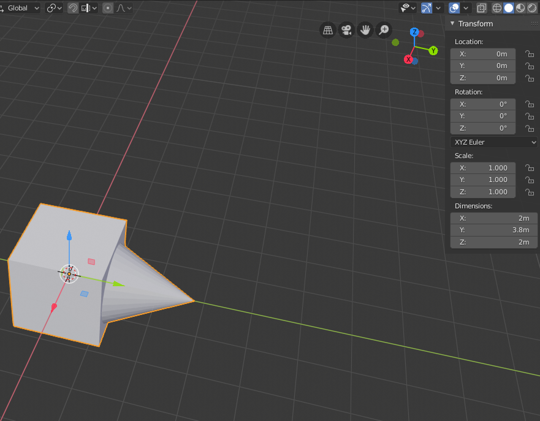
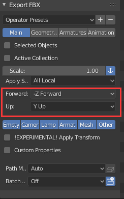
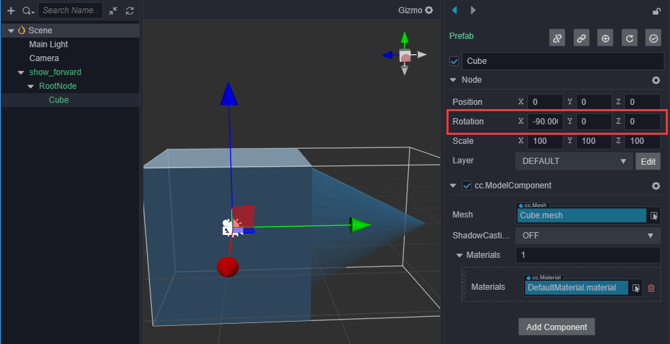
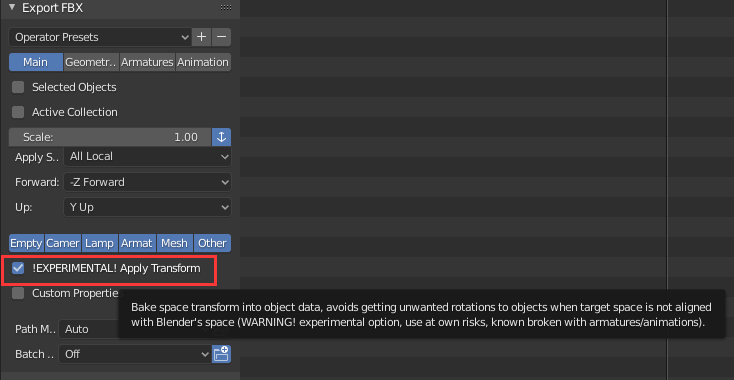
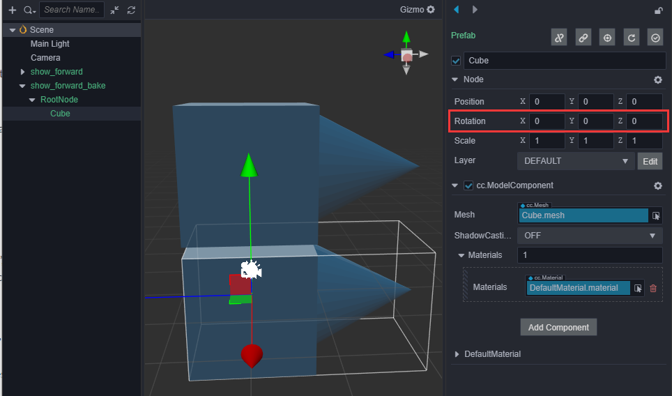
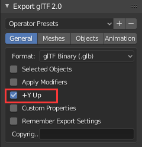
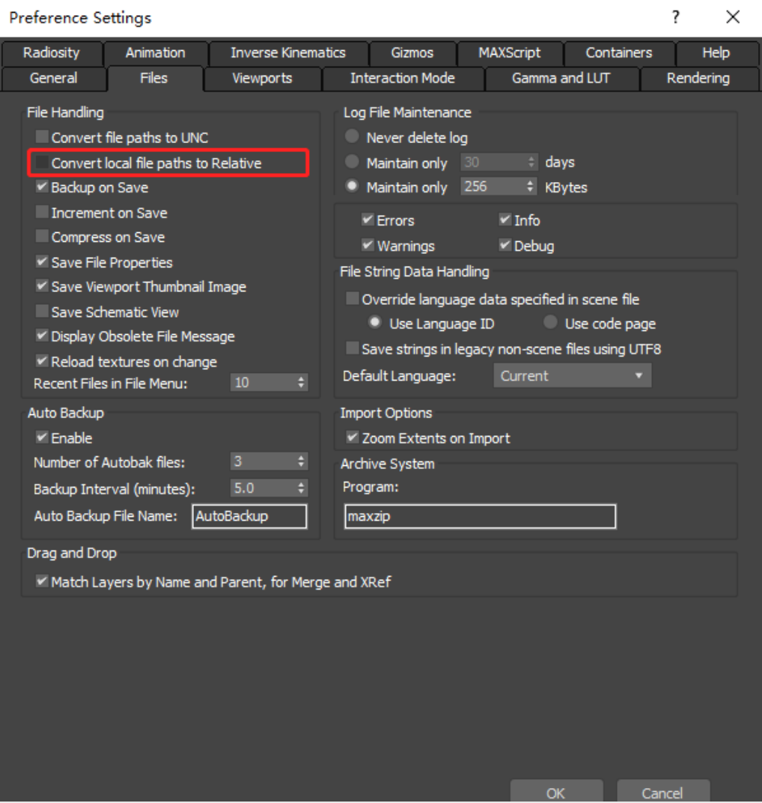

# Importing models exported from DCC tools
Currently, most __Digital Content Creation (DCC)__ tools (__3DS Max__, __Maya__, __Blender__) can export models in __FBX__ and __glTF__ formats. These formats, exported by these tools, can be well received in __Cocos Creator 3D__.

## Exporting FBX
Because the coordinate system of the DCC tool and the game engine's coordinate system are not necessarily the same, some transformations are required when exporting a model to get the desired result in the engine. For example, __Blender's__ coordinate system is __x-axis right__, __y-axis outward__, __z-axis right-hand__ coordinate system, and __Cocos Creator 3D__ is __x-axis right__, __y-axis__, __z-axis right-hand__ coordinate system, so rotation is required to make the axes consistent.

The following uses Blender 2.8 as an example to introduce the model import process. First we create a model in Blender.

In [Blender's FBX export options documentation](https://docs.blender.org/manual/en/2.80/addons/io_scene_fbx.html), we choose __up__ as __y up__ and __forward__ as __-z forward__.

Imported into __Cocos Creator 3D__, you can see that the nodes are rotated by __-90__ on the __x-axis__ in order to combine the __axis__ with __Cocos Creator 3D__. The axes are aligned.

If you don't want this rotation value, Blender's FBX export plugin provides an experimental function, __Apply Transform__, which can directly transform the rotation data into the model's vertex data.

You can see that the rotation data is gone in __Cocos Creator 3D__.

## Exporting glTF
Please read ther following documents:
  - [glTF also uses a right-handed coordinate system](https://github.com/KhronosGroup/glTF/tree/master/specification/2.0#coordinate-system-and-units)
  - [Options for exporting glTF in Blender](https://docs.blender.org/manual/en/2.80/addons/io_scene_gltf2.html).  It is relatively simple, as long as the __+y up__ option is checked, there is no rotation value in the exported data.

## Possible issues
During the game development process, the orientation of the model may be used. For example, if you want some objects to face the player (using the `LookAt()` method), you need to consider the initial orientation of the model. Here are two methods to adjust the initial orientation of the model.

  1. In __Cocos Creator 3D__, the __-z-axis__ is used as the forward direction, while in Blender, the forward direction is __+y-axis__, so when making a model, the positive direction of the __y-axis__ should be used as the orientation of the object, and the derived transformation later, in __Cocos Creator 3D__, the __-z-axis__ will be used as the front direction.
  2. If you do not want to change the orientation in the DCC tool, you can try adding a parent node to the imported model in the scene, and then rotate the model so that the initial orientation of the model is the __-z-axis__. All subsequent rotation-related operations are based on the parent. A node is an operation object.

## Artist's production specifications

1. Reasonably formulate sub-resources naming under model resources.(e.g **mesh** or **material**). Each modification of the sub-resources naming will result in the loss of the place associated with the sub-resources in the project.

2. When a part of the model needs to be transparent and a part does not need to be transparent, it should be exported in two materials. If it is a material export that is prone to model penetration, you need to manually adjust the material.

3. External resources reference, use relative path when exporting. Otherwise, under the cooperation of multiple people, the original resource path will not be recognized, resulting in the model's built-in materials cannot obtain the texture correctly and appear yellow. 3ds Max export local path is modified as follows:

