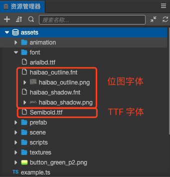
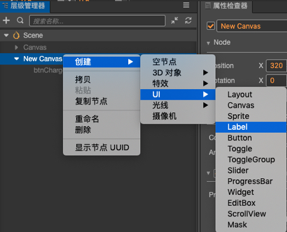
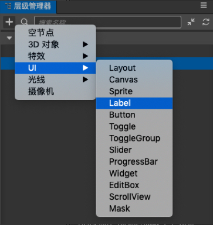
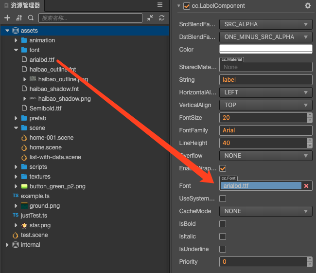

# Fontss

There are three types of font assets available to games made with __Cocos Creator__: __system fonts__, __dynamic fonts__, and __bitmap fonts__.

The __system font__ renders text by calling the __system font__ that comes with the game running platform, and does not require the user to add any related assets to the project. To use __system fonts__, use the **Use System Font** property in the [Label](../ui-system/components/editor/label.md) documentation.

## Importing font assets

### Dynamic fonts

__Cocos Creator__ currently supports dynamic fonts in **True Type** format. Simply drag a font file with an extension of `.ttf` into the **Assets Panel**, and you can import the font asset.

### Bitmap fonts

The bitmap font is composed of a font file in `.fnt` format and a `.png` image. The `.fnt` file provides an index of each character thumbnail. Fonts in this format can be generated by specialized software, please refer to:

  - [Glyph Designer](https://71squared.com/glyphdesigner)
  - [Hiero](https://github.com/libgdx/libgdx/wiki/Hiero)
  - [BMFont (Windows)](http://www.angelcode.com/products/bmfont/)

When importing bitmap fonts, be sure to drag both the `.fnt` file and the `.png` file into the **Assets Panel** at the same time.

> **Note**: after importing the bitmap font, you need to change the type of the `.png` file to __sprite-frame__, otherwise the bitmap font will not work properly.

The imported fonts are displayed in the **Assets Panel**, as follows:

> **Note**: in order to improve the efficiency of asset management, it is recommended that the imported `.fnt` and `.png` files be stored in separate directories and not mixed with other assets.

## Using font assets

The font asset needs to be rendered through the `Label` component. Here is how to create a `Node` with a `Label` component in the scene.

### Creating a Label (Font) Node Using the Menu

Click on the **Create Node** button in the upper left corner of the **Hierarchy Manager** and select `Create Render Node --> Label (Text)`, and a component with `Label` will be created in the `Scene` node.

You can also complete the creation through `Node --> Create Render Node --> Label (Text)` of the main menu, the effect is the same as the above method.

### Associated Font Assets

The font components created using the above method use the __system font__ as the associated asset, by default. If you want to use a __TTF__ or __bitmap fonts__ in the project, you can drag your font assets to the created `Label` component.

At this time, the font used in a scene will be immediately rendered using the font asset specified. You can also freely switch the `Font` property of the same `Label` component to use __TTF__ or __bitmap fonts__ according to the needs of the project. When switching font files, other properties of the `Label` component are not affected.

If you want to restore the use of __system fonts__, you can click the property check box of __Use System Font__ to clear the font file specified in the __Font__ property.

### Dragging and droping to create a Label node

Another quick way to create font nodes using specified assets is to directly __drag and drop__ font files, either __TTF__ or __bitmap fonts__, from the **Assets Panel** into the __Hierarchy Panel__. The only difference from the menu created above is that text nodes created using drag and drop will automatically use the dragged font asset to set the `Font` property of the **Label** component.

<!-- ## 位图字体合并渲染

如果位图字体使用的贴图和其他 Sprite 使用的贴图是同一张，而且位图字体和 Sprite 之间没有插入使用其他贴图的渲染对象时，位图字体就可以和 Sprite 合并渲染批次。在放置位图字体资源时，请把 `.fnt` 文件、`.png` 文件和 Sprite 所使用的贴图文件放在一个文件夹下，然后参考 [自动图集工作流程](auto-atlas.md) 将位图字体的贴图和 Sprite 使用的贴图打包成一个图集，即可在原生和 WebGL 渲染环境下自动享受位图字体合并渲染的性能提升。 -->

<!-- 详情请参考 [BMFont 与 UI 合图自动批处理](../advanced-topics/ui-auto-batch.md)。 -->

