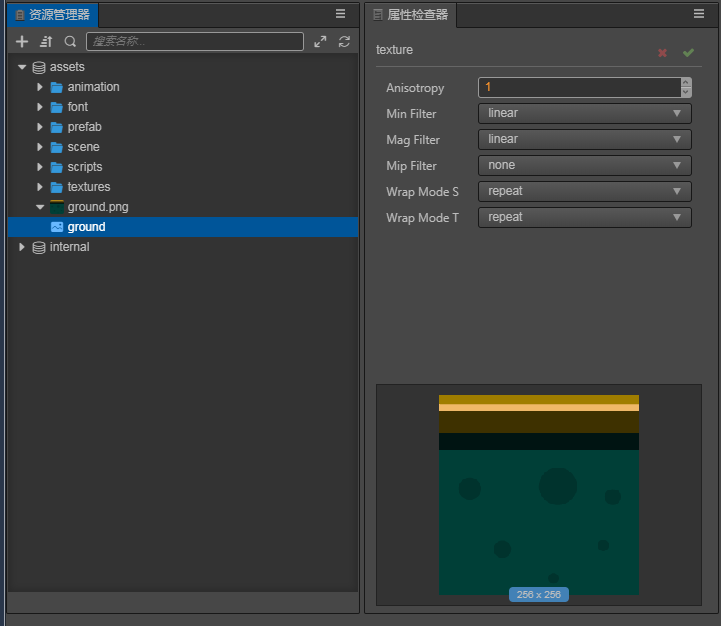

# Images

Image resources are often called __textures__ or __Images__. __Image__ resources are generally created using image processing software (such as __Photoshop__, __Paint__ on Windows, etc) and output into file formats that __Cocos Creator 3D__ can use, currently including `.jpg` and `.png`.

## Importing image resources

After importing images into __Cocos Creator 3D__, they can be seen in **Explorer** panel.

## Types of image resources

On the right side of the **Property Inspector** panel, you can choose different ways to use the image resource. There are currently 4 ways to use it for developers, as shown below:

The details of each type of image resource are described in detail in the following sections:
  - The raw type is the original picture type. It has no effect and users do not need to use it.
  - The texture type is the image resource type, which is also the default type for import. For details, see: [Texture](texture.md)
  - normal map type is normal map type
  - The sprite-frame type is a sprite frame resource, which is used for UI production. For details, see: [SpriteFrame](sprite-frame.md)
  - The texture cube type is a cube map type, which is used on the panorama to make a sky box. For details, see: [Sky Box](../concepts/scene/skybox.md#Modifytheenvironmentmapoftheskybox)

In the **Resource Manager**, a __triangle icon__ similar to a folder will be displayed on the left of the image . __Click__ to expand to see its __sub-resources__. After each image is imported, the editor will automatically create a **selected type** resource of the same name. __Select__ the resource itself to __change the resource type__, __set the image flip__, and __set the quality__ of the image on each platform. For detailed descriptions of __sub-resources__, please see: [Sub-resource Properties Panel](texture.md#Sub-resourceTexture2D'sPropertyPanel)

