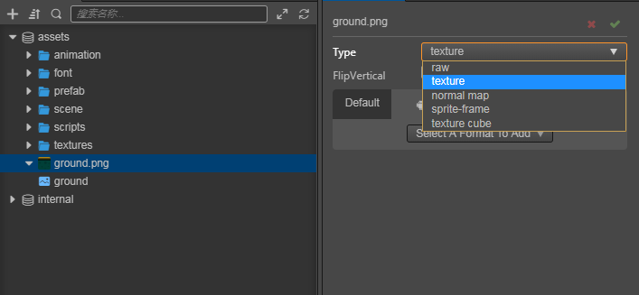
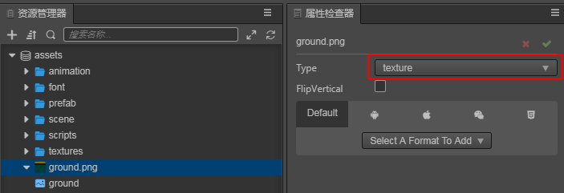
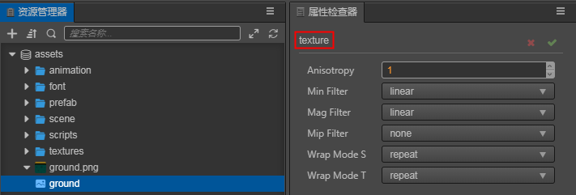

# Images

__Image__ assets are generally created using image processing software (such as __Photoshop__, __Paint__ on Windows, etc) and output into file formats that __Cocos Creator__ can use, currently including `.jpg` and `.png`.

## Importing image assets

After importing images into __Cocos Creator__, they can be seen in **Assets Panel**.

## Types of image assets

On the right side of the **Property Inspector** panel, you can choose different ways to use the image asset. There are currently 4 ways to use it for developers, as shown below:

The details of each type of image asset are described in detail in the following sections:
  - The raw type is the original picture type. It has no effect and users do not need to use it.
  - The texture type is the image asset type, which is also the default type for import. For details, see: [Texture](texture.md)
  - normal map type is normal map type
  - The sprite-frame type is a sprite frame asset, which is used for UI production. For details, see: [SpriteFrame](sprite-frame.md)
  - The texture cube type is a cube map type, which is used on the panorama to make a sky box. For details, see: [Sky Box](../concepts/scene/skybox.md#Modifytheenvironmentmapoftheskybox)

In the **Assets Manager**, a __triangle icon__ similar to a folder will be displayed on the left of the image . __Click__ to expand to see its __sub-assets__. After each image is imported, the editor will automatically create a **selected type** asset of the same name. __Select__ the asset itself to __change the asset type__, __set the image flip__, and __set the quality__ of the image on each platform. For detailed descriptions of __sub-assets__, please refer to the [Sub-asset Properties Panel](texture.md#Sub-AssetTexture2D'sPropertyPanel) documentation.

