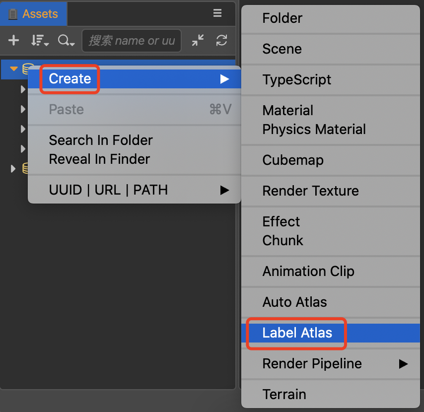
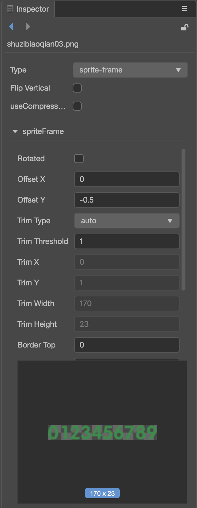
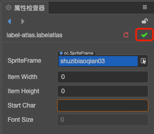

# LabelAtlas Asset

**LabelAtlas** asset is a user-defined asset, it's used for configuring a **LabelAtlas**.

## Create LabelAtlas Asset

In the **Assets Panel** right-click on a folder, and click the context menu item **Create -> Label Atlas**. It will create a **LabelAtlas.labelatlas** asset.

Before using the **LabelAtlas** asset, it needs some configuration. Configure a pre-drawn picture that contains the font style, as shown below:

## Configuration of LabelAtlas asset

After selecting a **LabelAtlas** asset in the **Assets Panel**, the **Property Inspector** panel will display all configurable properties for the **LabelAtlas** asset.

| Properties       | Description
| --------------   | -----------
| SpriteFrame      | Specify a pre-drawn picture that contains the font style you want
| Item Width       | Specify the width of each character
| Item Height      | Specify the height of each character
| Start Char       | Specify the start char, even if the start char is a *space*, you also need insert a space. |

When the configuration is complete, click the tick button at the top right of the **Property Inspector** panel to save the settings.

## Using LabelAtlas asset

It's quite simple to use the **LabelAtlas** asset. You just need setup a new Label component and drag the **LabelAtlas** asset to the **Font** attribute of the Label component. Please refer to the [Label Component](../ui-system/components/editor/label.md) documentation for details.
