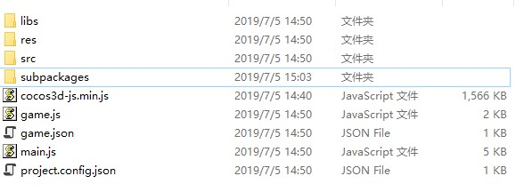

# Sub-package loading

As a game becomes more complex, it can get larger in size. This leaves the developer needing to balance out the package size. __Cocos Creator__ supports **Sub-package loading**, which supports both the loading __code__ and **assets**. __Sub-package loading__ currently only supports various __instant game platforms__, such as __WeChat Mini Games__.

__Sub-package loading__, is the splitting the game content into several packages according to certain rules. Only the necessary packages are downloaded when first started. This necessary package is called the **main package**. The __main package__ can trigger the download of other __sub-packages__, which can effectively reduce the time taken for the first startup.

## Configuration method

__Cocos Creator's__ __sub-packaging__ is configured __folder by folder__. When a folder is selected, the related configuration options of the folder will appear in the **Properties Inspector**:


After selecting **Configure as a sub-package**, click **OK** in the upper right. The assets (including code and other assets) under this folder will be treated as the contents of the __sub-package__. **Sub-package name** will be passed in as the loading name when the __sub-package** is loaded. By default, this folder name will be used.

> **Note**: when configured as a __sub-package__, only native assets, such as *pictures* and *audio*, will eventually be placed in the __sub-package__. __Prefabs__, __AnimationClip__ and other __JSON__ type assets will still be placed in the **main package**.

> **Note**: nesting of __sub-packages__ should be avoided as much as possible. For example, after __folder A__ is selected as a __sub-package__, __folder B__ under __folder A__ is also selected as a __sub-package__. If there is nesting, the parent folder will not package the content in the child folders.

## Constructing

The role of **sub-packaing** will only be reflected after the project is built. When previewing, the entire package is still loaded. After the project is built, the corresponding **sub-package** folders will be generated in **sub-packages** under the `release` package directory.

**For example**: Configure the **cases/01_graphics** folder in the example project as a **sub-package**, then after the project is built, the **01_graphics** folder will be generated in **sub-packages** under the release package directory.



When building and publishing, all the **code** and **assets** in the **cases/01_graphics** sub-package folder will be processed as follows:

  - **Code**: all code in the **cases/01_graphics** folder will be merged into an entry script file named **01_graphics/game.js**, and these codes will be removed from the main package.

  - **Assets**: will move the **cases/01_graphics** sub-package assets from the **res/raw-assets** folder in the release package directory to **sub-packages/01_graphics** in the release package directory under __contents__.

## Loading child packages

The engine provides a unified api `loader.downloader.loadSubpackage()` to load the assets (including code and other assets) in the **sub-package**. `loadSubpackage()` needs to pass in the name of a **sub-package**. This name is the name of the **sub-package** configured by the user in the previous project. The default is the name of the **sub-package** folder.

When the **sub-package** is loaded, a callback will be triggered. If the loading fails, an error message will be returned.

```typescript
loader.downloader.loadSubpackage ('01_graphics', (err: any) => {
    if (err) {
        return console.error (err);
    }
    console.log ('load sub-package successfully.');
});
```

If the loading is successful, the script in the **sub-package** will be executed, and the resource loading path of the **sub-package** will be added to the engine. Developers can access all the assets in this **sub-package** in exactly the same way as the **main package**, without having to worry about whether these assets were originally in the **main package** or in the **sub-package**.

## WeChat Mini-Games

In the construction of the __WeChat Mini-Game__ platform, the configuration of the **sub-packages** will also be automatically generated in accordance with the rules in the **game.json** configuration file. This file is located in the distribution package directory.


> **Note**: __WeChat Mini-Games__ require a specific version to support the sub-packaging functions. WeChat 6.6.7 client, 2.1.0 and above basic libraries are supported, please update to the latest client version. For developer tools please use version 1.02.1806120 and above. After updating the developer tools, don't forget to modify the **Details -> Project Settings -> debug base library** in the developer tools to 2.1.0 and above:


### Restrictions on the size of the sub-package loading package

The current **WeChat Mini-Game** **sub-packaging** size has the following restrictions:

  - The size of all **sub-packages** of the entire **WeChat Mini-Game** cannot exceed **8M**.
  - The size of a single **sub-package/main package** cannot exceed **4M**.

For additional details, please refer to the official **WeChat Mini-Game** [sub-package](https://developers.weixin.qq.com/minigame/dev/tutorial/base/sub-packages.html) documentation.
