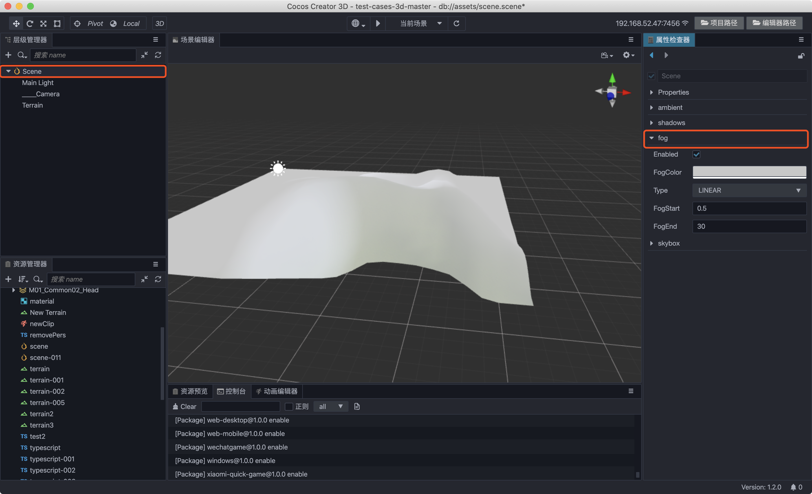
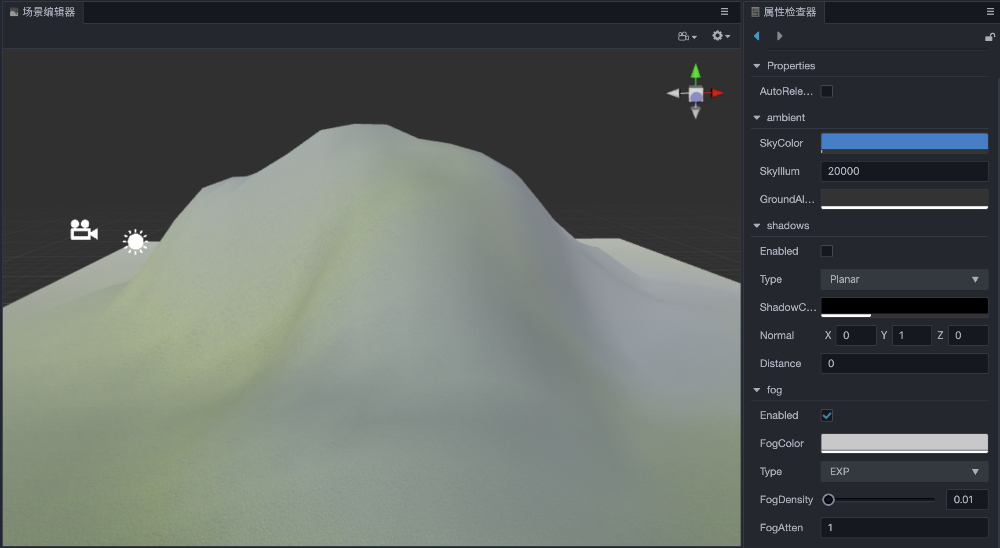

## Global fog type

Four types of global fog are provided inside the engine:

1. Linear Fog
2. Exponential Fog
3. Exponential Squared Fog
4. Layered Fog

The global fog function is used to obtain different fog effects with the fogging mixing factor affecting globally the model vertices, to get different global fog effects.

## Open method

Click on the scene node in the hierarchy panel, expand the fog option in the inspector panel, check the `Enabled` property to enable the global fog function, and set the type of global fog. You can set the color of the global fog through `FogColor`.

## Different types of use

### Linear Fog

The linear fog mixing factor is calculated in the following way:

`` f = (FogEnd - Cam_dis) / (FogEnd - FogStart)；``

That is:

When Cam_dis = `FogEnd`, the mixing factor is 0, all objects are covered by fog,

When Cam_dis = `FogStart`, the mixing factor is 1, the objects are not affected by any fog.

If you want to increase the concentration of Linear Fog, there are two ways:

1. Fixing the `FogStart` value and reducing `FogEnd` value.
2. Fixing the `FogEnd` value and reducing `FogStart` value.

To achieve project results, `FogStart` and `FogEnd` need to be adjusted appropriately.

### Exponential Fog and Exponential Squared Fog

The mixing factor f of Exponential Fog is obtained in the following way:

`` f = e^(-distance * fogDensity) ``

The mixing factor f of Exponential Squared Fog is obtained in the following way:

`` f = e^(-distance * fogDensity)² ``

In addition to adjusting the global fog density through `FogDensity`, the `FogAtten` attribute has been added, which is the attenuation coefficient of fog. The user can adjust this parameter to adapt to different concentrations in the right position.

### Layered Fog

Layered Fog provides a fog effect based on the vertical height upon x-z plane.

The following are the meanings of its parameters:

`FogAtten`: Layered Fog attenuation coefficient.

`FogTop`: The position in the vertical direction of the world coordinates of each vertex of the model, All vertices smaller than this position will be affected by the fog.

`FogRange`: Scope of fog.

Layered Fog is still relatively common in reality, If it can be used reasonably, I believe it will improve the effect, but at the same time the amount of calculation will increase to a certain extent. The developer can decide whether and where to use layered fog for a balance of performance and visual quality.
