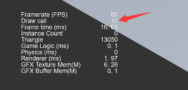
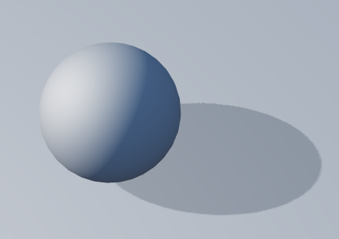

# additive per-pixel lights

First we use the default lighting material in Cocos.

As shown in the title picture, we placed a sphere in the scene, then a parallel light, and two spotlights, placed around the sphere.

Take a look at Draw Call under Status:

Let's open Frame Debug to see how these are rendered to the screen:

In the first pass, first render the base color of Main Light.

In the second pass, the Lighting pass of light_1 is rendered.

In the third pass, the Lighting pass of light_2 is rendered.

This kind of rendering path is Forward-Pipeline. Forward is composed of two Passes. The first Pass is called BasePas, which is used to draw the illumination brought by a parallel light, and the other is called LightPass, which is responsible for drawing the illumination of the remaining lights. One can be foreseen. When the object is illuminated by multiple lights, there will be multiple Draw Calls.

The advantage of this rendering method is that you can add more lighting effects, even on the mobile terminal, it also has a good performance.
