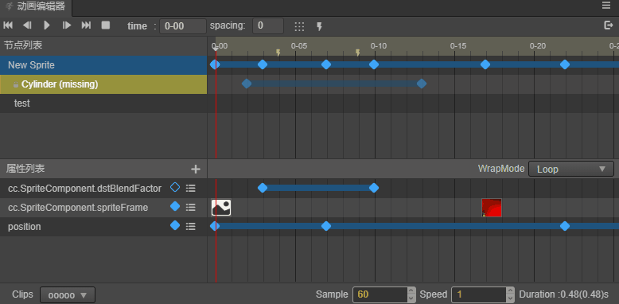
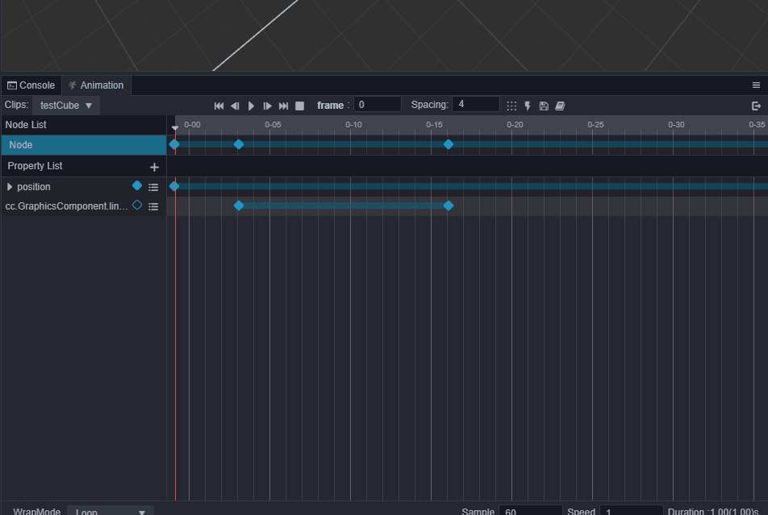
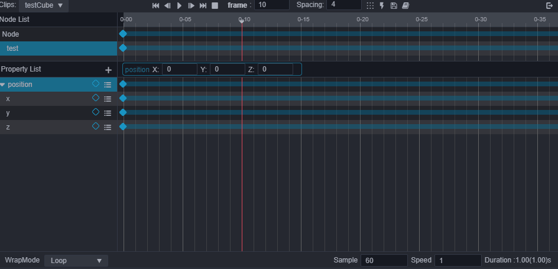
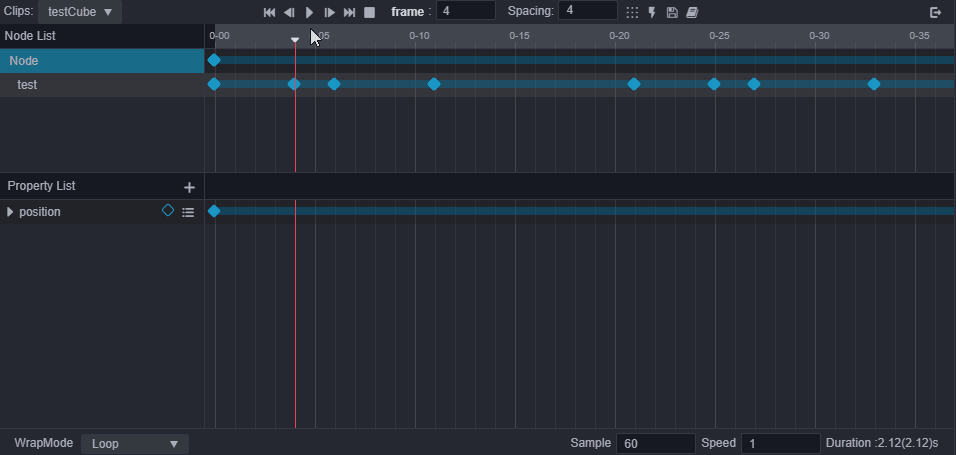
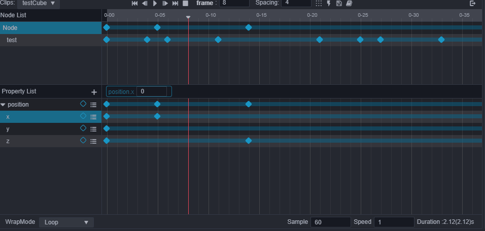
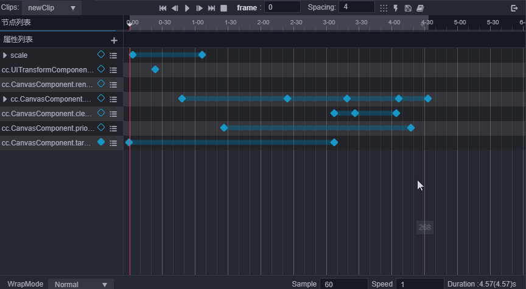

# Editing a animation sequence

After the __animation clip__ is attached to the __Node__, click __Enter Animation Edit Mode__ to enter the __animation editing mode__, and then you can create some __animation frame data__ in the __animation clip__.

__First__, it is important to understand about __animation properties__. __Animation properties__ include a __Node's__ own *position*, *rotation* and *other properties*, as well as the __properties__ in a __Component__.
The __component__ contains the __component's__ __name__ and other properties, such as `Sprite.spriteFrame`. The corresponding blue prism on the property track is the __key frame__.

__Animation components__ can animate the __node__ and __component__ properties on the __node__ and __child nodes__, including __Properties__ in __user-defined scripts__. This means that various animation requirements can be flexibly implemented. The specific animation implementation depends on different animation needs and different steps. For an example case, please refer to the [official example-3d](https://github.com/cocos-creator/example-3d). This repository mainly introduces some common editing operations and facilitates rapid editing to achieve these effects.

## Modify a clip's common properties

**sample**: define the frame rate of the current animation data per second, the default is __60__, this parameter will affect the number of frames between every two integer seconds scale on the time axis (that is, how many divisions within one seconds).

**speed**: the current playback speed of the animation, the default is __1__.

**duration**: when the animation playback speed is __1__, the duration of the animation.

**real time**: the actual duration of the animation from the beginning to the end of the animation, corresponding to the number in the parenthesis in the lower right corner of the editor.

**wrap mode**: **Loop mode**, please refer to the [Cycle Mode](./../../engine/animation-clip.md#CycleMode) documentation for specific configuration effects.

Changes to properties take effect after the focus leaves the control.

## Common operations of node panel

The __animation clip__ defines the position of the data by the name of the node, ignoring the root node itself, and the remaining child nodes find their corresponding data through the **relative path** index of the root node.

- **Clear node data**: right-click the node item of the animation editor, select __Empty Data__, and select __Clear__ after the pop-up window prompts

- **Copy and paste node data**:right-click the node item of the animation editor, select **Copy Node Data**, and then right-click the target node item, select **Paste Node Data**.

> **Note**: when using **shortcut keys to copy and paste node data**, please **make sure that no attribute track or keyframe is currently selected**. Because when there is a selected attribute track or key frame, the animation data will be copied first.
> If the paste target node does not exist when the attribute track in the animation data is copied, it will not be created automatically. Please create the required components in advance.

- **Migrating node data**: sometimes we will rename the node after the animation is completed, which will cause problems with the animation data, as shown below:

  

  Next, right-click on __Migrate Data__ on the missing node, and then click on other nodes to migrate the data. If you do not want to migrate after clicking __Migrate Data__, click directly in the timeline area or click __Cancel__ in the pop-up window after clicking other nodes.

  

    > **Note**: by default, node data migration will overwrite the data on the target node

## Common operations of property track data

An __animation clip__ may contain multiple nodes, and multiple __animation properties__ are bound to each node. The data in each property is the actual __key frame__. The __key frame__ operation in the property has been mentioned above. This section mainly introduces some operations for the entire property track:

- **Add an property track**: click the `+` small button next to the __property list__, after the pop-up property menu pops up, click on the property that needs to be added. Example:

    

- **Remove property track**: right-click the property list item and select __Remove property track__. Example:

    

- **Clear track data**: right-click the property list item and select __Clear property track__. Example:

    

- **Copy and paste track data**: right-click the property list item, select **copy track data** or press __Ctrl + C__, then click the same type of track as the copied track, right-click will see the paste option, click or press __Ctrl + V__ to paste. Example:

    

## Common Key Frame Operations

In the process of __producing animations__, there are often some __manipulation of key frames__. There are a variety of __key frame__ processing methods in the __animation editor.__. Knowing these methods and techniques can help to edit __animation clips__ faster.

### Selecting a key frame

After clicking the __key frame__, the __key frame__ will be selected. At this time, the __key frame__ changes from *blue* to *white*. Currently, there are the following ways to select the __key frame__:

- Right-click a __key frame__ to select it, press __Ctrl and right-click__ to select multiple __key frames__.
- Drag the frame directly in the __key frame__ area to select the __key frame__.
- Press down the mouse in the empty area of the __key frame__ panel and drag to form a selection area to select all __key frames__ inside.

### Add key frame

To add a __key frame__:

- __Right-click__ on the corresponding property track position and select __Add Key Frame__. The current number of __key frame__ frames will also appear on the right-click menu.

    

- **Select the corresponding node and the corresponding property**, move the time cursor to the position where the __key frame__ needs to be added, and press the __I__ (inset) key

    

- Move the time cursor to the position where the __key frame__ needs to be added. In the corresponding property list item, click .

    

- After selecting the corresponding node and the corresponding property track, the editor control for the corresponding property will appear in the middle of the __animation editor__, and the __key frame__ can be marked by modification.

    

- After adding the __property track__, move the time cursor to desired position of the __Inspector__ panel or perform scene operations to automatically generate __key frames__.

### Removing key frames

- **Select** the __key frames__ you want to delete and press __delete/Cmd + backspace__ on MacOS and __delete/Ctrl + backspace__ on Windows.
- At the position of the __key frame__ to be deleted **right-click**, select __Remove Key Frame__.
- Drag the __time cursor__ to the position where the __key frame__ needs to be removed and **double-click** the __key frame__, in the corresponding property list item, click 

    

### Modifying key frame data

On the __timeline__ **double-click** the __key frame__ that needs to be modified. The __time cursor__ will move to that position. You can also directly drag the __time cursor__ to the corresponding position, and modify the corresponding properties directly in the **Inspector** panel. Make sure the __animation editor__ is in __edit mode__. For example, there are three property tracks in the property list: *position*, *scale*, and *rotation*. After the __key frame__ is selected, you can modify the *position*, *scale*, and *rotation* properties in the **Inspector** panel.

In __animation editing mode__, move the __time control__ line to a position where there are no __key frames__ on the timeline, and then modify the corresponding properties in the __Inspector__ panel, and a frame will also be inserted automatically.

### Moving a key frame

After selecting a __key frame__, __right-click__ and hold on the selected __key frame__ to drag, and release it to complete the movement. There will be prompts for the distance and the number of frames in the final position during the movement.

### Zooming a keyframe

After selecting multiple __key frames__, the left and right control levers will be displayed. Drag any one of the joysticks to move and perform zooming of the key frames.

### Arranging key frames at specific intervals

After selecting multiple __key frames__, adjust the number of interval __key frames__. After pressing the button for arranging intervals, the selected __key frames__ will be arranged in sequence according to the set number of intervals.

### Copying/pasting keyframes

- A. After selecting the __key frame__, follow the normal __shortcut key__ __C/V__ to *copy* and *paste*. Note that the location of the __shortcut key__ __paste__ will start from __the current key frame__(The red line position).
- B. After selecting the __key frame__, __right-click__ on the selected __key frame__, select __Copy Key Frame__, and then __right-click__ elsewhere, select __Paste Key Frame__.

    

The copy and paste of key frame data supports cross-node and cross-clip use.

> **Note**: there is a difference between A and B. When using the shortcut key to paste the keyframe data, it will be pasted one by one in the order of the copied track data, while right-clicking on the target property track and selecting paste will only pasted on the target property track.Please be sure to copy the correct data to produce unexpected results.

For more about the design of animation sequences and the content of scripting animations, you can refer to the [Animation Clip](./../../engine/animation/animation-clip.md) documentation.
