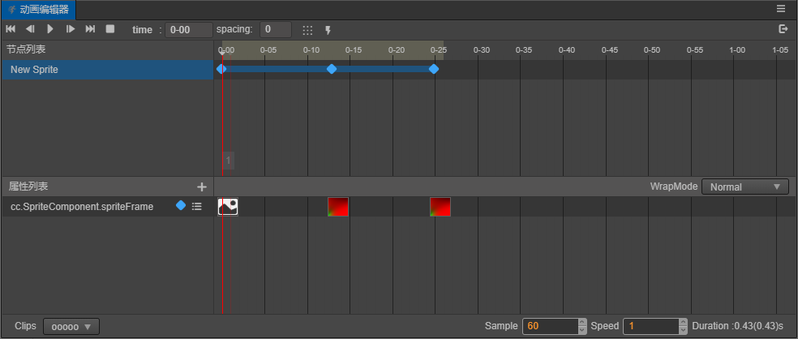

# Creating a frame animation

Previous chapters wrote about the operation of __Attribute Frames__, now how to create a __Frame Animation__.

## Adding a Sprite component to a node

__First__, we need to allow the node to display the texture normally, so we need to add a __Sprite__ component to the node.

__After__ selecting the node, use the **Add Component** button in the __Property Inspector__ and select __UI-> Render-> Sprite__.

## Add a Sprite.spriteFrame to the attribute list

__After__ the node can display the texture normally, an __Attribute Track__ needs to be created for the texture.

Click the `+` next to the __Property List__ of the __Animation Editor__. Select __Sprite-> spriteFrame__.

## Adding a Frame

__First__, from the __Explorer__, drag the texture to the __Attribute Frame__ area and place it on the __Sprite.spriteFrame__ track.

__Next__, drag the texture to be displayed in the next frame to the specified position, and then __click__ __Play__ to preview the animation that was just created.

If you drag multiple textures to the __Attribute Track__ at the same time, the button textures are selected in the order on the track, and they are arranged in sequence according to the number of intervals displayed on the toolbar to generate key frames.

## Arranging and modifying key frame intervals

The __interval frame number__ of __frame animation__ is usually fixed. Sometimes after adding multiple textures, if you want to adjust the interval number, you can fill in the desired __interval frame number__ at the top of the __toolbar__ Then select the __key frame__ to be arranged, __click__ __Arrange__ button on the __toolbar__  or __right-click__ on the selected __key frame__ and __select__ __Arrange selected key frames__.

---

Continue to the [Editing Animation Curves](animation-curve.md) documentation.
