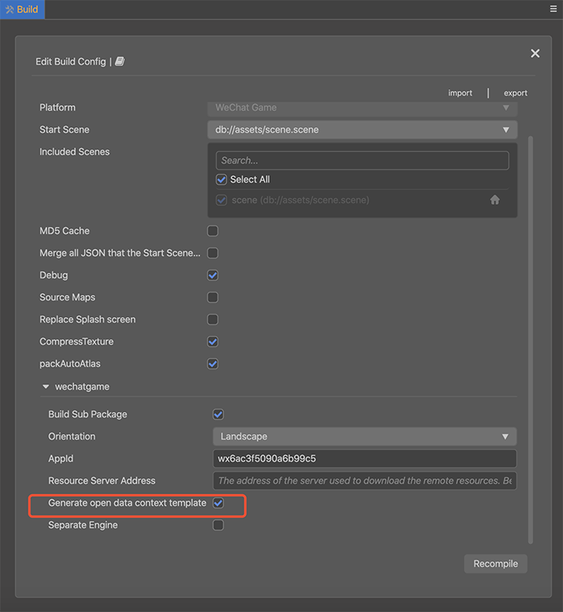
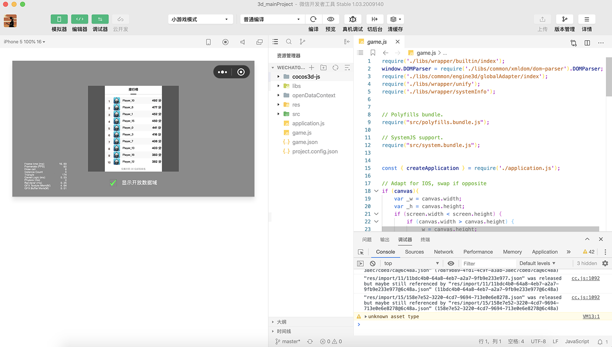

# Building Open Data Context Project

Currently, **WeChat**, **Baidu** and **ByteDance** are small game platforms that add the concept of **Open Data Context**, which is a separate game execution environment, in order to protect their social relationship chain data. The resources, engines, and applications in the **Open Data Context** are completely isolated from the main game, and only in the **Open Data Context** can developers access the relationship chain data through the open interface provided by the platform to implement some features such as ranked version.

In **Cocos Creator 3.0**, we deprecate the maintenance of the Canvas Renderer module and provide with a mini game Canvas engine instead. It is a lightweight front-end Canvas engine based on **XML** + **CSS**, and developers only need to have some basic front-end skills to simply implement a leaderboard-like feature.

## SubContextView Component Description

Since the **Open Data Context** can only be rendered on the off-screen canvas called sharedCanvas, you need a node in your project to act as a container for rendering the **Open Data Context**, and add the `SubContextView` component to that node, which will render the sharedCanvas to the container node.

The `SubContextView` component contains two main properties, **Design Resolution** and **FPS**.


### Design Resolution

The image above sets the component's design resolution to **640** * **960**, so at the component onLoad phase, the size of the sharedCanvas will be set to **640** * **960**, which means that after the build, the open data project will be rendered on a **640** * **960** off-screen canvas, which requires the maximum width of the element is **640** and the maximum height is **960** when setting style in `style.js`, otherwise the rendered content will exceed the canvas. Example:

```js
// style.js
export default {
    container: {
        width: 640, // max width
        height: 960,  // max height
    },
}
```

To avoid this part of the data coupling, setting a percentage adaptation to the size is supported. Example:

```js
// style.js
export default {
    container: {
        width: '100%',
        height: '100%',
    },
}
```

In the actual rendering process, the `sharedCanvas` can be interpreted as content and the `SubContextView` node as a container, and the engine will adopt the adaptation strategy of `SHOW ALL` to render the `sharedCanvas` to the screen to avoid the UI distortion caused by stretching during rendering.

In the actual rendering process, the engine will adopt the **SHOW ALL** adaptation policy to render the sharedCanvas to the `SubContextView` component node to avoid the UI distortion caused by stretching during rendering. For example, in the following two images, we are using `SubContextView` component nodes of different sizes, and the **Open Data Context** texture will not be stretched.


### Setting FPS

The **FPS** property is primarily used to set how often the main context will update the sharedCanvas on the **SubContextView** component to avoid performance loss due to frequent updates to the **Open Data Context** texture.

## Building processes

1. Open the project and double-click the scene, then add the `SubContextView` component to the node on which you need to render the **Open Data Context**.

2. After the scene is set, save the scene, and then open the **Build** panel in **Menu -> Project**, select the **WeChat** / **Baidu** / **ByteDance** mini-game platform you want to release, check **Generate Open Data Context Template**, and then click **Build**.

    

3. After the build is complete, click the **Open** button at the end of **Buid Path**, you'll see an **openDataContext** folder (e.g. `build/wechatgame/openDataContext`), which is an **Open Data Context** project template built into Cocos Creator, in the distribution folder of the corresponding game platform.

    

    Developers can customize the required **Open Data Context** content based on this template, and the customization methods are described below. When built again, if the **openDataContext** directory exists in the distribution package directory, it will be skipped directly and the developer does not have to worry about customizing the open data domain content to be overwritten.

4. Use the developer tools provided by the platform to open the built main project, you can see the effect of the **Open Data Context Template Project**.
1. Open the build distribution (e.g. `build/wechatgame`) using the platform-side developer tool to open the mini-game project to view the **Open Data Context** content.

    

## Customization on Open Data Context Project

Before customizing an **Open Data Context** project, developers need to know some basic information.
- [minigame-canvas-engine quick start](https://wechat-miniprogram.github.io/minigame-canvas-engine/api/guide.html#%E5%AE%89%E8%A3%85)
- [doT template engine use](http://olado.github.io/doT/?spm=a2c6h.12873639.0.0.36f45227oKu0XO)

With this basic information in mind, let's take a look at the **Open Data Context** template generated by default after the build, with the following directory structure:


- **render/dataDemo.js**：Simulates some random data of the ranked version, where the developer can request the relational chain data from the platform and pass it to the **doT template engine** to generate relevant XML text
- **render/style.js**：To record CSS style text information，refer to [Style Document](https://wechat-miniprogram.github.io/minigame-canvas-engine/api/style.html#%E5%B8%83%E5%B1%80)
- **render/template.js**：To record XML text information, the project uses the template engine to generate XML text by default. Refer to [Tag Document](https://wechat-miniprogram.github.io/minigame-canvas-engine/api/tags.html#%E6%A0%87%E7%AD%BE%E5%88%97%E8%A1%A8).
- **render/avatar.png**：Header images for display in template project, can be deleted.
- **engine.js**：source code of Canvas engine
- **index.js**：**Open Data Context Project** entry file where the **Open Data Context** is rendered by passing XML text and CSS styles to the Canvas engine

## Recommended practices

1. Since the build directory generated after the build of the project is excluded from version control by default by git, if you want to include your custom **Open Data Context** in version control, you can put the `openDataContext` folder (e.g. `build/wechatgame/openDataContext`) into your project's build-templates directory. Please refer to [Custom Project Build Process](./custom-project-build-template.md) documentation.

2. In an **Open Data Context Project**, if you need to listen to messages from the primary project, you need to first determine whether the message comes from the primary project engine, using the WeChat interface as an example.

```js
wx.onMessage(res => {
    if (!(res && res.type === 'engine')) {
        console.log('do something...');
    }
});
```

It is also recommended to send messages to **Open Data Context** with a type message to avoid handling the wrong source, where `res.type === 'engine'` in the code means the message came from the engine in main context.

## Known issues

In the **Open Data Context** of **Baidu** platform, since the image can only load player avatars returned from Baidu, the local avatar image may not be loaded in the generated template project.

## Reference documentation

- [minigame-canvas-engine document](https://wechat-miniprogram.github.io/minigame-canvas-engine/)
- [minigame-canvas-engine repository](https://github.com/wechat-miniprogram/minigame-canvas-engine)
- [doT template engine](http://olado.github.io/doT/?spm=a2c6h.12873639.0.0.36f45227oKu0XO)
