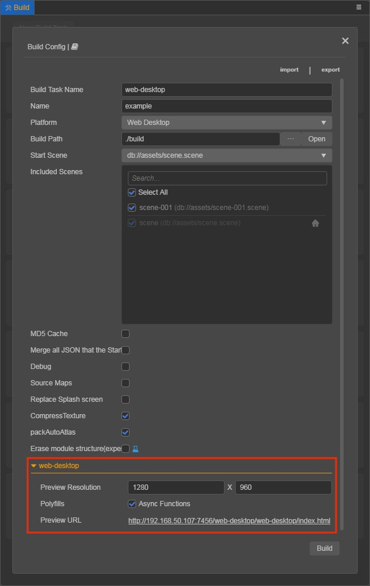
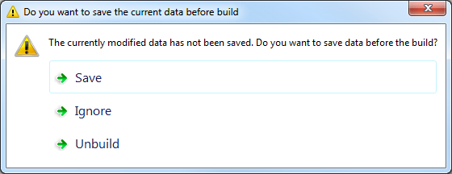
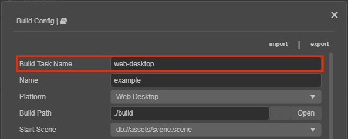
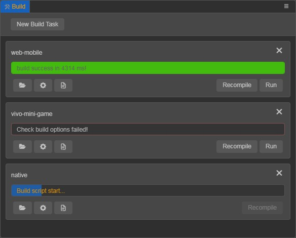
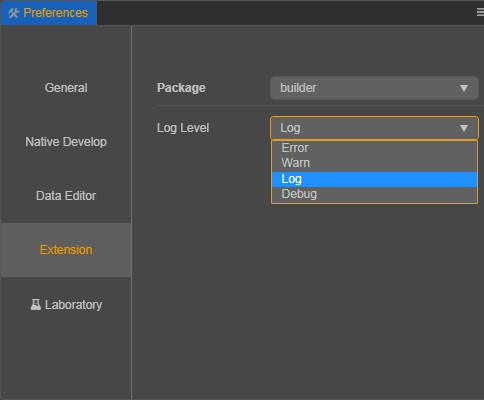

# About Build Panel

Click **Project -> Build** in the main menu or use the shortcut `Ctrl / Cmd + Shift + B` to open the **Build** panel. If multiple build tasks are added at the same time, the editor will automatically start building the next task after the current platform's build task is completed in the order in which it was added.

## Platform Plugin

Starting from v1.0.3, each platform's build will be embedded in the **Build** panel as a separate plugin, with platform related options placed in a collapsible `section` (e.g. the Web Desktop in the figure below).

## New Build Task

Click the **New Build Task** button at the top right of the **Build** panel to open the build options configuration panel. After the options are configured, click **Build**.

Make sure the content in the **Scene** panel is saved before you build. If no save, when you click on the **Build** button, a prompt will pop up for `Do you want to save the current data before build`, you can choose **Save**, **Ignore** or **Unbuild**. If **Save** / **Ignore** is selected, the build will continue, and if **Unbuild** is selected, a record of cancelled builds will be generated.

**Note**: There is no point in executing a build if there is no scene in the project, so projects without a scene are not allowed to add build tasks.

### Build Task Name

Build Task Name, which will be the name of the release folder generated after the build, is not modified by default. If the same platform performs multiple builds, the suffix `-001`, `-002`, `-003` and so on will be added to the original Build Task Name. If you want to overwrite an old release package, just change it back to its original name manually.

**Note**:

- Cocos Creator uses the **Platform** name as the name for the release package generated after the build, and overwrites the original package with each build.
- Cocos Creator 3D uses the **Build Task Name** as the name of the release package that is generated after the build, and a new release package is generated with each build. If you want to overwrite the original release package, you can manually modify the **Build Task Name** to match the original release package name.

## Build Progress

After clicking **Build**, you can see the current build task progress in the **Build** panel. If the build is successful, the progress bar is shown in green and the time of the actual build is output. The first build, the engine will be slow to compile, so please be patient. If the build fails, the progress bar is shown in red.

## Run

Currently, most platforms can directly click the **Run** button in the **Build** panel to preview the effect of the project after the build. If there is no **Run** button, it means that the current platform does not support direct run in the editor, please refer to the release document of the relevant platform for details.

## Build Log

Because the build process generates so many log messages, by default only error log are printed to the editor's **Console** panel. There are several ways to view all log information:

- **Open Build DevTools**

  Click **Developer -> Open Build DevTools** in the menu bar to see all the log information printed during the build, including the call stack.

- **Log Level**

  Click **Cocos Creator 3D -> Preferences -> Extension** in the menu bar, set **Package** to `builder`, and then set the log type to output to the **Console** panel in **Log Level**.

  

- **Log File**

  Starting from v1.0.3, the editor will record the error log generated during each build, which can be viewed by clicking the  button under build task in the **Build** panel. The log file is stored in the project's `temp/build-log` directory and can be attached when you send feedback to the forum on build related issues.

## Adjust the build options configuration

The **Build** panel has a  button below the build task, which can be clicked to see or adjust the configuration of the previous build options. click the **Recompile** button after the adjustment is complete, the generated release package will directly overwrite the original. 
The information about the completed build task will be saved in the `profiles/packages/build.json` file of the project. As long as the source file of corresponding build task is not deleted in the **Build** panel or directly deleted in the project directory, you can view the build options configuration of the previous build after reopening the editor, as well as to run and preview again.

**Note**: The  button is for developers to recompile after adjusting the build options of the current build task, while the **New Build Task** button is for creating a new build task, please don't confuse the two.

## Export / Import

### Export

The **Export** option at the top right of the **Build** panel exports the current build options configuration to a `json` file, mainly to facilitate build from command line and sharing build options configurations within the same project. The exported build options configuration are platform-specific. For developers who use the command line to build, you can directly use the `json` configuration file as the `configPath` of the command line build options.

### Import

The **Import** option reads `json` configuration file into the **Build** panel for developers to share build options configuration.

## Recompile

If you want to adjust the build options configuration after the project is built, or if you want to recompile project after fix a bug. There are following two ways:

- One is a **Recompile** button at the bottom right of the build task in the **Build** panel, which will directly recompile using the previous build options configuration.

- The other is a  button at the bottom of the build task in the **Build** panel, click the button to enter the panel and you can see a **Recompile** button. For details, see **Adjust the build options configuration** in the upper part of the document.
