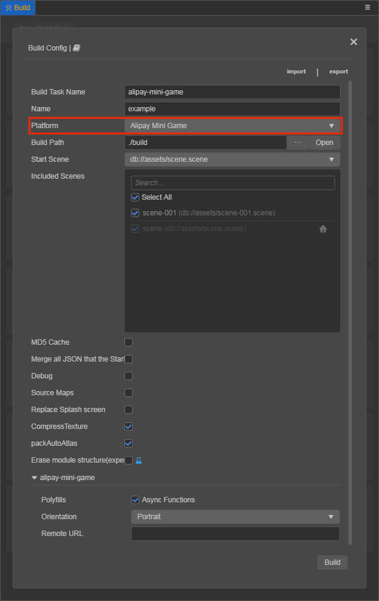
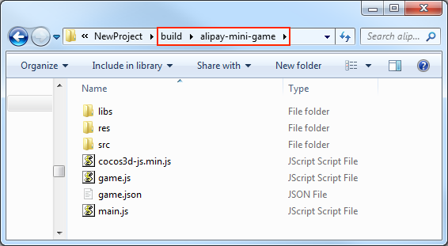

# Publish to Alipay Mini Games

Starting with v1.0.3, Cocos Creator 3D officially supports the release of games to the Alipay Mini Games.

## Environment Configuration

- Download [Alipay Mini Program Studio](https://render.alipay.com/p/f/fd-jwq8nu2a/pages/home/index.html) on the PC and install it.

- Download [Alipay](https://mobile.alipay.com/index.htm) and install it on your phone.

- The minimum supported version of Alipay on Android is **10.1.75**, on iOS is **10.1.78**.

## Release Process

**First**, use Cocos Creator 3D to open the project that needs to be released. Select **Alipay Mini Game** in the Platform dropdown of the **Build** panel, and then click **Build**.

The specific filling rules for the relevant parameter configuration are as follows:

- Polyfills

  **Polyfills** is optional. If this option is checked at build time, the resulting release package will have the corresponding polyfills in it, and will also increase the size of the package. Developers can choose polyfills on demand, but only `Async Functions` are currently available, and more will be opened later.

- Remote URL

  **Remote URL** is optional. For details, please refer to the **Resource Management for Alipay Mini Game Environment** section below.

**Second**, after the build is completed, click the **folder icon** button below the alipay-mini-game build task to open the `build` release path. If the Build Task Name is `alipay-mini-game`, you can see that the alipay mini game's project folder `alipay-mini-game` is generated in the `build` directory, which has included alipay mini game environment configuration file `game.json`.

**Third**, use Alipay Mini Program Studio to open **alipay-mini-game** directory, then you can open alipay mini game project, preview and debug game content.

## Resource Management for Alipay Mini Game Environment

Alipay Mini Game is similar to WeChat Mini Game. There are restrictions on the package. More than **4MB** of extra resources must be downloaded through the network request.

We recommend that you only save the script files in the mini game packages, and other resources are uploaded to the remote server, and downloaded from the remote server as needed. And the download, cache and version management of remote resources, Cocos Creator 3D has already done it for you. The specific implementation logic is similar to the WeChat mini game, please refer to [Resource Management for WeChat Mini Game Environment](./publish-wechatgame.md) for details.

Specifically, developers need to do:

1. Set **Remote URL** in the **Build** panel. And then click **Build**.
2. When the build is complete, upload the `build/alipay-mini-game/res` folder to the server.
3. Delete the `res` folder under the local release package directory.

## Alipay Mini Games Known issues

Currently, our adaptation of Alipay Mini Games has not been completely completed, and the following modules are still not supported:

- WebView
- VideoPlayer
- Subpackage Loading
- Custom Font

The above functions are expected to be gradually supported in future updates, and we will continue to communicate closely with Alipay Mini Games engineers to continuously optimize the adaptation effect.

## About Documentation

Since the documents related to Alipay Mini Games are currently only open to the inside, you can contact them directly if needed:

| Contacts  | Email |
| --------- | ----- |
| LiZhi     | lz98684@alibaba-inc.com      |
| HuangJiao | huangjiao.hj@alibaba-inc.com |
