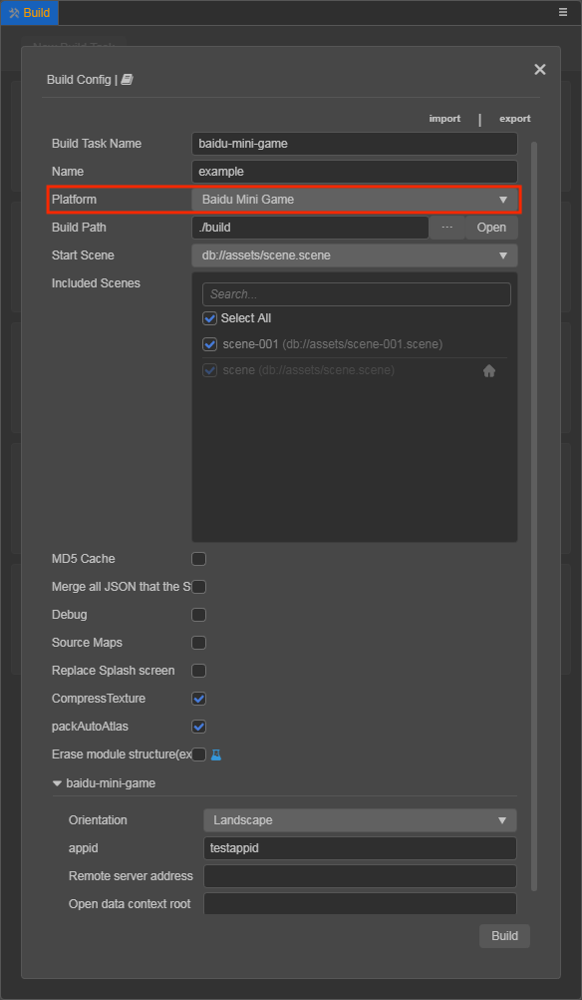

# Publish to Baidu Mini Games

Starting with v1.0.3, Cocos Creator 3D officially supports the release of games to the Baidu Mini Games.

The runtime environment of the Baidu Mini Game is an extension of the Baidu Smart Mini Program, providing a WebGL interface encapsulation based on the mini program environment, greatly improving rendering capabilities and performance. However, since these interfaces are encapsulated by the Baidu team, they are not equivalent to the browser environment.

As the engine side, in order to make the developers' workload as easy as possible, our main tasks for developers include the following:

- The engine framework adapts to the Baidu Mini Game API, pure game logic level, developers do not need any additional modifications.
- The Cocos Creator 3D editor provides a fast packaging process, released directly as a **Baidu Mini Game**, and automatically evokes the Baidu DevTools.
- Automatically load remote resources, cache resources, and cache resource version control.

In addition, the game submission, review and release process of the Baidu Mini Game, please refer to the [Baidu Mini Game Developer Documentation](https://smartprogram.baidu.com/docs/game/).

## Publish Baidu Mini Games with Cocos Creator 3D

### Prerequisites

- Download and install **Baidu DevTools** in [Baidu DevTools Documentation](https://smartprogram.baidu.com/docs/game/tutorials/howto/dev/).
- Download and install the **Baidu App** in the app store of your phone.
- Log in to [Baidu Smart Mini Progame Platform](https://smartprogram.baidu.com/developer/index.html) and find **App ID**.

  

### Release process

1. Select the **Baidu Mini Game** in the Platform of the **Build** panel, fill in the **appid**, and then click **Build**.

    

2. After the build is completed, a `baidu-mini-game` folder will be generated in the project's **build** directory (the name of the folder is based on the Build Task Name), which already contains the configuration files `game.json` and `project.swan.json` of the Baidu Mini Games environment.

    

3. Use the **Baidu DevTools** to open the `baidu-mini-game` folder, and you can preview and debug the game content of Baidu mini game project. About how ​​to use Baidu DevTools, please refer to [Baidu DevTools Documentation](https://smartprogram.baidu.com/docs/game/tutorials/howto/dev/) for details.

    

    **Note**: When preview and debugging, if there is a prompt that `The current version of the developer tool can't publish mini program, please update to the latest devtools`. This means the **appid** filled in the **Build** panel is the **appid** of the **Baidu Smart Mini Program**, not the **appid** of the **Baidu Mini Game**, please re-apply for the **appid** of the **Baidu Mini Game**.

## Resource Management for Baidu Mini Game Environment

Baidu Mini Game is similar to WeChat Mini Game, there are restrictions on the package. Anything more than 4MB of extra resources must be downloaded through the network request.

We recommend that you only save script files in mini game packages, and other resources are downloaded from remote servers. And the download, cache and version management of remote resources, Cocos Creator 3D has already done it for you. The specific implementation logic is similar to the WeChat Mini Game. For details, please refer to [Resource Management for WeChat Mini Game Environment](./publish-wechatgame.md).

At the same time, when the **MD5 Cache** feature of the engine is enabled, the URL of the file will change as the content of the file changes. When the game releases a new version, the resources of the old version will naturally become invalid in the cache, and only the new resources can be requested from the server, which achieves the effect of version control.

Specifically, developers need to do the following:

1. When building, check the **MD5 Cache** in the **Build** panel.
2. Set **Remote server address** in the **Build** panel and then click **Build**.
3. After the build is complete, upload the `build/baidu-mini-game/res` folder to the server.
4. Delete the `res` folder under the local release package directory.

**Note**:

- When Baidu loads the resources on the remote server on the physical device, it only supports access via HTTPS, so the resource file must be placed on HTTPS, otherwise the loading of the resource will fail.

- If the cache resource exceeds the environment limit of Baidu, you need to manually clear the resource. You can use the `remoteDownloader.cleanAllCaches()` and `remoteDownloader.cleanOldCaches()` interfaces to clear the cache in Baidu mini game. The former will clear all cache resources in the cache directory, please use it with caution. The latter will clear the cache resources that are not used in the current application in the cache directory.

## Baidu Mini Game Subpackage Loading

The subpackage loading method of Baidu mini game is similar to WeChat, and the package restrictions are as follows:

- The size of all subpackage of the entire Mini Game can not exceed **8MB**.
- The size of single subpackage / main package can not exceed **4MB**.

Please refer to the [SubPackage Loading](../../asset/subpackage.md) for details.

## Platform SDK Access

In addition to pure game content, the Baidu Mini Game environment also provides a very powerful native SDK interface, these interfaces are only exist in the Baidu Mini Game environment, equivalent to the third-party SDK interface of other platforms. The porting of such SDK interfaces still needs to be handled by developers at this stage. Here are some of the powerful SDK capabilities offered by Baidu Mini Game:

1. User interface: login, authorization, user information, etc.
2. Baidu cashier payment
3. Forwarding information
4. File upload and download
5. Other: images, locations, ads, device information, etc.

## Baidu Mini Games known issues

At present, our adaptation work of Baidu Mini Game is not completely finished, and the following components are not supported for the time being:

- VideoPlayer
- WebView

If needed, you can directly call Baidu's [API](https://smartprogram.baidu.com/docs/game/api/openApi/authorize/) to use.

## Reference link

- [Baidu Mini Game Registration Guide](https://smartprogram.baidu.com/docs/game/)
- [Baidu DevTools Documentation](https://smartprogram.baidu.com/docs/game/tutorials/howto/dev/)
- [Baidu Mini Game API documentation](https://smartprogram.baidu.com/docs/game/api/openApi/authorize/)
