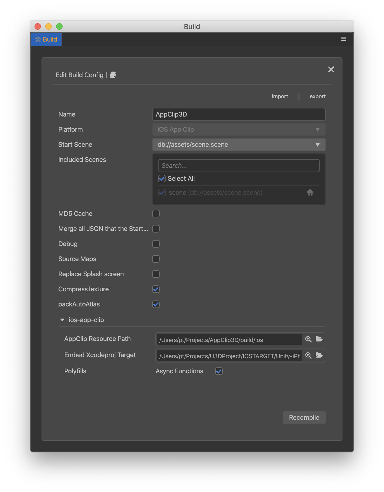

# Publish to iOS App Clip (Light App)

Starting from the v1.2.1 version, the Xcode project built on the iOS platform already includes the **App Clip** compilation target. After constructing resources through this process, the **App Clip** application can be run and/or published.

**Cocos Creator 3D** also supports embedding the game into other Xcode projects by way of **App Clip**. For example, after using other game engines to **generate** iOS project files, the **Cocos Creator 3D** project can be embedded in it through this construction process. It is convenient for players to easily experience the application through **App Clip**.

## Environment Requirements

- Xcode 12+
- iOS 14+

## Release Process

Using **Cocos Creator 3D**, open the project that needs to be released. Open the **Build and Release** panel from the **Project** menu, and select **iOS App Clip**.

## Parameters

In addition to the following two parameters, other parameters can refer to the parameter description of the native iOS build.

- **App Clip Resources Path**

  Set the path of App Clip resource storage.

- **Embed Xcodeproj Target** (optional)
  
  Specify the `.xcodeproj` path to be embedded in **App Clip**. The editor will configure **App Clips** for the iOS targets in it.

> **Note**: Since the **App Clip** has a package size limitation of `10M`, the developer can select the scene appropriately and adjust the final package size.

### Build App Clip Resources For Cocos Creator project

Before building the **App Clip**, the native iOS platform needs to be built first to generate the Xcode main project.

First, set **App Clip Resources Path** as the build directory of the **iOS main project**. The generated resource files will be stored in the subdirectory 　`ios-app-clip/`.

Next, **Embed Xcodeproj Target**,　the path does not need to be set, just leave it blank.

### Embed App Clip into Other iOS Projects

If you want to embed the **Cocos Creator 3D** target in other iOS projects, you need to specify the above two paths at the same time.

Where **App Clip Resources Path** can be specified as the same level directory or subdirectory of **Embed Xcodeproj Target** to facilitate the management of resource files.

> **Note**: in order to prevent accidental file damage, the target Xcode project will be backed up to a subdirectory of the same level directory for easy restoration.

## Construction

**After building**, you can run/debug the **App Clip** in Xcode by setting the `Bundle ID` and other steps.

## Next Steps

Refer to the [Apple](https://developer.apple.com/documentation/app_clips?language=objc) documentation to make the necessary settings for the packaging/testing/releasing of an **App Clip**.