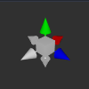

# Scene Editor

**Scene Editor** is the core working area of content creation, You will use it to choose an place the scene image, character, effect, UI and other game elements. In this working area, you can select and use the **Transform Tool** to change the *position*, *rotation*, *scale*, *size* and *other attributes of node*, also you will preview the WYSIWYG scene.

## View Introduction
### Navigation
There are some differences between 3D view and 2D view navigation. you can change between 3D view and 2D view by click the 3D/2D button on the toolbar. 3D view is used for 3D scene editing，2D is used for UI and Sprite editing.

#### 3D View
In 3D view, you can move and rotate the view of the **Scene Editor** by the following operations:
- **left mouse button + Alt**：rotate editor camera around view center.
- **middle mouse button**：pan view.
- **mouse scroll**：move editor camera back and forth.
- **right mouse button + WASD**：wandering in scene editor.
- **__F__ shortcut**：focus editor to the selected node.

#### 2D View
In 2D view, you can move and rotate the view of the **Scene Editor** by the following operations:
- **middle mouse button**：pan view.
- **mouse scroll**：scale view based on the current mouse position。
- **right mouse button**：pan view.
- **__F__ shortcut**：focus editor to the selected node.

### Coordinate System And Grid
The **Grid** in a scene is an important reference information for us to layout scene elements. For information on relationship between coordinate system and node attributes, like position, please read the [Transform](../../concepts/scene/coord.md) documentation.

### Scene Gizmo
The **Scene Gizmo** is in the upper-right corner of the **Scene** view. It indicates the view direction of editor camera in **Scene** view. You can change view direction quickly by clicking on it.

- Click on the six arrows, you can change to the *top*, *down*, *left*, *right*, *front*, *back* views separately.
- Click on the cube in the center, you can switch between *ortho* camera mode and *perspective* camera mode.

## Selecting a node
The node will be selected upon left-clicking the mouse on the node in the **Scene Editor**. You can use transform tools (like position, rotation) to do basic node operations when it is selected.

## Gizmo Operation Introduction
The main function of the **Scene Editor** is to edit and arrange the visible elements in the scene and get a WYSIWYG scene immediately. Mainly **Gizmo** tools are used to assist in the visual editing of the scene。Please review the following documentation:

- [Transform Gizmo](./transform-gizmo.md)
- [Camera Gizmo](./camera-gizmo.md)
- [Light Gizmo](./light-gizmo.md)
- [Collider Gizmo](./collider-gizmo.md)
- [ParticleSystem Gizmo](./particle-system-gizmo.md)
