# Quick start: making your first game.

The power of the __Cocos Creator 3D__ editor is that it allows developers to quickly prototype games.

Let's follow a guided tutorial to make a magical game named **One Step Two Steps**. This game tests the player's reaction ability, and chooses whether to jump one step or two steps according to traffic conditions.

You can try out the completed form of the game [here](https://gameall3d.github.io/MindYourStep_Tutorial/index.html).


## New Project
If you still don’t know how to download and run __Cocos Creator 3D__, please review the [Installation and Starting](../install/index.md) documentation.

To start a new project:

  1. Start __Cocos Creator 3D__ and then create a new project named **MindYourStep**. If you don’t know how to create a project, please read the [Hello World!](../helloworld/index.md) documentation.

  2. After creating a new project, you should see the following editor interface:

  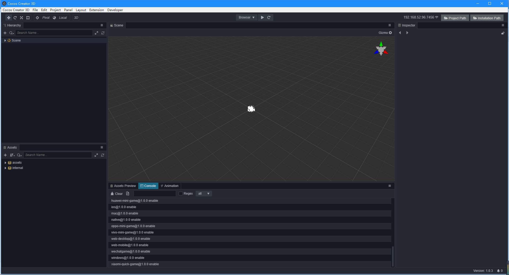

## Creating a game scene
In __Cocos Creator 3D__, **Scene** is the center for organizing game content during development and the container for presenting all game content to players. The game scene will generally include the following components:

  - Scene objects
  - Roles
  - User interface elements
  - Game logic, in the form of __scripts__, attached to __Scene__ __Nodes__ as __Components__

When the player runs the game, the game scene will be loaded. After the game scene is loaded, scripts of the included components will be automatically run. Apart from __assets__, game scenes are the foundation of all content creation. Now, to create a new __Scene__:

  1. In the **Explorer**, click to select the **assets** directory, click the plus button in the upper left corner, select the folder, and name it __Scenes__. Example:

   

  2. Click the __Scenes__ directory first (the following pictures create some common folders in advance), click the right mouse button, and select **Scene Files** from the pop-up menu. Example:

   

  3. We created a __Scene__ file named __New Scene__. After the creation, the name of the scene file __New Scene__ will be in the edit state. Rename it from __New Scene__ to __Main__.

  4. Double-click __Main__ to open this __Scene__ in **Scene Editor** and **Hierarchy Manager**.

## Adding a road
Our main character needs to run from left to right on a road composed of blocks. Let's make the road by using a built-in cube.

  1. Right click on __Scene Node__ in the **Hierarchy Manager**, then choose __Create --> 3D Object --> Cube__
  
  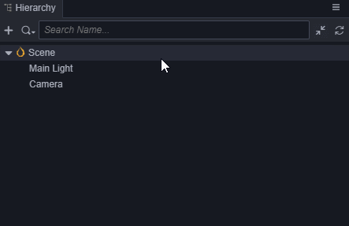

  2. Clone the cube to make two more cube with the shortcut key __Ctrl+D__.

  3. Sort the __Cubes__ by their position. 
    - First one at position __(0, -1.5, 0)__.
    - Second one at position __(1, -1.5, 0)__.
    - Third one at position __(2, -1.5, 0)__.

    The result is as follows:

   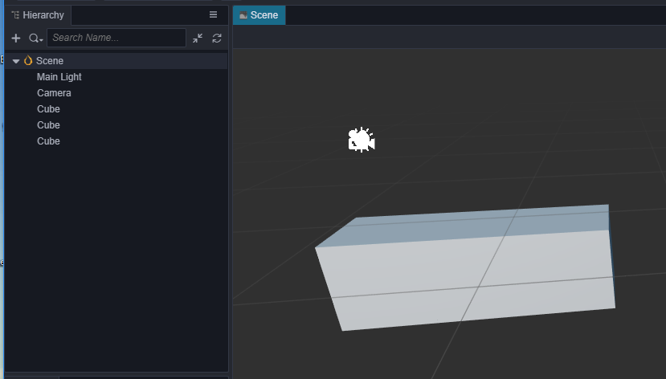

## Add a main character

### Create a main character node
__First__, create an empty node named `Player`.

__Second__, create a __Model Component__ named `Body` under the `Player` node. For convenience, let's use the builtin capsule model as the body of our main character.

  

The advantage of being divided into two nodes is that we can use the script to control the `Player` node to move the main character in the horizontal direction, and do some vertical animations on the `Body` node (such as falling after jumping in place), the two are superimposed to form a jumping animation.

__Third__, set the `Player` node to the `(0, 0, 0)` position so that it can stand on the first square.

The effect is as follows:

   

### Writing a script for the main character
It is necessary for the main character to be affected when the mouse moves. To do this a custom script needs to be written. 

#### Creating a script
1. If you have not yet created a `Scripts` folder, right-click the **assets** folder in the __Explorer__ panel, select **New -> Folder**, and rename the newly created folder to `Scripts`.
2. Right-click the `Scripts` folder and select **New -> TypeScript** to create a new, blank __TypeScript__ script. For __TypeScript__ information, you can view the [TypeScript Official Website](https://www.typescriptlang.org/).
3. Change the name of the newly created script to `PlayerController` and the double-click the script to open the code editor (in, for example, __VSCode__).

   

> **Note:** The name of the script in __Cocos Creator 3D__ is the name of the component. This name is case sensitive! If the capitalization of the component name is incorrect, the component cannot be used correctly by the name!

#### Writing script code
There are already some pre-set code blocks in the `PlayerController` script. Example:

```ts
import { _decorator, Component } from "cc";
const { ccclass, property } = _decorator;

@ccclass("PlayerController")
export class PlayerController extends Component {
    /* class member could be defined like this */
    // dummy = '';

    /* use `property` decorator if your want the member to be serializable */
    // @property
    // serializableDummy = 0;

    start () {
        // Your initialization goes here.
    }

    // update (deltaTime: number) {
    //     // Your update function goes here.
    // }
}
```

This code is the structure needed to write a __component__. Scripts with this structure are the **Components in Cocos Creator 3D**. They can be attached to nodes in the __Scene__ and provide various functions for controlling nodes. For detailed information review the [Script]( ../../scripting/index.md) documentation.

We add the monitoring of mouse events in the script, and then let the `Player` move, modify the code in `PlayerController` as follows:

```ts
import { _decorator, Component, Vec3, systemEvent, SystemEvent, EventMouse, AnimationComponent, v3 } from "cc";
const { ccclass, property } = _decorator;

@ccclass("PlayerController")
export class PlayerController extends Component {
    /* class member could be defined like this */
    // dummy = '';

    /* use `property` decorator if your want the member to be serializable */
    // @property
    // serializableDummy = 0;

    // for fake tween
    private _startJump: boolean = false;
    private _jumpStep: number = 0;
    private _curJumpTime: number = 0;
    private _jumpTime: number = 0.1;
    private _curJumpSpeed: number = 0;
    private _curPos: Vec3 = v3();
    private _deltaPos: Vec3 = v3(0, 0, 0);
    private _targetPos: Vec3 = v3();
    private _isMoving = false;

    start () {
        // Your initialization goes here.
        systemEvent.on(SystemEvent.EventType.MOUSE_UP, this.onMouseUp, this);
    }

    onMouseUp(event: EventMouse) {
        if (event.getButton() === 0) {
            this.jumpByStep(1);
        } else if (event.getButton() === 2) {
            this.jumpByStep(2);
        }

    }

    jumpByStep(step: number) {
        if (this._isMoving) {
            return;
        }
        this._startJump = true;
        this._jumpStep = step;
        this._curJumpTime = 0;
        this._curJumpSpeed = this._jumpStep / this._jumpTime;
        this.node.getPosition(this._curPos);
        Vec3.add(this._targetPos, this._curPos, v3(this._jumpStep, 0, 0));

        this._isMoving = true;
    }

    onOnceJumpEnd() {
        this._isMoving = false;
    }

    update (deltaTime: number) {
        if (this._startJump) {
            this._curJumpTime += deltaTime;
            if (this._curJumpTime > this._jumpTime) {
                // end
                this.node.setPosition(this._targetPos);
                this._startJump = false;
                this.onOnceJumpEnd();
            } else {
                // tween
                this.node.getPosition(this._curPos);
                this._deltaPos.x = this._curJumpSpeed * deltaTime;
                Vec3.add(this._curPos, this._curPos, this._deltaPos);
                this.node.setPosition(this._curPos);
            }
        }
    }
}
```

__Next__, attach the `PlayerController` component to the `Player` node. Select the `Player` node in the **Hierarchy Manager**, then click the **Add Component** button in the **Property Inspector**, select **Add User Script Component- > PlayerController** to the `Player` node to add the `PlayerController` component.

  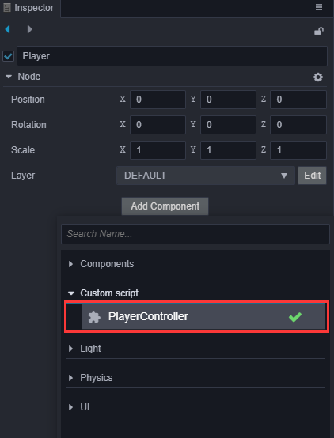

In-order to see the object at runtime, we need to adjust some parameters of the Camera in the scene, set the __position__ to __(0, 0, 13)__, and set the __Color__ to __(50, 90, 255, 255)__:

  

__Now__, click the __Play__ button. Once running, click the left and right mouse buttons on the opened web page, you can see the following screen:

  

For additional etails please refer to the [Project Preview Debugging](../../editor/preview/index.md) documentation.

### 添加角色动画
从上面运行的结果可以看到单纯对Player进行水平方向的移动是十分呆板的，我们要让Player跳跃起来才比较有感觉，我们可以通过为角色添加垂直方向的动画来达到这个效果。有关 **动画编辑器** 的更多信息，请阅读 [动画编辑器](../../editor/animation/index.md)

1. 选中场景中的Body节点，编辑器下方 **控制台** 边上的 **动画编辑器**，添加Animation组件并创建Clip，命名为oneStep。

   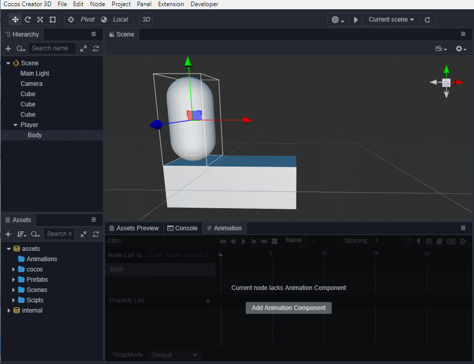

2. 进入动画编辑模式，添加position属性轨道，并添加三个关键帧，position值分别为（0，0，0）、（0，0.5，0）、（0，0，0）。

   

退出动画编辑模式前前记得要保存动画，否则做的动画就白费了。

3. 我们还可以通过 **资源管理器** 来创建Clip，下面我们创建一个名为twoStep的Clip并将它添加到Body身上的 `AnimationComponent` 上，这里为了录制方便调整了一下面板布局。

   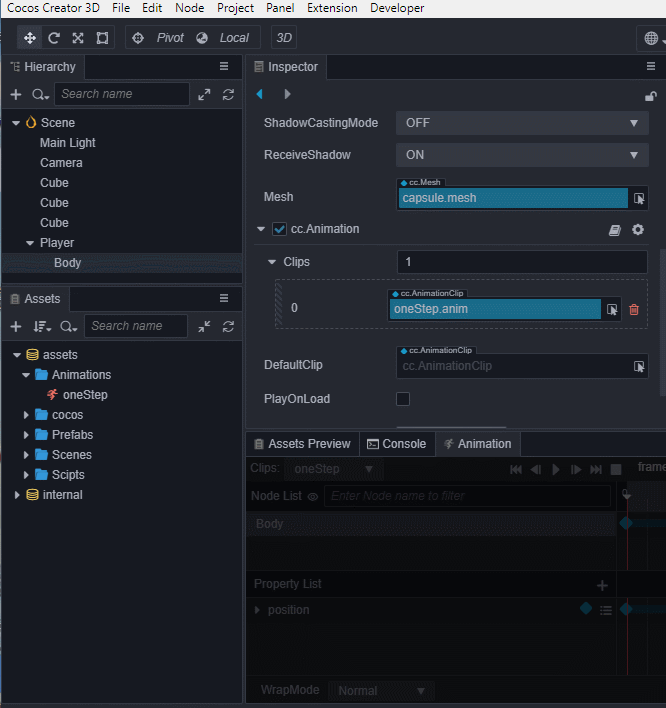
4. 进入动画编辑模式，选择并编辑twoStep的clip，类似第2步，添加三个position的关键帧，分别为（0，0，0）、（0，1，0）、（0，0，0）。

   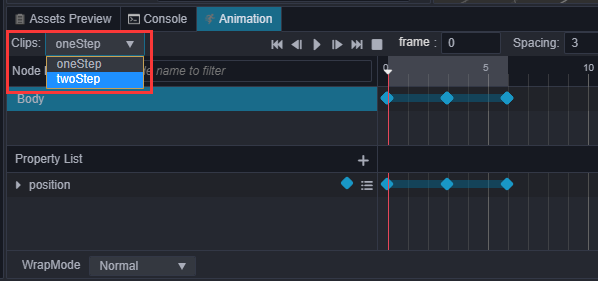

5. 在 `PlayerController组件` 中引用 `动画组件` ，我们需要在代码中根据跳的步数不同来播放不同的动画。

   首先需要 在 `PlayerController组件` 中引用Body身上的 `AnimationComponent`。
   ```ts
      @property({type: AnimationComponent})
      public BodyAnim: AnimationComponent = null;
   ```
   然后在 **属性检查器** 中将Body身上的 `AnimationComponent` 拖到这个变量上。

      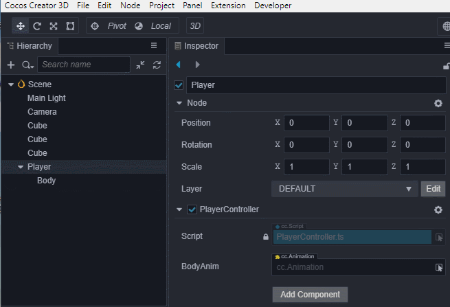

   在跳跃的函数 `jumpByStep` 中加入动画播放的代码：
   ```ts
      if (step === 1) {
         this.BodyAnim.play('oneStep');
      } else if (step === 2) {
         this.BodyAnim.play('twoStep');
      }
   ```

   点击Play按钮,点击鼠标左键、右键，可以看到新的跳跃效果：

      

## 跑道升级
为了让游戏有更久的生命力，我们需要一个很长的跑道来让Player在上面一直往右边跑，在场景中复制一堆Cube并编辑位置来组成跑道显然不是一个明智的做法，我们通过脚本完成跑道的自动创建。

### 游戏管理器（GameManager）
一般游戏都会有一个管理器，主要负责整个游戏生命周期的管理，可以将跑道的动态创建代码放到这里。在场景中创建一个名为GameManager的节点，然后在 `assets/Scripts` 中创建一个名为GameManager的ts脚本文件，并将它添加到GameManager节点上。

### 制作Prefab
对于需要重复生成的节点，我们可以将他保存成 **Prefab（预制）** 资源，作为我们动态生成节点时使用的模板。关于 **Prefab** 的更多信息，请阅读 [预制资源（Prefab）](../../asset/prefab.md)。
我们将生成跑道的基本元素`正方体（Cube）`制作成Prefab，之后可以把场景中的三个Cube都删除了。

   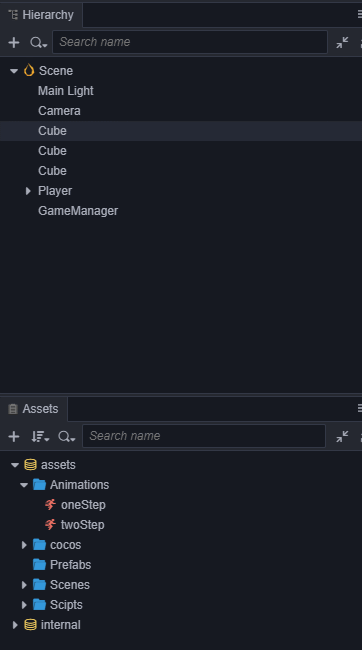

### 添加自动创建跑道代码
我们需要一个很长的跑道，理想的方法是能动态增加跑道的长度，这样可以永无止境的跑下去，这里为了方便我们先生成一个固定长度的跑道，跑道长度可以自己定义。跑道上会生成一些坑，跳到坑上就GameOver了。
将GameManager脚本中代码替换成以下代码：
```ts
import { _decorator, Component, Prefab, instantiate, Node, CCInteger} from "cc";
const { ccclass, property } = _decorator;

enum BlockType{
    BT_NONE,
    BT_STONE,
};

@ccclass("GameManager")
export class GameManager extends Component {

    @property({type: Prefab})
    public cubePrfb: Prefab = null;
    @property({type: CCInteger})
    public roadLength: Number = 50;
    private _road: number[] = [];

    start () {
        this.generateRoad();
    }

    generateRoad() {

        this.node.removeAllChildren(true);

        this._road = [];
        // startPos
        this._road.push(BlockType.BT_STONE);

        for (let i = 1; i < this.roadLength; i++) {
            if (this._road[i-1] === BlockType.BT_NONE) {
                this._road.push(BlockType.BT_STONE);
            } else {
                this._road.push(Math.floor(Math.random() * 2));
            }
        }

        for (let j = 0; j < this._road.length; j++) {
            let block: Node = this.spawnBlockByType(this._road[j]);
            if (block) {
                this.node.addChild(block);
                block.setPosition(j, -1.5, 0);
            }
        }
    }

    spawnBlockByType(type: BlockType) {
        let block = null;
        switch(type) {
            case BlockType.BT_STONE:
                block = instantiate(this.cubePrfb);
                break;
        }

        return block;
    }

    // update (deltaTime: number) {
    //     // Your update function goes here.
    // }
}
```
在GameManager的inspector面板中可以通过修改roadLength的值来改变跑道的长度。
预览可以看到现在自动生成了跑道，不过因为Camera没有跟随Player移动，所以看不到后面的跑道，我们可以将场景中的Camera设置为Player的子节点。

   

这样Camera就会跟随Player的移动而移动，现在预览可以从头跑到尾的观察生成的跑道了。

## 增加开始菜单
开始菜单是游戏不可或缺的一部分，我们可以在这里加入游戏名称、游戏简介、制作人员等信息。

1. 添加一个名为Play的按钮

   

   这个操作生成了一个Canvas节点，一个PlayButton节点和一个Label节点。因为UI组件需要在带有 `CanvasComponent` 的父节点下才能显示，所以编辑器在发现目前场景中没有带这个组件的节点时会自动添加一个。
   创建按钮后，将Label节点上的 `cc.LabelComponent` 的String属性从Button改为Play。
2. 在Canvas底下创建一个名字为StartMenu的空节点，将PlayButton拖到它底下。我们可以通过点击工具栏上的2D/3D按钮来切换到2D编辑视图下进行UI编辑操作，详细的描述请查阅 [场景编辑](../../editor/scene/index.md)。
3. 增加一个背景框，在StartMenu下新建一个名字为BG的Sprite节点，调节它的位置到PlayButton的上方，设置它的宽高为（200，200）,并将它的SpriteFrame设置为 `internal/default_ui/default_sprite_splash` 。
    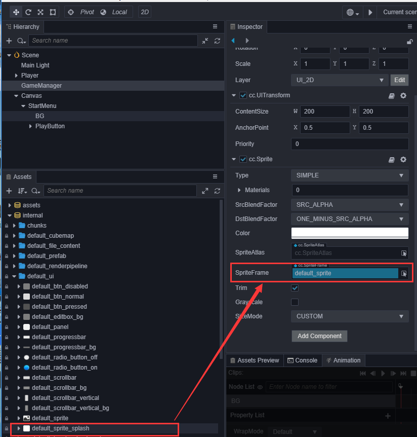
4. 添加一个名为Title的 `Label` 用于开始菜单的标题，。
   

5. 修改Title的文字，并调整Title的位置、文字大小、颜色。
   
6. 增加操作的Tips，然后调整PlayButton的位置，一个简单的开始菜单就完成了
   
7. 增加游戏状态逻辑，一般我们可以将游戏分为三个状态：
   - 初始化（Init）：显示游戏菜单，初始化一些资源。
   - 游戏进行中（Playing）：隐藏游戏菜单，玩家可以操作角度进行游戏。
   - 结束（End）：游戏结束，显示结束菜单。

   使用一个枚举（enum）类型来表示这几个状态。
   ```ts
    enum BlockType{
        BT_NONE,
        BT_STONE,
    };

    enum GameState{
        GS_INIT,
        GS_PLAYING,
        GS_END,
    };
   ```

    GameManager脚本中加入表示当前状态的私有变量
    ```ts
    private _curState: GameState = GameState.GS_INIT;
    ```

    为了在开始时不让用户操作角色，而在游戏进行时让用户操作角色，我们需要动态的开启和关闭角色对鼠标消息的监听。
    所以对PlayerController做如下的修改：
    ```ts
    start () {
        // Your initialization goes here.
        //systemEvent.on(SystemEvent.EventType.MOUSE_UP, this.onMouseUp, this);
    }

    setInputActive(active: boolean) {
        if (active) {
            systemEvent.on(SystemEvent.EventType.MOUSE_UP, this.onMouseUp, this);
        } else {
            systemEvent.off(SystemEvent.EventType.MOUSE_UP, this.onMouseUp, this);
        }
    }
    ```
    然后需要在GameManager脚本中引用PlayerController，需要在Inspector中将场景的Player拖入到这个变量中。
    ```ts
    @property({type: PlayerController})
    public playerCtrl: PlayerController = null;
    ```

    为了动态的开启\关闭开启菜单，我们需要在GameManager中引用StartMenu节点，需要在Inspector中将场景的StartMenu拖入到这个变量中。
    ```ts
    @property({type: Node})
    public startMenu: Node = null;
    ```

    

    增加状态切换代码，并修改GameManger的初始化方法：
    ```ts
    start () {
        this.curState = GameState.GS_INIT;
    }

    init() {
        this.startMenu.active = true;
        this.generateRoad();
        this.playerCtrl.setInputActive(false);
        this.playerCtrl.node.setPosition(v3());
    }

    set curState (value: GameState) {
        switch(value) {
            case GameState.GS_INIT:
                this.init();
                break;
            case GameState.GS_PLAYING:
                this.startMenu.active = false;
                setTimeout(() => {      //直接设置active会直接开始监听鼠标事件，做了一下延迟处理
                    this.playerCtrl.setInputActive(true);
                }, 0.1);
                break;
            case GameState.GS_END:
                break;
        }
        this._curState = value;
    }
    ```
8. 添加对Play按钮的事件监听。
    为了能在点击Play按钮后开始游戏，我们需要对按钮的点击事件做出响应。
    在GameManager脚本中加入响应按钮点击的代码，在点击后进入游戏的Playing状态：
    ```ts
    onStartButtonClicked() {
        this.curState = GameState.GS_PLAYING;
    }
    ```
    然后在Play按钮的Inspector上添加ClickEvents的响应函数。

    

现在预览场景就可以点击Play按钮开始游戏了。

## 添加游戏结束逻辑
目前游戏角色只是呆呆的往前跑，我们需要添加游戏规则，来让他跑的更有挑战性。
1. 角色每一次跳跃结束需要发出消息，并将自己当前所在位置做为参数发出消息
   在PlayerController中记录自己跳了多少步
   ```ts
    private _curMoveIndex = 0;
    // ...
    jumpByStep(step: number) {
        // ...

        this._curMoveIndex += step;
    }

   ```

   在每次跳跃结束发出消息：
   ```ts
    onOnceJumpEnd() {
        this._isMoving = false;
        this.node.emit('JumpEnd', this._curMoveIndex);
    }
   ```
2. 在GameManager中监听角色跳跃结束事件，并根据规则判断输赢
   增加失败和结束判断，如果跳到空方块或是超过了最大长度值都结束：
   ```ts
    checkResult(moveIndex: number) {
        if (moveIndex <= this.roadLength) {
            if (this._road[moveIndex] == BlockType.BT_NONE) {   //跳到了空方块上
                this.curState = GameState.GS_INIT;
            }
        } else {    // 跳过了最大长度
            this.curState = GameState.GS_INIT;
        }
    }
   ```
   监听角色跳跃消息，并调用判断函数：
   ```ts
    start () {
        this.curState = GameState.GS_INIT;
        this.playerCtrl.node.on('JumpEnd', this.onPlayerJumpEnd, this);
    }

    // ...
    onPlayerJumpEnd(moveIndex: number) {
        this.checkResult(moveIndex);
    }
   ```
   此时预览，会发现重新开始游戏时会有判断出错，是因为我们重新开始时没有重置PlayerController中的_curMoveIndex属性值。所以我们在PlayerController中增加一个reset函数：
   ```ts
    reset() {
        this._curMoveIndex = 0;
    }
   ```
   在GameManager的init函数调用reset来重置PlayerController的属性。
   ```ts
    init() {
        \\ ...
        this.playerCtrl.reset();
    }
   ```

## 步数显示
我们可以将当前跳的步数显示到界面上，这样在跳跃过程中看着步数的不断增长会十分有成就感。
1. 在Canvas下新建一个名为Steps的Label，调整位置、字体大小等属性。

   

2. 在GameManager中引用这个Label
   ```ts
    @property({type: LabelComponent})
    public stepsLabel: LabelComponent = null;
   ```
   
3. 将当前步数数据更新到这个Label中
   因为我们现在没有结束界面，游戏结束就跳回开始界面，所以在开始界面要看到上一次跳的步数，因此我们在进入Playing状态时，将步数重置为0。
   ```ts
    set curState (value: GameState) {
        switch(value) {
            case GameState.GS_INIT:
                this.init();
                break;
            case GameState.GS_PLAYING:
                this.startMenu.active = false;
                this.stepsLabel.string = '0';   // 将步数重置为0
                setTimeout(() => {      //直接设置active会直接开始监听鼠标事件，做了一下延迟处理
                    this.playerCtrl.setInputActive(true);
                }, 0.1);
                break;
            case GameState.GS_END:
                break;
        }
        this._curState = value;
    }
   ```

    在响应角色跳跃的函数中，将步数更新到Label控件上
    ```ts
    onPlayerJumpEnd(moveIndex: number) {
        this.stepsLabel.string = '' + moveIndex;
        this.checkResult(moveIndex);
    }
    ```


## 光照和阴影
有光的地方就会有影子，光和影构成明暗交错的3D世界。接下来我们为角色加上简单的影子。
### 开启阴影
1. 在 **层级管理器** 中点击最顶部的 `Scene` 节点，将planarShadows选项中的Enabled打钩，并修改Distance和Normal参数

    

2. 点击Player节点下的Body节点，将 `cc.ModelComponent` 下的ShadowCastingMode设置为ON。
    

此时在场景编辑器中会看到一个阴影面片，预览会发现看不到这个阴影，因为它在模型的正后方，被胶囊体盖住了。


### 调整光照
新建场景时默认会添加一个 `DirctionalLight` ，由这个平行光计算阴影，所以为了让阴影换个位置显示，我们可以调整这个平行光的方向。
在 **层级管理器** 中点击选中 `Main Light` 节点，调整Rotation参数为（-10，17，0）。

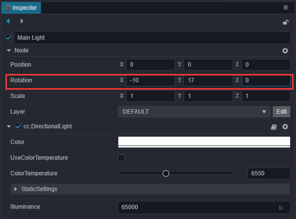

预览可以看到影子效果：


## 添加主角模型
做为一个官方教程，用胶囊体当主角显的有点寒碜，所以我们花（低）重（预）金（算）制作了一个Cocos主角。

### 导入模型资源
从原始资源导入模型、材质、动画等资源不是本篇基础教程的重点，所以这边直接使用已经导入工程的资源。
将[项目工程](https://github.com/cocos-creator/tutorial-mind-your-step-3d)中assets目录下的cocos文件夹拷贝到你自己工程的assets目录下。

### 添加到场景中
在cocos文件中已经包含了一个名为Cocos的Prefab，将它拖到场景中Player下的Body节点中。


此时会发现模型有些暗，可以加个聚光灯，以突出它锃光瓦亮的脑门。

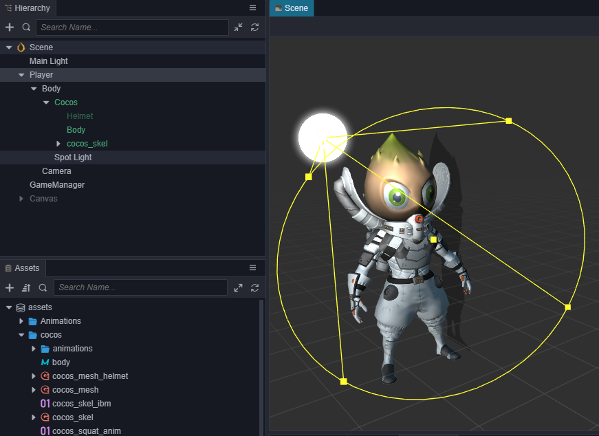

### 添加跳跃动画
现在预览可以看到主角初始会有一个待机动画，但是跳跃时还是用这个待机动画会显得很不协调，所以我们在跳跃过程中换成跳跃的动画。
在 `PlayerController` 类中添加一个引用模型动画的变量：

```ts
    @property({type: SkeletalAnimationComponent})
    public CocosAnim: SkeletalAnimationComponent = null;
```
然后在`Inspector`中要将Cocos节点拖入这个变量里。
在jumpByStep函数中播放跳跃动画

```ts
    jumpByStep(step: number) {
        if (this._isMoving) {
            return;
        }
        this._startJump = true;
        this._jumpStep = step;
        this._curJumpTime = 0;
        this._curJumpSpeed = this._jumpStep / this._jumpTime;
        this.node.getPosition(this._curPos);
        Vec3.add(this._targetPos, this._curPos, v3(this._jumpStep, 0, 0));

        this._isMoving = true;

        this.CocosAnim.getState('cocos_anim_jump').speed = 3.5; //跳跃动画时间比较长，这里加速播放
        this.CocosAnim.play('cocos_anim_jump'); //播放跳跃动画
        if (step === 1) {
            //this.BodyAnim.play('oneStep');
        } else if (step === 2) {
            this.BodyAnim.play('twoStep');
        }

        this._curMoveIndex += step;
    }
```

在onOnceJumpEnd函数中让主角变为待机状态，播放待机动画。

```ts
    onOnceJumpEnd() {
        this._isMoving = false;
        this.CocosAnim.play('cocos_anim_idle');
        this.node.emit('JumpEnd', this._curMoveIndex);
    }
```

预览效果：


## 最终代码
PlayerController.ts

```ts
import { _decorator, Component, Vec3, systemEvent, SystemEvent, EventMouse, AnimationComponent, SkeletalAnimationComponent, v3 } from "cc";
const { ccclass, property } = _decorator;

@ccclass("PlayerController")
export class PlayerController extends Component {

    @property({type: AnimationComponent})
    public BodyAnim: AnimationComponent = null;
    @property({type: SkeletalAnimationComponent})
    public CocosAnim: SkeletalAnimationComponent = null;

    // for fake tween
    private _startJump: boolean = false;
    private _jumpStep: number = 0;
    private _curJumpTime: number = 0;
    private _jumpTime: number = 0.3;
    private _curJumpSpeed: number = 0;
    private _curPos: Vec3 = v3();
    private _deltaPos: Vec3 = v3(0, 0, 0);
    private _targetPos: Vec3 = v3();
    private _isMoving = false;
    private _curMoveIndex = 0;

    start () {
    }

    reset() {
        this._curMoveIndex = 0;
    }

    setInputActive(active: boolean) {
        if (active) {
            systemEvent.on(SystemEvent.EventType.MOUSE_UP, this.onMouseUp, this);
        } else {
            systemEvent.off(SystemEvent.EventType.MOUSE_UP, this.onMouseUp, this);
        }
    }

    onMouseUp(event: EventMouse) {
        if (event.getButton() === 0) {
            this.jumpByStep(1);
        } else if (event.getButton() === 2) {
            this.jumpByStep(2);
        }

    }

    jumpByStep(step: number) {
        if (this._isMoving) {
            return;
        }
        this._startJump = true;
        this._jumpStep = step;
        this._curJumpTime = 0;
        this._curJumpSpeed = this._jumpStep / this._jumpTime;
        this.node.getPosition(this._curPos);
        Vec3.add(this._targetPos, this._curPos, v3(this._jumpStep, 0, 0));

        this._isMoving = true;

        this.CocosAnim.getState('cocos_anim_jump').speed = 3.5; //跳跃动画时间比较长，这里加速播放
        this.CocosAnim.play('cocos_anim_jump'); //播放跳跃动画
        if (step === 1) {
            //this.BodyAnim.play('oneStep');
        } else if (step === 2) {
            this.BodyAnim.play('twoStep');
        }

        this._curMoveIndex += step;
    }

    onOnceJumpEnd() {
        this._isMoving = false;
        this.CocosAnim.play('cocos_anim_idle');
        this.node.emit('JumpEnd', this._curMoveIndex);
    }

    update (deltaTime: number) {
        if (this._startJump) {
            this._curJumpTime += deltaTime;
            if (this._curJumpTime > this._jumpTime) {
                // end
                this.node.setPosition(this._targetPos);
                this._startJump = false;
                this.onOnceJumpEnd();
            } else {
                // tween
                this.node.getPosition(this._curPos);
                this._deltaPos.x = this._curJumpSpeed * deltaTime;
                Vec3.add(this._curPos, this._curPos, this._deltaPos);
                this.node.setPosition(this._curPos);
            }
        }
    }
}
```

GameManager.ts

```ts
import { _decorator, Component, Prefab, instantiate, Node, LabelComponent, CCInteger, v3} from "cc";
import { PlayerController } from "./PlayerController";
const { ccclass, property } = _decorator;

enum BlockType{
    BT_NONE,
    BT_STONE,
};

enum GameState{
    GS_INIT,
    GS_PLAYING,
    GS_END,
};

@ccclass("GameManager")
export class GameManager extends Component {

    @property({type: Prefab})
    public cubePrfb: Prefab = null;
    @property({type: CCInteger})
    public roadLength: Number = 50;
    private _road: number[] = [];
    @property({type: Node})
    public startMenu: Node = null;
    @property({type: PlayerController})
    public playerCtrl: PlayerController = null;
    private _curState: GameState = GameState.GS_INIT;
    @property({type: LabelComponent})
    public stepsLabel: LabelComponent = null;

    start () {
        this.curState = GameState.GS_INIT;
        this.playerCtrl.node.on('JumpEnd', this.onPlayerJumpEnd, this);
    }

    init() {
        this.startMenu.active = true;
        this.generateRoad();
        this.playerCtrl.setInputActive(false);
        this.playerCtrl.node.setPosition(v3());
        this.playerCtrl.reset();
    }

    set curState (value: GameState) {
        switch(value) {
            case GameState.GS_INIT:
                this.init();
                break;
            case GameState.GS_PLAYING:
                this.startMenu.active = false;
                this.stepsLabel.string = '0';   // 将步数重置为0
                setTimeout(() => {      //直接设置active会直接开始监听鼠标事件，做了一下延迟处理
                    this.playerCtrl.setInputActive(true);
                }, 0.1);
                break;
            case GameState.GS_END:
                break;
        }
        this._curState = value;
    }

    generateRoad() {

        this.node.removeAllChildren();

        this._road = [];
        // startPos
        this._road.push(BlockType.BT_STONE);

        for (let i = 1; i < this.roadLength; i++) {
            if (this._road[i-1] === BlockType.BT_NONE) {
                this._road.push(BlockType.BT_STONE);
            } else {
                this._road.push(Math.floor(Math.random() * 2));
            }
        }

        for (let j = 0; j < this._road.length; j++) {
            let block: Node = this.spawnBlockByType(this._road[j]);
            if (block) {
                this.node.addChild(block);
                block.setPosition(j, -1.5, 0);
            }
        }
    }

    spawnBlockByType(type: BlockType) {
        let block = null;
        switch(type) {
            case BlockType.BT_STONE:
                block = instantiate(this.cubePrfb);
                break;
        }

        return block;
    }

    onStartButtonClicked() {
        this.curState = GameState.GS_PLAYING;
    }

    checkResult(moveIndex: number) {
        if (moveIndex <= this.roadLength) {
            if (this._road[moveIndex] == BlockType.BT_NONE) {   //跳到了空方块上
                this.curState = GameState.GS_INIT;
            }
        } else {    // 跳过了最大长度
            this.curState = GameState.GS_INIT;
        }
    }

    onPlayerJumpEnd(moveIndex: number) {
        this.stepsLabel.string = '' + moveIndex;
        this.checkResult(moveIndex);
    }

    // update (deltaTime: number) {
    //     // Your update function goes here.
    // }
}
```

## 总结
恭喜您完成了用 Cocos Creator 3D 制作的第一个游戏！在 [这里](https://github.com/cocos-creator/tutorial-mind-your-step-3d) 可以下载完整的工程，希望这篇快速入门教程能帮助您了解 Cocos Creator 3D 游戏开发流程中的基本概念和工作流程。如果您对编写和学习脚本编程不感兴趣，也可以直接从完成版的项目工程中把写好的脚本复制过来使用。

接下来您还可以继续完善游戏的各方各面，以下是一些推荐的改进方向：
- 为游戏增加难度，当角色在原地停留1秒就算失败
- 改为无限跑道，动态的删除已经跑过的跑道，延长后面的跑道。
- 增加游戏音效
- 为游戏增加结束菜单界面，统计玩家跳跃步数和所花的时间
- 用更漂亮的资源替换角色和跑道
- 可以增加一些可拾取物品来引导玩家“犯错”
- 添加一些粒子特效，例如角色运动时的拖尾、落地时的灰尘
- 为触屏设备加入两个操作按钮来代替鼠标左右键操作

此外如果希望将完成的游戏发布到服务器上分享给好友玩耍，可以阅读 [发布工作流](../../editor/publish/index.md) 一节的内容。