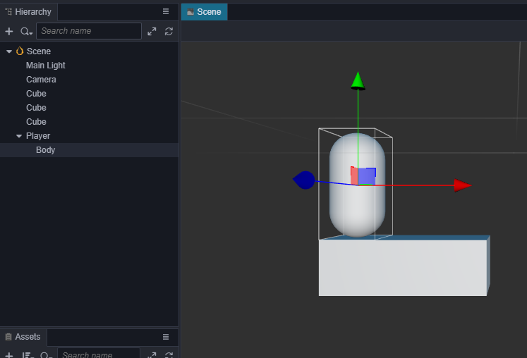
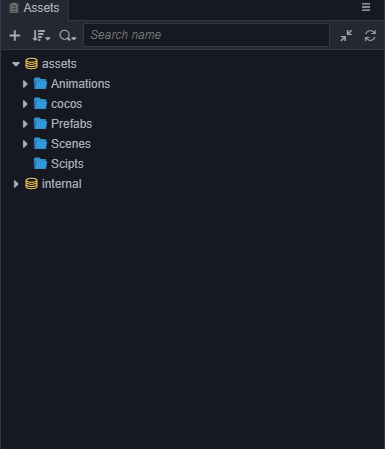
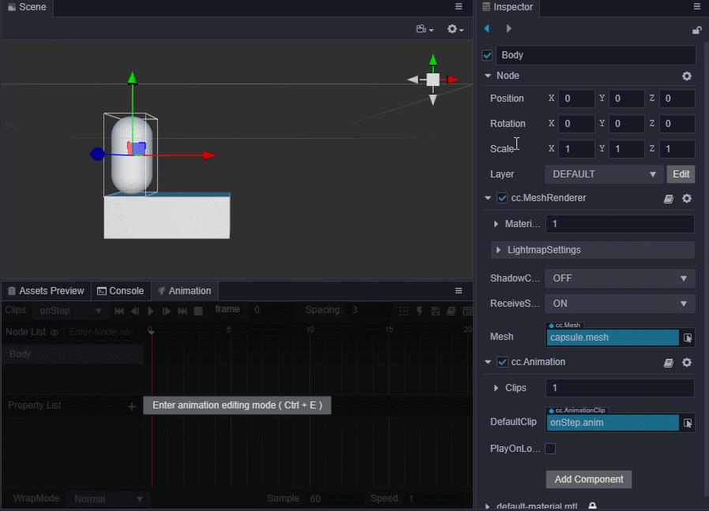
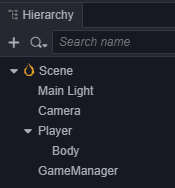
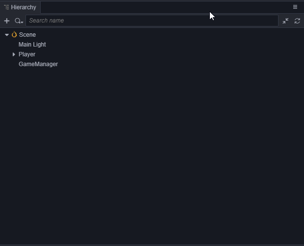
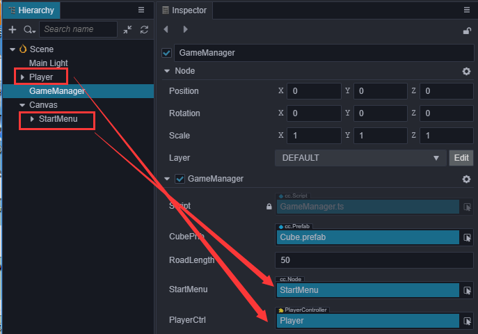

# Quick start: making your first game.

The power of the __Cocos Creator 3D__ editor is that it allows developers to quickly prototype games.

Let's follow a guided tutorial to make a magical game named **One Step Two Steps**. This game tests the player's reaction ability, and chooses whether to jump one step or two steps according to traffic conditions.

You can try out the completed form of the game [here](https://gameall3d.github.io/MindYourStep_Tutorial/index.html).


## New Project
If you still don’t know how to download and run __Cocos Creator 3D__, please review the [Installation and Starting](../install/index.md) documentation.

To start a new project:

  1. Start __Cocos Creator 3D__ and then create a new project named **MindYourStep**. If you don’t know how to create a project, please read the [Hello World!](../helloworld/index.md) documentation.

  2. After creating a new project, you should see the following editor interface:

  

## Creating a game scene
In __Cocos Creator 3D__, **Scene** is the center for organizing game content during development and the container for presenting all game content to players. The game scene will generally include the following components:

  - Scene objects
  - Roles
  - User interface elements
  - Game logic, in the form of __scripts__, attached to __Scene__ __Nodes__ as __Components__

When the player runs the game, the game scene will be loaded. After the game scene is loaded, scripts of the included components will be automatically run. Apart from __assets__, game scenes are the foundation of all content creation. Now, to create a new __Scene__:

  1. In the **Explorer**, click to select the **assets** directory, click the plus button in the upper left corner, select the folder, and name it __Scenes__. Example:

   

  2. Click the __Scenes__ directory first (the following pictures create some common folders in advance), click the right mouse button, and select **Scene Files** from the pop-up menu. Example:

   

  3. We created a __Scene__ file named __New Scene__. After the creation, the name of the scene file __New Scene__ will be in the edit state. Rename it from __New Scene__ to __Main__.

  4. Double-click __Main__ to open this __Scene__ in **Scene Editor** and **Hierarchy Manager**.

## Adding a road
Our main character needs to run from left to right on a road composed of cubes (blocks). Let's make the road by using a built-in cube.

  1. Right click on __Scene Node__ in the **Hierarchy Manager**, then choose __Create --> 3D Object --> Cube__
  
  

  2. Clone the cube to make two more cube with the shortcut key __Ctrl+D__.

  3. Sort the __Cubes__ by their position. 
    - First one at position __(0, -1.5, 0)__.
    - Second one at position __(1, -1.5, 0)__.
    - Third one at position __(2, -1.5, 0)__.

    The result is as follows:

   

## Add a main character

### Create a main character node
__First__, create an empty node named `Player`.

__Second__, create a __Model Component__ named `Body` under the `Player` node. For convenience, let's use the builtin capsule model as the body of our main character.

  

The advantage of being divided into two nodes is that we can use the script to control the `Player` node to move the main character in the horizontal direction, and do some vertical animations on the `Body` node (such as falling after jumping in place), the two are superimposed to form a jumping animation.

__Third__, set the `Player` node to the `(0, 0, 0)` position so that it can stand on the first square.

The effect is as follows:

   

### Writing a script for the main character
It is necessary for the main character to be affected when the mouse moves. To do this a custom script needs to be written. 

#### Creating a script
1. If you have not yet created a `Scripts` folder, right-click the **assets** folder in the __Explorer__ panel, select **New -> Folder**, and rename the newly created folder to `Scripts`.
2. Right-click the `Scripts` folder and select **New -> TypeScript** to create a new, blank __TypeScript__ script. For __TypeScript__ information, you can view the [TypeScript Official Website](https://www.typescriptlang.org/).
3. Change the name of the newly created script to `PlayerController` and the double-click the script to open the code editor (in, for example, __VSCode__).

   

> **Note:** The name of the script in __Cocos Creator 3D__ is the name of the component. This name is case sensitive! If the capitalization of the component name is incorrect, the component cannot be used correctly by the name!

#### Writing script code
There are already some pre-set code blocks in the `PlayerController` script. Example:

```ts
import { _decorator, Component } from "cc";
const { ccclass, property } = _decorator;

@ccclass("PlayerController")
export class PlayerController extends Component {
    /* class member could be defined like this */
    // dummy = '';

    /* use `property` decorator if your want the member to be serializable */
    // @property
    // serializableDummy = 0;

    start () {
        // Your initialization goes here.
    }

    // update (deltaTime: number) {
    //     // Your update function goes here.
    // }
}
```

This code is the structure needed to write a __component__. Scripts with this structure are the **Components in Cocos Creator 3D**. They can be attached to nodes in the __Scene__ and provide various functions for controlling nodes. For detailed information review the [Script]( ../../scripting/index.md) documentation.

We add the monitoring of mouse events in the script, and then let the `Player` move, modify the code in `PlayerController` as follows:

```ts
import { _decorator, Component, Vec3, systemEvent, SystemEvent, EventMouse, AnimationComponent, v3 } from "cc";
const { ccclass, property } = _decorator;

@ccclass("PlayerController")
export class PlayerController extends Component {
    /* class member could be defined like this */
    // dummy = '';

    /* use `property` decorator if your want the member to be serializable */
    // @property
    // serializableDummy = 0;

    // for fake tween
    private _startJump: boolean = false;
    private _jumpStep: number = 0;
    private _curJumpTime: number = 0;
    private _jumpTime: number = 0.1;
    private _curJumpSpeed: number = 0;
    private _curPos: Vec3 = v3();
    private _deltaPos: Vec3 = v3(0, 0, 0);
    private _targetPos: Vec3 = v3();
    private _isMoving = false;

    start () {
        // Your initialization goes here.
        systemEvent.on(SystemEvent.EventType.MOUSE_UP, this.onMouseUp, this);
    }

    onMouseUp(event: EventMouse) {
        if (event.getButton() === 0) {
            this.jumpByStep(1);
        } else if (event.getButton() === 2) {
            this.jumpByStep(2);
        }

    }

    jumpByStep(step: number) {
        if (this._isMoving) {
            return;
        }
        this._startJump = true;
        this._jumpStep = step;
        this._curJumpTime = 0;
        this._curJumpSpeed = this._jumpStep / this._jumpTime;
        this.node.getPosition(this._curPos);
        Vec3.add(this._targetPos, this._curPos, v3(this._jumpStep, 0, 0));

        this._isMoving = true;
    }

    onOnceJumpEnd() {
        this._isMoving = false;
    }

    update (deltaTime: number) {
        if (this._startJump) {
            this._curJumpTime += deltaTime;
            if (this._curJumpTime > this._jumpTime) {
                // end
                this.node.setPosition(this._targetPos);
                this._startJump = false;
                this.onOnceJumpEnd();
            } else {
                // tween
                this.node.getPosition(this._curPos);
                this._deltaPos.x = this._curJumpSpeed * deltaTime;
                Vec3.add(this._curPos, this._curPos, this._deltaPos);
                this.node.setPosition(this._curPos);
            }
        }
    }
}
```

__Next__, attach the `PlayerController` component to the `Player` node. Select the `Player` node in the **Hierarchy Manager**, then click the **Add Component** button in the **Property Inspector**, select **Add User Script Component- > PlayerController** to the `Player` node to add the `PlayerController` component.

  

In-order to see the object at runtime, we need to adjust some parameters of the Camera in the scene, set the __position__ to __(0, 0, 13)__, and set the __Color__ to __(50, 90, 255, 255)__:

  

__Now__, click the __Play__ button. Once running, click the left and right mouse buttons on the opened web page, you can see the following screen:

  

For additional etails please refer to the [Project Preview Debugging](../../editor/preview/index.md) documentation.

### Adding character animations
So far, the `Player` can be moved in a horizontal direction. This is a start but not god enough. `Player` must become more life-like. We can achieve this effect by adding a vertical animation to the character. 

> **Note**: Before proceeding, please read the [Animation Editor](../../editor/animation/index.md) documentation.

After reading and understanding about the __Animation Editor__ let's start implementating character animations!

1. Locate the **Animation Editor** on the side of the editor below the **Console**. Select the `Body` node in the __Scene__, to add an __Animation Component__ and create a new __Animation Clip__. Give this new _Animation Clip__ a name of `oneStep`.

   

2. Enter __animation editing mode__ in-order to add the __position attribute__. Next, add three __key frames__ with position values ​​of __(0, 0, 0)__, __(0, 0.5, 0)__, __(0, 0, 0)__.

   

> **Note**: Remember to save the animation before exiting the animation editing mode, otherwise the animation will be lost.

3. __Animation Clips__ can also be created using the **Explorer** panel. Below we create a __Clip__ named `twoStep` and add it to the __AnimationComponent__ on `Body`.

   

> **Note**: The panel layout was adjusted for recording convenience.

4. Enter the __animation editing mode__, select and edit the `twoStep` clip. Similar to the second step, add three key frames at positions __(0, 0, 0)__, __(0, 1, 0)__, __(0, 0, 0)__.

   

5. Reference the __AnimationComponent__ in the` PlayerController` Component, as different animations need to be played according to the number of steps `Player` jumped.

   First, reference the __AnimationComponent__ on the `Body` in the `PlayerController` component.
   ```ts
      @property({type: AnimationComponent})
      public BodyAnim: AnimationComponent = null;
   ```
   Then in the ** Property Inspector **, drag the `AnimationComponent` on Body to this variable.

    

    Add the animation playback code to the jump function `jumpByStep`:

   ```ts
      if (step === 1) {
         this.BodyAnim.play('oneStep');
      } else if (step === 2) {
         this.BodyAnim.play('twoStep');
      }
   ```

   Click the __Play__ button. When playing click the left and right mouse buttons, you can see the new jump effect in action:

      

## Upgrade the road
In-order to make the gameplay longer and more enjoyable, we need a long stretch of road to let the `Player` run all the way to the right. Copying a bunch of cubes in the __Scene__ and editing the position to form the road is not a wise practice. We can complete this by using a script to automatically create the road pieces.

### A "Game Manager" can help.
Most games have a __manager__, which is mainly responsible for the management of the entire game life cycle. You can put the dynamic creation code of the road in this same manager. Create a node named `GameManager` in the __Scene__. Next, create a TypesScript file named `GameManager` in `assets/Scripts` and add it to the `GameManager` node.

### Making a Prefab
For the node that needs to be generated repeatedly, we can save it as a **Prefab (prefabricated)** resource. This means it can be used as a template when we dynamically generate the node.

> **Note**: Before proceeding, please read the [Prefab Resources](../../asset/prefab.md) documentation.

It is necesssary to make the basic element `cube` of the road into a __Prefab__, and then we can delete all three cubes in the __Scene__.

   

### Adding the automatic road creation
A very long road is needed. The ideal method is to dynamically increase the length of the road, so that the `Player` can run forever. First, generate a fixed-length road with a length that is arbitraty. Replace the code in the `GameManager` script with the following code:

```ts
import { _decorator, Component, Prefab, instantiate, Node, CCInteger} from "cc";
const { ccclass, property } = _decorator;

enum BlockType{
    BT_NONE,
    BT_STONE,
};

@ccclass("GameManager")
export class GameManager extends Component {

    @property({type: Prefab})
    public cubePrfb: Prefab = null;
    @property({type: CCInteger})
    public roadLength: Number = 50;
    private _road: number[] = [];

    start () {
        this.generateRoad();
    }

    generateRoad() {

        this.node.removeAllChildren(true);

        this._road = [];
        // startPos
        this._road.push(BlockType.BT_STONE);

        for (let i = 1; i < this.roadLength; i++) {
            if (this._road[i-1] === BlockType.BT_NONE) {
                this._road.push(BlockType.BT_STONE);
            } else {
                this._road.push(Math.floor(Math.random() * 2));
            }
        }

        for (let j = 0; j < this._road.length; j++) {
            let block: Node = this.spawnBlockByType(this._road[j]);
            if (block) {
                this.node.addChild(block);
                block.setPosition(j, -1.5, 0);
            }
        }
    }

    spawnBlockByType(type: BlockType) {
        let block = null;
        switch(type) {
            case BlockType.BT_STONE:
                block = instantiate(this.cubePrfb);
                break;
        }

        return block;
    }

    // update (deltaTime: number) {
    //     // Your update function goes here.
    // }
}
```

The length of the road can be changed by modifying the value of `roadLength` in the __Properties__ panel for the `GameManager`.

When previewing, the road is now automatically generated, but because the __Camera__ does not follow the `Player`, the road behind cannot be seen. Setting the __Camera__ in the __Scene__ as a child node of the `Player` can help solve this.

  

The Camera will follow the Player's movement.

## Adding a start menu
The __start menu__ is an indispensable part of most any game. Add the game name, game introduction, production staff and other information here.

1. Add a button called `Play`

    

  This operation creates a `Canvas` node, a `PlayButton` node, and a `Label` node. Because the UI component needs to be displayed under the parent node with `CanvasComponent`, the editor will automatically add one when it finds that there is not a node with this component in the current __Scene__. After creating the button, change the `String` property of `cc.LabelComponent` on the `Label` node from `Button` to `Play.`

2. Create an empty node named `StartMenu` under `Canvas` and drag `PlayButton` under it. We can switch to the 2D editing view for UI editing operations by clicking the 2D/3D button on the toolbar.

  > **Note**: 2D View is this toolbar button . 

  > **Note**: Before proceeding, please read the [Scene Editing](../../editor/scene/index.md) documentation.

3. Add a background frame, create a Sprite node named `BG` under `StartMenu`, adjust its position to above the `PlayButton`, set its width and height to __(200, 200)__, and set its SpriteFrame to `internal/default_ui/ default_sprite_splash`.

    

4. Add a __Label__ called `Title` for the title of the start menu.

   

5. Modify the text for `Title` and adjust it's *position*, *text size* and *color*.
   
   

6. Adjust the position of the `PlayButton`, and a simple start menu is complete.
   
   

7. Add game state logic, generally it can be divided into three states:
   - **Init**: Display the game menu and initialize some resources.
   - **Playing**: Hide the game menu, players can operate the game.
   - **End**: End the game and display the ending menu.

   Use an enum type to represent these states.

   ```ts
    enum BlockType{
        BT_NONE,
        BT_STONE,
    };

    enum GameState{
        GS_INIT,
        GS_PLAYING,
        GS_END,
    };
   ```

    Add a private variable that represents the current state to the `GameManager` script

    ```ts
    private _curState: GameState = GameState.GS_INIT;
    ```

    In-order not to let the user operate the character at the beginning, but to allow the user to operate the character while the game is in progress, we need to dynamically turn on and off the character's monitoring of mouse messages. This can be done with the following changes to `PlayerController`:

    ```ts
    start () {
        // Your initialization goes here.
        //systemEvent.on(SystemEvent.EventType.MOUSE_UP, this.onMouseUp, this);
    }

    setInputActive(active: boolean) {
        if (active) {
            systemEvent.on(SystemEvent.EventType.MOUSE_UP, this.onMouseUp, this);
        } else {
            systemEvent.off(SystemEvent.EventType.MOUSE_UP, this.onMouseUp, this);
        }
    }
    ```

    Next, reference `PlayerController` in the `GameManager` script. Drag the `Player` of the scene into this variable in the __Inspector__ panel.
    
    ```ts
    @property({type: PlayerController})
    public playerCtrl: PlayerController = null;
    ```

    In-order to dynamically open/close the open menu, the `StartMenu` needs to be referenced in the `GameManager`. Drag the `StartMenu` of the scene into this variable in the __Inspector__ panel.

    ```ts
    @property({type: Node})
    public startMenu: Node = null;
    ```

    

    Modify the code in the `GameManger`:

    ```ts
    start () {
        this.curState = GameState.GS_INIT;
    }

    init() {
        this.startMenu.active = true;
        this.generateRoad();
        this.playerCtrl.setInputActive(false);
        this.playerCtrl.node.setPosition(v3());
    }

    set curState (value: GameState) {
        switch(value) {
            case GameState.GS_INIT:
                this.init();
                break;
            case GameState.GS_PLAYING:
                this.startMenu.active = false;
                setTimeout(() => {      //直接设置active会直接开始监听鼠标事件，做了一下延迟处理
                    this.playerCtrl.setInputActive(true);
                }, 0.1);
                break;
            case GameState.GS_END:
                break;
        }
        this._curState = value;
    }
    ```

8. Add event monitoring to the `Play` button. In-order to start the game after clicking the `Play` button, the button needs to respond to click events. Add code that responds to the button click in the `GameManager` script, and click to enter the game's `Playing` state:
    
    ```ts
    onStartButtonClicked() {
        this.curState = GameState.GS_PLAYING;
    }
    ```
    
    Next, add the response function of __Click Events__ in the __Inspector__ panbel of the `Play` button.

    

Now preview the scene by clicking the `Play` button to start the game.

## Adding game end logic
The game character is just running forward, with no purpose. Let's add game rules to make the game play more challenging.

1. The character needs to send a message at the end of each jump, that records how many steps the character jumped and its current position. This can be done in `PlayerController`.

   ```ts
    private _curMoveIndex = 0;
    // ...
    jumpByStep(step: number) {
        // ...

        this._curMoveIndex += step;
    }
   ```

   Send a message at the end of each jump:
   ```ts
    onOnceJumpEnd() {
        this._isMoving = false;
        this.node.emit('JumpEnd', this._curMoveIndex);
    }
   ```

2. Monitor the character's jumping end event in `GameManager`, and judge the winning or losing according to the rules.
  
  Increase the failure and end judgment, if it jumps to an empty square or exceeds the maximum length value, it will end:

   ```ts
    checkResult(moveIndex: number) {
        if (moveIndex <= this.roadLength) {
            // Jump to the empty square
            if (this._road[moveIndex] == BlockType.BT_NONE) {   
                this.curState = GameState.GS_INIT;
            }
        } else {    // skipped the maximum length
            this.curState = GameState.GS_INIT;
        }
    }
   ```

   Monitor the character'S jump message and call a function to decide:

   ```ts
    start () {
        this.curState = GameState.GS_INIT;
        this.playerCtrl.node.on('JumpEnd', this.onPlayerJumpEnd, this);
    }

    // ...
    onPlayerJumpEnd(moveIndex: number) {
        this.checkResult(moveIndex);
    }
   ```

   If you preview playing the game now, there will be a judgment error when restarting the game. This is because we did not reset the `_curMoveIndex` property value in `PlayerController` when the game restarts. To fix this, add a reset function in `PlayerController`.

   ```ts
    reset() {
        this._curMoveIndex = 0;
    }
   ```
   Call `reset()` in the `init` function of `GameManager` to reset the properties of `PlayerController`.

   ```ts
    init() {
        \\ ...
        this.playerCtrl.reset();
    }
   ```

## 步数显示
我们可以将当前跳的步数显示到界面上，这样在跳跃过程中看着步数的不断增长会十分有成就感。

1. 在Canvas下新建一个名为Steps的Label，调整位置、字体大小等属性。

   

2. 在GameManager中引用这个Label
   ```ts
    @property({type: LabelComponent})
    public stepsLabel: LabelComponent = null;
   ```
   
3. 将当前步数数据更新到这个Label中
   因为我们现在没有结束界面，游戏结束就跳回开始界面，所以在开始界面要看到上一次跳的步数，因此我们在进入Playing状态时，将步数重置为0。
   ```ts
    set curState (value: GameState) {
        switch(value) {
            case GameState.GS_INIT:
                this.init();
                break;
            case GameState.GS_PLAYING:
                this.startMenu.active = false;
                this.stepsLabel.string = '0';   // 将步数重置为0
                setTimeout(() => {      //直接设置active会直接开始监听鼠标事件，做了一下延迟处理
                    this.playerCtrl.setInputActive(true);
                }, 0.1);
                break;
            case GameState.GS_END:
                break;
        }
        this._curState = value;
    }
   ```

    在响应角色跳跃的函数中，将步数更新到Label控件上
    ```ts
    onPlayerJumpEnd(moveIndex: number) {
        this.stepsLabel.string = '' + moveIndex;
        this.checkResult(moveIndex);
    }
    ```


## 光照和阴影
有光的地方就会有影子，光和影构成明暗交错的3D世界。接下来我们为角色加上简单的影子。
### 开启阴影
1. 在 **层级管理器** 中点击最顶部的 `Scene` 节点，将planarShadows选项中的Enabled打钩，并修改Distance和Normal参数

    

2. 点击Player节点下的Body节点，将 `cc.ModelComponent` 下的ShadowCastingMode设置为ON。
    

此时在场景编辑器中会看到一个阴影面片，预览会发现看不到这个阴影，因为它在模型的正后方，被胶囊体盖住了。


### 调整光照
新建场景时默认会添加一个 `DirctionalLight` ，由这个平行光计算阴影，所以为了让阴影换个位置显示，我们可以调整这个平行光的方向。
在 **层级管理器** 中点击选中 `Main Light` 节点，调整Rotation参数为（-10，17，0）。


预览可以看到影子效果：


## 添加主角模型
做为一个官方教程，用胶囊体当主角显的有点寒碜，所以我们花（低）重（预）金（算）制作了一个Cocos主角。

### 导入模型资源
从原始资源导入模型、材质、动画等资源不是本篇基础教程的重点，所以这边直接使用已经导入工程的资源。
将[项目工程](https://github.com/cocos-creator/tutorial-mind-your-step-3d)中assets目录下的cocos文件夹拷贝到你自己工程的assets目录下。

### 添加到场景中
在cocos文件中已经包含了一个名为Cocos的Prefab，将它拖到场景中Player下的Body节点中。


此时会发现模型有些暗，可以加个聚光灯，以突出它锃光瓦亮的脑门。


### 添加跳跃动画
现在预览可以看到主角初始会有一个待机动画，但是跳跃时还是用这个待机动画会显得很不协调，所以我们在跳跃过程中换成跳跃的动画。
在 `PlayerController` 类中添加一个引用模型动画的变量：

```ts
    @property({type: SkeletalAnimationComponent})
    public CocosAnim: SkeletalAnimationComponent = null;
```
然后在`Inspector`中要将Cocos节点拖入这个变量里。
在jumpByStep函数中播放跳跃动画

```ts
    jumpByStep(step: number) {
        if (this._isMoving) {
            return;
        }
        this._startJump = true;
        this._jumpStep = step;
        this._curJumpTime = 0;
        this._curJumpSpeed = this._jumpStep / this._jumpTime;
        this.node.getPosition(this._curPos);
        Vec3.add(this._targetPos, this._curPos, v3(this._jumpStep, 0, 0));

        this._isMoving = true;

        this.CocosAnim.getState('cocos_anim_jump').speed = 3.5; //跳跃动画时间比较长，这里加速播放
        this.CocosAnim.play('cocos_anim_jump'); //播放跳跃动画
        if (step === 1) {
            //this.BodyAnim.play('oneStep');
        } else if (step === 2) {
            this.BodyAnim.play('twoStep');
        }

        this._curMoveIndex += step;
    }
```

在onOnceJumpEnd函数中让主角变为待机状态，播放待机动画。

```ts
    onOnceJumpEnd() {
        this._isMoving = false;
        this.CocosAnim.play('cocos_anim_idle');
        this.node.emit('JumpEnd', this._curMoveIndex);
    }
```

预览效果：


## 最终代码
PlayerController.ts

```ts
import { _decorator, Component, Vec3, systemEvent, SystemEvent, EventMouse, AnimationComponent, SkeletalAnimationComponent, v3 } from "cc";
const { ccclass, property } = _decorator;

@ccclass("PlayerController")
export class PlayerController extends Component {

    @property({type: AnimationComponent})
    public BodyAnim: AnimationComponent = null;
    @property({type: SkeletalAnimationComponent})
    public CocosAnim: SkeletalAnimationComponent = null;

    // for fake tween
    private _startJump: boolean = false;
    private _jumpStep: number = 0;
    private _curJumpTime: number = 0;
    private _jumpTime: number = 0.3;
    private _curJumpSpeed: number = 0;
    private _curPos: Vec3 = v3();
    private _deltaPos: Vec3 = v3(0, 0, 0);
    private _targetPos: Vec3 = v3();
    private _isMoving = false;
    private _curMoveIndex = 0;

    start () {
    }

    reset() {
        this._curMoveIndex = 0;
    }

    setInputActive(active: boolean) {
        if (active) {
            systemEvent.on(SystemEvent.EventType.MOUSE_UP, this.onMouseUp, this);
        } else {
            systemEvent.off(SystemEvent.EventType.MOUSE_UP, this.onMouseUp, this);
        }
    }

    onMouseUp(event: EventMouse) {
        if (event.getButton() === 0) {
            this.jumpByStep(1);
        } else if (event.getButton() === 2) {
            this.jumpByStep(2);
        }

    }

    jumpByStep(step: number) {
        if (this._isMoving) {
            return;
        }
        this._startJump = true;
        this._jumpStep = step;
        this._curJumpTime = 0;
        this._curJumpSpeed = this._jumpStep / this._jumpTime;
        this.node.getPosition(this._curPos);
        Vec3.add(this._targetPos, this._curPos, v3(this._jumpStep, 0, 0));

        this._isMoving = true;

        this.CocosAnim.getState('cocos_anim_jump').speed = 3.5; //跳跃动画时间比较长，这里加速播放
        this.CocosAnim.play('cocos_anim_jump'); //播放跳跃动画
        if (step === 1) {
            //this.BodyAnim.play('oneStep');
        } else if (step === 2) {
            this.BodyAnim.play('twoStep');
        }

        this._curMoveIndex += step;
    }

    onOnceJumpEnd() {
        this._isMoving = false;
        this.CocosAnim.play('cocos_anim_idle');
        this.node.emit('JumpEnd', this._curMoveIndex);
    }

    update (deltaTime: number) {
        if (this._startJump) {
            this._curJumpTime += deltaTime;
            if (this._curJumpTime > this._jumpTime) {
                // end
                this.node.setPosition(this._targetPos);
                this._startJump = false;
                this.onOnceJumpEnd();
            } else {
                // tween
                this.node.getPosition(this._curPos);
                this._deltaPos.x = this._curJumpSpeed * deltaTime;
                Vec3.add(this._curPos, this._curPos, this._deltaPos);
                this.node.setPosition(this._curPos);
            }
        }
    }
}
```

GameManager.ts

```ts
import { _decorator, Component, Prefab, instantiate, Node, LabelComponent, CCInteger, v3} from "cc";
import { PlayerController } from "./PlayerController";
const { ccclass, property } = _decorator;

enum BlockType{
    BT_NONE,
    BT_STONE,
};

enum GameState{
    GS_INIT,
    GS_PLAYING,
    GS_END,
};

@ccclass("GameManager")
export class GameManager extends Component {

    @property({type: Prefab})
    public cubePrfb: Prefab = null;
    @property({type: CCInteger})
    public roadLength: Number = 50;
    private _road: number[] = [];
    @property({type: Node})
    public startMenu: Node = null;
    @property({type: PlayerController})
    public playerCtrl: PlayerController = null;
    private _curState: GameState = GameState.GS_INIT;
    @property({type: LabelComponent})
    public stepsLabel: LabelComponent = null;

    start () {
        this.curState = GameState.GS_INIT;
        this.playerCtrl.node.on('JumpEnd', this.onPlayerJumpEnd, this);
    }

    init() {
        this.startMenu.active = true;
        this.generateRoad();
        this.playerCtrl.setInputActive(false);
        this.playerCtrl.node.setPosition(v3());
        this.playerCtrl.reset();
    }

    set curState (value: GameState) {
        switch(value) {
            case GameState.GS_INIT:
                this.init();
                break;
            case GameState.GS_PLAYING:
                this.startMenu.active = false;
                this.stepsLabel.string = '0';   // 将步数重置为0
                setTimeout(() => {      //直接设置active会直接开始监听鼠标事件，做了一下延迟处理
                    this.playerCtrl.setInputActive(true);
                }, 0.1);
                break;
            case GameState.GS_END:
                break;
        }
        this._curState = value;
    }

    generateRoad() {

        this.node.removeAllChildren();

        this._road = [];
        // startPos
        this._road.push(BlockType.BT_STONE);

        for (let i = 1; i < this.roadLength; i++) {
            if (this._road[i-1] === BlockType.BT_NONE) {
                this._road.push(BlockType.BT_STONE);
            } else {
                this._road.push(Math.floor(Math.random() * 2));
            }
        }

        for (let j = 0; j < this._road.length; j++) {
            let block: Node = this.spawnBlockByType(this._road[j]);
            if (block) {
                this.node.addChild(block);
                block.setPosition(j, -1.5, 0);
            }
        }
    }

    spawnBlockByType(type: BlockType) {
        let block = null;
        switch(type) {
            case BlockType.BT_STONE:
                block = instantiate(this.cubePrfb);
                break;
        }

        return block;
    }

    onStartButtonClicked() {
        this.curState = GameState.GS_PLAYING;
    }

    checkResult(moveIndex: number) {
        if (moveIndex <= this.roadLength) {
            if (this._road[moveIndex] == BlockType.BT_NONE) {   //跳到了空方块上
                this.curState = GameState.GS_INIT;
            }
        } else {    // 跳过了最大长度
            this.curState = GameState.GS_INIT;
        }
    }

    onPlayerJumpEnd(moveIndex: number) {
        this.stepsLabel.string = '' + moveIndex;
        this.checkResult(moveIndex);
    }

    // update (deltaTime: number) {
    //     // Your update function goes here.
    // }
}
```

## 总结
恭喜您完成了用 Cocos Creator 3D 制作的第一个游戏！在 [这里](https://github.com/cocos-creator/tutorial-mind-your-step-3d) 可以下载完整的工程，希望这篇快速入门教程能帮助您了解 Cocos Creator 3D 游戏开发流程中的基本概念和工作流程。如果您对编写和学习脚本编程不感兴趣，也可以直接从完成版的项目工程中把写好的脚本复制过来使用。

接下来您还可以继续完善游戏的各方各面，以下是一些推荐的改进方向：
- 为游戏增加难度，当角色在原地停留1秒就算失败
- 改为无限跑道，动态的删除已经跑过的跑道，延长后面的跑道。
- 增加游戏音效
- 为游戏增加结束菜单界面，统计玩家跳跃步数和所花的时间
- 用更漂亮的资源替换角色和跑道
- 可以增加一些可拾取物品来引导玩家“犯错”
- 添加一些粒子特效，例如角色运动时的拖尾、落地时的灰尘
- 为触屏设备加入两个操作按钮来代替鼠标左右键操作

此外如果希望将完成的游戏发布到服务器上分享给好友玩耍，可以阅读 [发布工作流](../../editor/publish/index.md) 一节的内容。