# Hello World project

This is the very first __Cocos Creator__ project, and it aims to demonstrate the following:
  - Creating a project
  - Understanding the project directory
  - Creating an object
  - Modifying `Camera` properties
  - Creating, modifying, and binding scripts
  - Running projects

## Creating a New Project

In the __Dashboard__ panel, click the __New__ button in the lower right corner and select __Creator 3D__ in the pop-up menu.


Select an empty template, set the project path, and click the __Create__ button below.

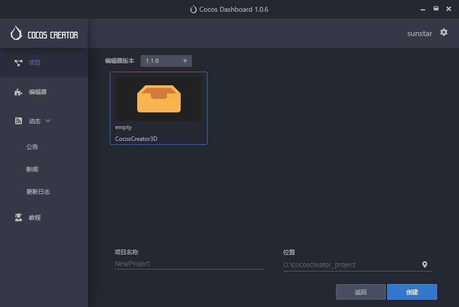

## The Editor interface

This is the default layout of the __Editor__ interface: 

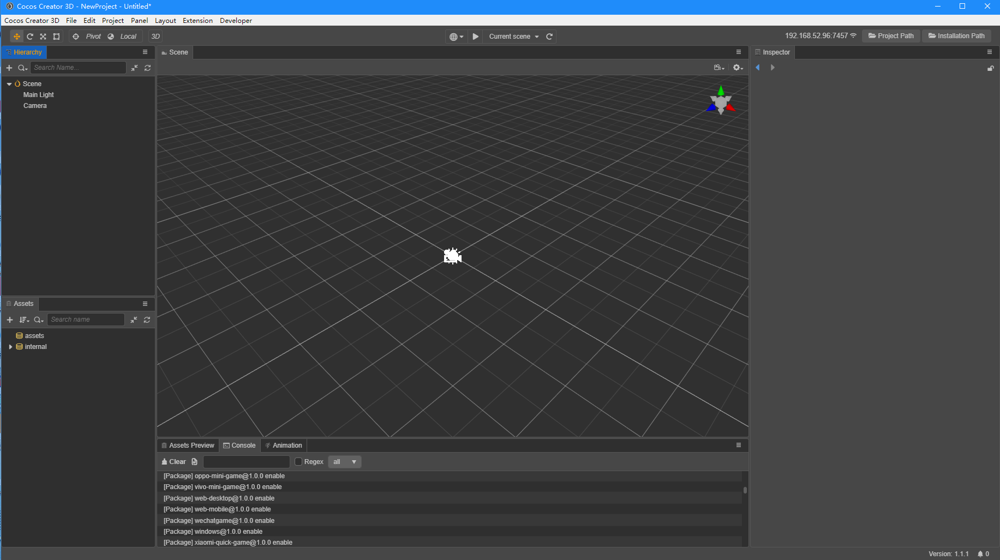

The layout is customizable, if you don't find the default layout suitable.

## Project Directory
Usually, the most commonly used directory is `assets`. There are others:

- `assets` (resources directory)
- `build` (build directory)
- `library` (imported resources directory)
- `local` (log file directory)
- `profiles` (editor configuration)
- `temp` (temporary file directory)
- `package.json` (project configuration)

## Creating a New Scene

In the bottom left __Explorer__ panel, __click the right mouse button__ and select __New__->__Scene__.

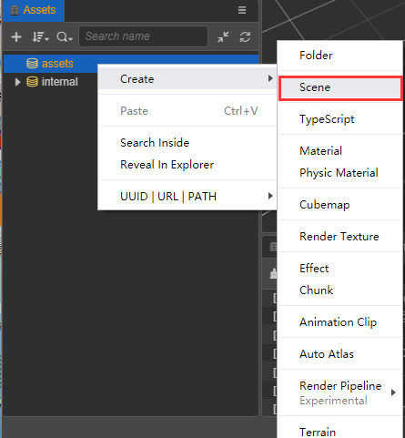

## Creating an Object

Upper left __Hierarchy Manager__ panel, click the __right mouse button__, select __Create__ -> __3D object__ -> __Cube cube__. The created cube will appear in the scene editor.

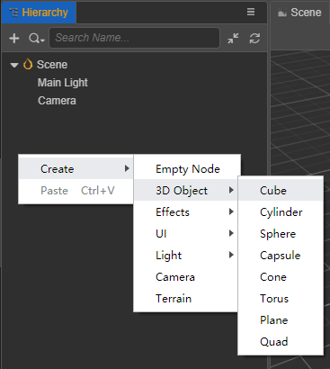

## Modifying the Camera

### Selecting the `Camera` object
In the __Hierarchy Manager__ panel, select `Camera`, and the scene editor will select it and display a __Gizmo__.

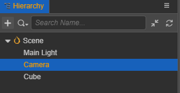

### Modifying the `Camera` position
In the scene editor, drag the __Gizmo__ so that the `Camera` can see the created cube.

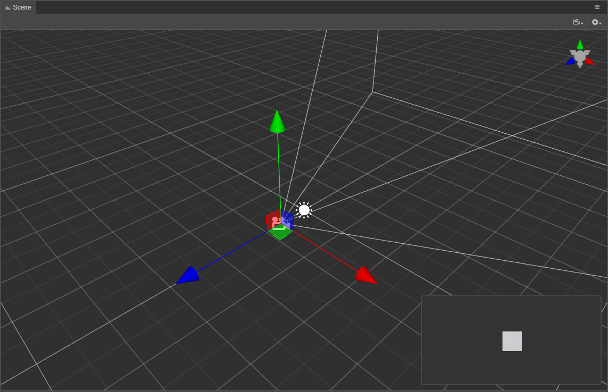

### Modifying the `Camera` background color
In the __Property Inspector__ panel, click the `Color` property and select black as the background color. 

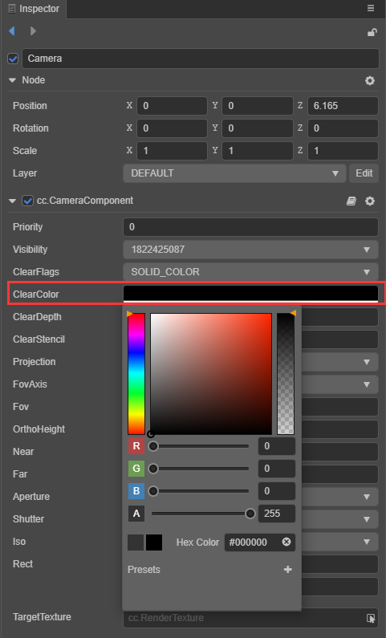

## Adding a script

### Creating a new script
In the __Explorer__ panel, __click the right mouse button__, select __New__ -> __TypeScript__. 

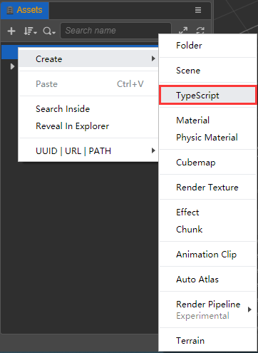

### Life cycle functions
Life cycle functions (called in the following order):
   - `onLoad`
     Called when the script is initialized
   - `onEnable`
     Called when the enabled property of the component changes from `false` to `true`
   - `start`
     Called when the component is first activated
   - `update` 
     Update object call before rendering each frame
   - `lateUpdate`
     Called after the update of all components has been executed
   - `onDisable`
     Called when the `enabled` property of the component changes from `true` to `false`
   - `onDestroy`
     Called when the component or node is destroyed

### Adding code
Add `start()` function to output `Hello world`:

```ts
import { _decorator, Component, Node } from 'cc';
const {ccclass, property} = _decorator;

@ccclass('HelloWorld')
export class HelloWorld extends Component {
    /* class member could be defined like this */
    // dummy ='';

    /* use `property` decorator if your want the member to be serializable */
    // @property
    // serializableDummy = 0;

    start () {
        // Your initialization goes here.
        console.info('Hello world');
    }

    // // update (deltaTime: number) {
    // // Your update function goes here.
    //}
}
```

### Bind scripts to objects
Select the created cube and click __Add component__ -> __Custom Script__->__HelloWorld__

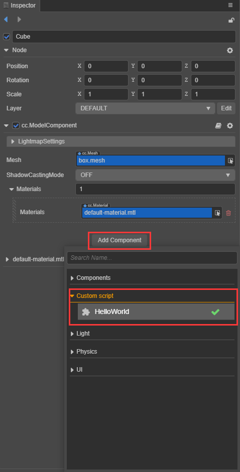

## Running a project
In the __Editor__, from the __menu bar__ click __Project__ -> __Run preview__, or Click the __Run__ button in the middle. 

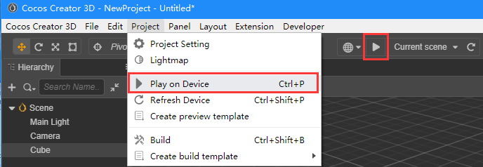

## Debuging a project
In the __Editor__, from the __menu bar__ click __Developer__ -> __Scene Debugging Tool__

It is also may be necessary to Log information. The __Console__ panel displays all log output.

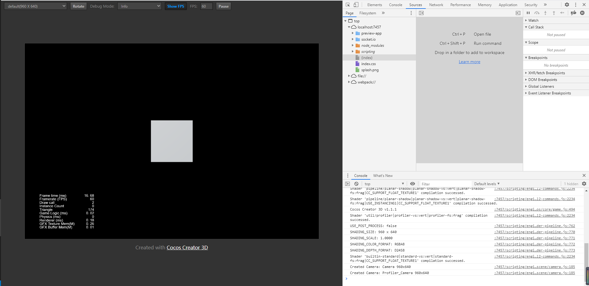

__Breakpoints__ can also be placed for stopping execution of the debugger to examine values. Select the __Source__ option on the __tab bar__ and press __CTRL+P__, Search for `HelloWorld.ts`, set a breakpoint in the `start()` function, and then run the preview to debug. 

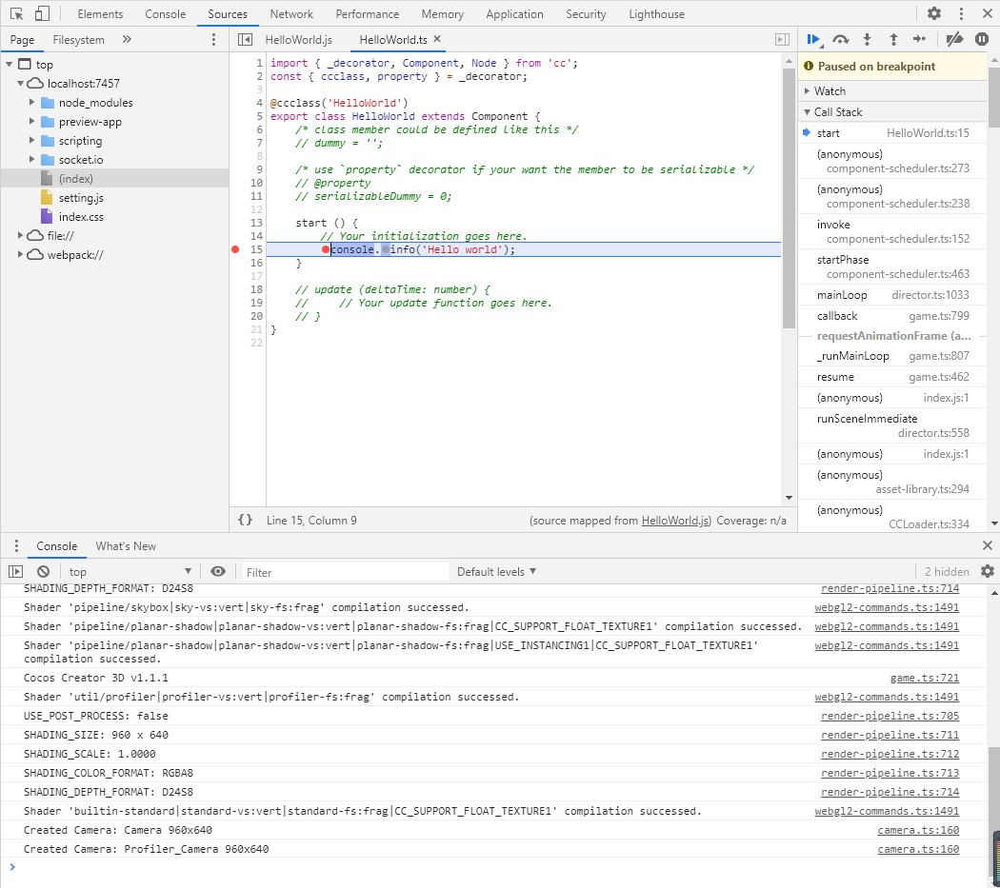