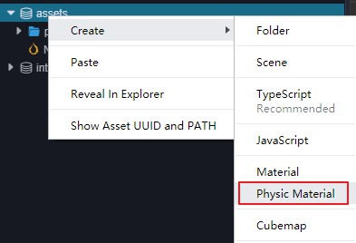
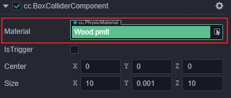

# Physics Material

In __Cocos Creator 3D__, the physics material is a __asset__, which records the surface information of the object. This is used to calculate the friction and elastic force of the colliding object.

## Properties

The physics material properties are shown below:


Properties | Description
---|---
*friction* | Coefficient of friction
*restitution* | Coefficient of restitution

When in contact with other surfaces, these coefficients are used to calculate the corresponding friction and elastic forces.

## Creating Physics Materials

Physics materials can be created in two ways:

1. Create in editor
2. Code instantiation

The way to create with the editor is shown below:



Instantiated in the code:

```ts
let newPmtl = new PhysicMaterial();
newPmtl.friction = 0.1;
newPmtl.restitution = 0.1;
```

## Application

At present, the physics material is set in units of collision bodies, and each `Collider` has a `material` property (when not set, `Collider` will refer to the default physics material in the physics system).
The application to `Collider` is also divided into editor operation and code operation.

To operate in the editor, just drag the resource into the `cc.PhysicMaterial` property box, as shown in the following figure:



Operation in the code:

```ts
const collider = this.node.getComponent(ColliderComponent);
collider.material = newPmtl;
```

Because of the design of [Material Sharing](physics-collider.md##PhysicsMaterial), you can actually do this directly in the code (because an instance will be created when you get `material`)

```ts
collider.material.friction = 0.1;
collider.material.restitution = 0.1;
```

---

Continue to the [rigid body component](physics-rigidbody.md) documentation.
