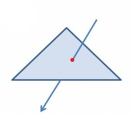

# Raycast Detection

__Raycast detection__ is a very important function and is often used to judge various situations. The essence is to make a **intersection judgment** between a ray and another shape, as shown in the figure below.



## Constructing a Ray

The `ray` is under the `geometry` namespace of the `cc` module, so in order to access to `ray`, we need to import `geometry`:

```ts
import { geometry } from "cc";
```


The `ray` is composed of **start point** and **direction**. There are the following common methods to construct a ray:

1. Via **start point** + **direction**, such as `ray` constructor or static interface `create`:

    ```ts
    import { geometry } from "cc";
    const { ray } = geometry;
    // Construct a ray starting from (0, -1, 0) and pointing to the Y axis
    // The first three parameters are the starting point, the last three parameters are the direction
    const outRay = new ray(0, -1, 0, 0, 1, 0);

    // Or through the static method create
    const outRay2 = ray.create(0, -1, 0, 0, 1, 0);
    ```

2. Via **start point** + **another point on the ray**, for example the static interface `fromPoints` in the `ray`:

    ```ts
    import { geometry, Vec3 } from "cc";
    // Construct a ray starting from the origin and pointing to the Z axis
    const outRay = new geometry.ray();
    geometry.ray.fromPoints(outRay, Vec3.ZERO, Vec3.UNIT_Z);
    ```

3. Use the camera to construct a ray emitted from the origin of the camera to a point on the screen (or the near plane of the camera):

    ```ts
    import { geometry, Camera } from "cc";
    const { ray } = geometry;
    // It is assumed here that there is already a reference to cameraCom
    const cameraCom: Camera;
    const cameraCom: Camera;
    // Get a ray emitted by the screen coordinates (0, 0)
    const outRay = new ray();
    cameraCom.screenPointToRay(0, 0, outRay);
    ```

    > **Note**:
    > 1. First you need to get a reference to a camera component or camera instance.
    > 2. The order of the interface parameters exposed by both the camera component and the camera instance is not the same.

## Interface Introduction

__Cocos Creator__ provides a set of ray detection functions. However, it should be noted that the detected object is a physics collider, and the corresponding collider component on the inspector panel, such as `BoxCollider`.

Currently, the interface is provided by PhysicsSystem, which has the following two categories:

- `raycastAll`: Detect all colliders and return a Boolean value to indicate whether the detection was successful.
- `raycastClosest`: Detect all colliders and return Boolean value as well.

Parameter description:

- `worldRay`: Rays in world space
- `mask`: Mask for filtering, you can pass in the packets to be detected
- `maxDistance`: Maximum detection distance, please do not pass Infinity or Number.MAX_VALUE
- `queryTrigger`: Whether to detect triggers

## Getting Results

To get the detection results of the above interfaces, you need to use the following methods separately:

- Gets the detection result of `raycastAll`: `PhysicsSystem.instance.raycastResults`
- Gets the detection result of `raycastClosest`: `PhysicsSystem.instance.raycastClosestResult`

> **Note**: the returned object is read-only and reused, and the corresponding result will be updated after each call to the detection interface.

## Information Stored By Results

The information is stored by `PhysicsRayResult`, which mainly has the following information:

- `collider`: Collider that is hit
- `distance`: The distance between the hit point and the starting point of the ray
- `hitPoint`: Hit point (in world coordinate system)
- `hitNormal`: The normal of the hit point's face (in the world coordinate system)

Related test cases can be found [here](https://github.com/cocos-creator/example-3d/blob/master/physics-3d/assets/cases/scenes/csae-physics-raycast.scene).
