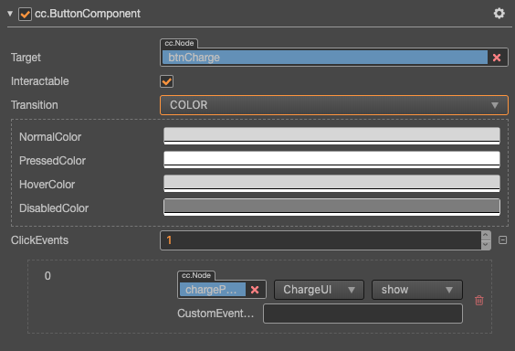
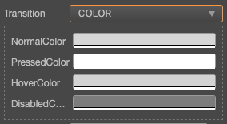
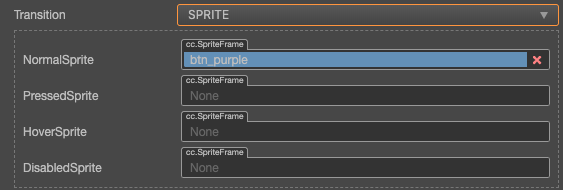

# Button Component Reference

The Button component responds to a click from the user. When the user clicks a Button, its status will change. In addition, users can assign a custom behavior to buttons' click event.




Click the **Add Component** button at the bottom of the **Inspector** panel and select **UI/Button** to add the Button component to the node.

## Button Properties

| Properties   | Function Explanation |
| ------------ | -------------------- |
| Target       | Specify the Button background node. When the Button status changes, the `Color` or `Sprite` property of the node will be modified. |
| Interactable | Boolean type, if set to `false` then the Button component enters the forbidden state. |
| Transition   | Enumeration type, including **NONE**, **COLOR**, **SPRITE** and **SCALE**. Each type corresponds to a different Transition setting. Please see the **Button Transition** section below for details. |
| ClickEvents  | List type, default is null. Each event added by the user is composed of the node reference, component name and a response function. Please see the **Button Event** section below for details. |

## Button Transition

Button Transition is used to indicate the status of the Button when clicked by the user. Currently the types available are **NONE**, **COLOR**, **SPRITE** and **SCALE**.


### Color Transition



| Properties | Function Explanation |
| ---------- | -------------------- |
| Normal     | Color of Button under Normal status.    |
| Pressed    | Color of Button under Pressed status.   |
| Hover      | Color of Button under Hover status.     |
| Disabled   | Color of Button under Disabled status.  |
| Duration   | Time interval needed for Button status switching. |

### Sprite Transition



| Properties     | Function Explanation |
| -------------- | -------------------- |
| Normal         | SpriteFrame of Button under Normal status.   |
| Pressed        | SpriteFrame of Button under Pressed status.  |
| Hover          | SpriteFrame of Button under Hover status.    |
| Disabled       | SpriteFrame of Button under Disabled status. |

### Scale Transition


| Properties     | Function Explanation            |
| -------------- | -----------    |
| Duration       | Time interval needed for Button status switching. |
| ZoomScale      | When the user clicks the button, the button will zoom to a scale. The final scale of the button equals to the button's original `scale * zoomScale`, and the zoomScale can be a negative value.|

## Button Click Event

The Button can additionally add a click event to respond to the player's click action. There are two ways to do this.

### Add a callback through the Properties


| Property        | Function Explanation                              |
| --------------  | -----------                                       |
| Target          | Node with the script component.                   |
| Component       | Script component name.                            |
| Handler         | Assign a callback function which will be triggered when the user clicks the Button. |
| CustomEventData | A user-defined string value passed as the last event argument of the event callback. |

### Add a callback through the script

There are two ways to add a callback through the script.

1. The event callback added by this method is the same as the event callback added by the editor, all added by the script. First you need to construct a `EventHandler` object, and then set the corresponding `target`, `component`, `handler` and `customEventData` parameters.

    ```ts
    import { _decorator, Component, Event, Node, ButtonComponent, EventHandler } from "cc";
    const { ccclass, property } = _decorator;

    @ccclass("example")
    export class example extends Component {
        onLoad(){
            const clickEventHandler = new EventHandler();
            // This node is the node to which your event handler code component belongs
            clickEventHandler.target = this.node;
            // This is the code file name
            clickEventHandler.component = 'example';
            clickEventHandler.handler = 'callback';
            clickEventHandler.customEventData = 'foobar';

            const button = this.node.getComponent(ButtonComponent);
            button.clickEvents.push(clickEventHandler);
        }

        callback(event: Event, customEventData: string){
            // The event here is a Touch object, and you can get the send node of the event by event.target
            const node = event.target as Node;
            const button = node.getComponent(ButtonComponent);
            console.log(customEventData); // foobar
        }
    }
    ```

2. By `button.node.on ('click', ...)` to add event callback. This is a very simple way, but the way has some limitations, in the event callback the screen coordinate point of the current click button cannot be obtained.

    ```ts
    // Suppose we add an event handler callback to the onLoad method of a component and handle the event in the callback function:
    import { _decorator, Component, ButtonComponent } from "cc";
    const { ccclass, property } = _decorator;

    @ccclass("example")
    export class example ex tends Component {
        @property(ButtonComponent)
        button: ButtonComponent | null = null;
        onLoad(){
            this.button.node.on('click', this.callback, this);
        }

        callback(button: ButtonComponent){
            // Note that events registered this way cannot pass customEventData
        }
    }
    ```
