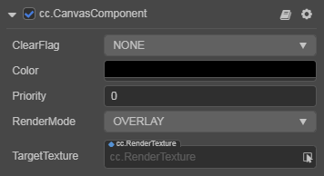

# Canvas Component Reference

The **Canvas** component is in charge of rendering all UI components, all UI elements must be placed under a __Canvas__ so that it can be rendered. The **Canvas** component can adapt the UI elements in __design resolution__ to the actual resolution of the device screen and can control zoom of all UI elements. There can be multiple __Canvas__ in the scene, each of them represents a camera, the rendering results of each canvas and 3d cameras can be presented in a certain order controlled by the `priority`.

The Canvas __design resolution__ and __adaptation scheme__ are uniformly set in the __Project Setting__. A camera is provided inside the __Canvas__, and the default z axis direction is __-1000 ~ 998__, so the z axis on the UI must be within this range to display properly (without taking the threshold value).

In the previous design, __Canvas__ was last rendered, meaning it could mask the rendering of all 3D content, but this was far from sufficient for project development needs, such as a 2D map with a 3D character. So, we've added the **RenderMode** property, which allows developers to sort the rendering order of the 3D Camera and UI Camera. To be noted, if you want to have canvas and 3d camera content mixed up, only the lowest camera or canvas can have the **SOLID_COLOR** **ClearFlag**, otherwise a camera with **SOLID_COLOR** flag will erase all content rendered before it.

The __Canvas__ component is not only the root of the UI rendering, but also a very important feature in the game production is the multi-resolution adaptation, please refer to the [Multi-Resolution Adaption](../engine/multi-resolution.md) documentation.

## Canvas Properties

| Properties    | Function Explanation  |
| ------------- | ----------- |
| __ClearFlag__     | Clean up the flag of the screen buffer. __DONT_CLEAR__: No cleanup. __DEPTH_ONLY__: Clear the depth buffer. __SOLID_COLOR__: Clear the color depth buffer. |
| __Color__     | The color used to clear the whole render buffer. |
| __Priority__       | Camera sort priority. Only when the **Canvas** **RenderMode** is **INTERSPERSE**, the canvas can be rendered before any camera with lower priority. When **RenderMode** is **OVERLAY**, the priority only affect the order among all canvas. |
| __RenderMode__    | Render mode of the Canvas. When set to **INTERSPERSE**, the priority take effect among all canvas and cameras in the Scene. When set to **OVERLAY**, the canvas will always be rendered after all cameras in the scene. **Note**: When **INTERSPERSE** mode is enabled and its priority is lower than other camera, the camera's **ClearFlags** should be set to **DONT_ClEAR**, otherwise the content of the beneath canvas will be erased. |
| __TargetTexture__ | Rendering texture of the target. |

## Detailed Explanation

If you encounter errors in UI rendering, such as **flickering**, **unwanted artifacts** or **other graphical oddness** please refer to the [Engine priority](../engine/priority.md) documentation.
