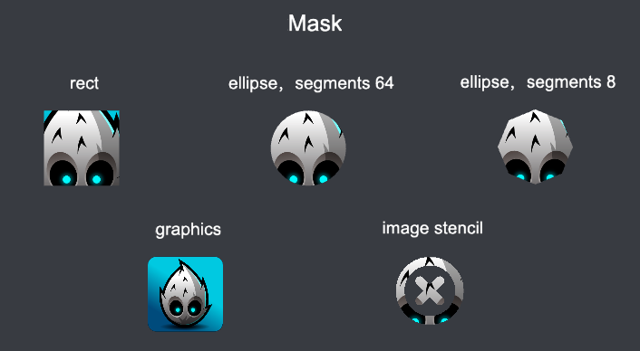

# Mask Component Reference

Mask is used to specify the range where the child node can perform rendering. A node with a Mask component will use a bounding box (which has the range specified by the `ContentSize` of the Node component in the **Inspector**) of this node to create a rectangular rendered mask. All child nodes of this node will clip according to this mask, which will not be renderer outside the mask range.

Select a node in the **Hierarchy** panel, then click the **Add Component** button at the bottom of the **Inspector** panel and select **Mask** from **UI -> Render**. Then you can add the Mask component to the node.

**Note**: The Mask component cannot be added to a node with other renderer components such as **Sprite**, **Label**, etc.

## Mask Properties

| Properties | Function Explanation |
| -------------- | ----------- |
| Type           | Mask type, including `RECT`, `ELLIPSE`, `GRAPHICS_STENCIL`. |
| Segments       | The segements for ellipse mask, which takes effect only when the Mask type is set to `ELLIPSE`.   |
| Inverted       | The Reverse mask. |

**Note**:

- After adding the Mask component to a node, all the child nodes of this node will be affected by Mask during rendering.
- The `GRAPHICS_STENCIL` simply provides the **graphics**, which developers can use to draw custom graphics. But the node click events are still calculated based on the size of the node.
