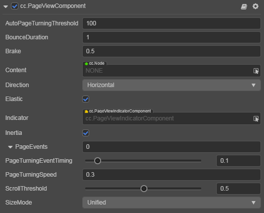

# PageView Component Reference

The __PageView__ component is derived from __ScrollView__, the difference is that when scrolls it automatically snaps to next page of content.



Click the __Add Component__ button at the bottom of the __Inspector__ panel and select __UI/PageView__ to add the __PageView__ component to the node.

## PageView Properties

| Properties               | Function Description |
| --------------           | ----------- |
| *AutoPageTurningThreshold* | Auto page turning velocity threshold. When users swipe the PageView quickly, it will calculate a velocity based on the scroll distance and time, if the calculated velocity is larger than the threshold, then it will trigger page turning  |
| *Bounce Duration*          | The elapse time of bouncing back. The value range is 0 ~ 10, and when the value is 0, it will bounce back immediately |
| *Brake*                    | It determines how quickly the content stop moving. A value of 1 will stop the movement immediately. A value of 0 will never stop the movement until it reaches to the boundary of scrollview |
| *Content*                  | It is a node reference that is used to contain the contents of the PageView |
| *Direction*                | The pageview direction |
| *Elastic*                  | When elastic is set, the content will be bounce back when move out of boundary |
| *Indicator*                | The Page View Indicator, please refer to __PageViewIndicator Setting__ below for details |
| *Inertia*                  | When inertia is set, the content will continue to move when touch ended |
| *PageEvents*               | Array. The PageView events callback |
| *PageTurningEventTiming*   | Change the timing for sending PageView, PageTurning events |
| *CancelInnerEvents*        | If CancelInnerEvents is set to true, the scroll behavior will cancel touch events on inner content nodes. It's set to true by default |
| *ScrollThreshold*          | This value will be multiplied with the distance between two pages, to get the threshold distance. If user scroll distance is larger than this threshold distance, the page will turn immediately  |
| *SizeMode*                 | Specify the size type of each page in PageView, including __Unified__ and __Free__ |

### PageViewIndicator Setting

__PageViewIndicator__ is optional, the component is used to display the number of pages and mark the current page.

The association can be done by dragging a node with a __PageViewIndicator__ component into the __Indicator__ property of the __PageView__ component in the __Hierarchy__ panel.

### PageView Event


| Properties      | Function Description |
| --------------  | ----------- |
| *Target*          | Node with script component |
| *Component*       | Script component name |
| *Handler*         | Specifies a callback function that will be called when the __PageView__ event occurs |
| *CustomEventData* | The user specifies an arbitrary string as the last parameter of the event callback |

The __PageView__ event callback has two parameters, the first parameter is the __PageView__ itself, the second parameter is the event type of the __PageView__.

## Detailed Explanation

The __PageView__ component must have the specified content node to work. Each child node in content is a separate page, and the size of each page is the size of the __PageView__ node. If the node size is larger than the content size, it may result in an incomplete scroll. Under the __PageView__ component there is a node object, which combines with `ScrollThreshold` to determine whether the current sliding distance is such that the page can be turned. The operation effect is divided into two kinds: 

- __Slow sliding__ - by dragging the page in the view to reach the specified `ScrollThreshold` value (the value is the percentage of page size), after the release will automatically slide to the next page.
- __Fast sliding__ - quickly drag in one direction, automatically slide to the next page. Only slide up to one page at a time.

## Add callback via script code

### Method one

The event callback added by this method is the same as the event callback added by the editor, all added by code. First you need to construct a `EventHandler` object, and then set the corresponding `target`, `component`, `handler` and `customEventData` parameters.

```ts
import { _decorator, Component, Event, Node, PageViewComponent, EventHandler } from "cc";
const { ccclass, property } = _decorator;

@ccclass("example")
export class example extends Component {
    onLoad(){
        const pageChangedEventHandler = new EventHandler();
        // This Node is the node to which your event processing code component belongs
        pageChangedEventHandler.target = this.node;
        // This is the code file name
        pageChangedEventHandler.component = 'example';
        pageChangedEventHandler.handler = 'callback';
        pageChangedEventHandler.customEventData = 'foobar';

        const page = this.node.getComponent(PageViewComponent);
        page.clickEvents.push(pageChangedEventHandler);
    }

    callback(event: Event, customEventData: string){
        // The event here is a Touch Event object, and you can get the send node of the event by event.target
        const node = event.target as Node;
        const pageview = node.getComponent(PageViewComponent);
        console.log(customEventData); // foobar
    }
}
```

### Method two

By `pageView.node.on('page-turning', ...)` way to add.

```ts
// Suppose we add event handling callbacks to the onLoad method of a component and perform event handling in the callback function:

import { _decorator, Component, Event, Node, PageViewComponent } from "cc";
const { ccclass, property } = _decorator;

@ccclass("example")
export class example extends Component {
    onLoad(){
        this.pageView.node.on('page-turning', this.callback, this);
    }

    callback(pageView: PageViewComponent){
        // The parameter of the callback is the PageView component. Note that events registered this way cannot pass customEventData
    }
}
```
