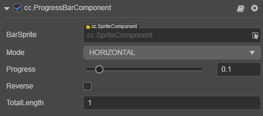

# ProgressBar Component Reference

ProgressBar is usually used to show the progress of a certain operation in the game. Add the ProgressBar component to a node and associate a Bar Sprite to this component. Then the Bar Sprite can be controlled to show progress in the scene.

Click the **Add Component** button at the bottom of the **Inspector** panel and select **UI/ProgressBar** to add the ProgressBar component to the node.

## ProgressBar Properties

| Properties | Function Explanation |
| -------------- | ----------- |
| BarSprite | The Sprite component needed for rendering ProgressBar. It can be linked by dragging a node with the **Sprite** component to this property |
| Mode      | Currently supports the **HORIZONTAL**, **VERTICAL** and **FILLED** modes. The initial direction can be changed by cooperating with the **reverse** property |
| Progress  | Floating point. The value range is 0~1, and values outside the range are not allowed.
| Reverse   | Boolean value. The default fill direction is from left to right / bottom to top, and when enable, it becomes right to left / top to bottom |
| Total Length | The total length/total width of the BarSprite when the ProgressBar is at 100%. In **FILLED** mode, **Total Length** represents the percentage of the total display range for Bar Sprite, with values ranging from 0 to 1 |

## Detailed Explanation

After adding the ProgressBar component, drag a node with the **Sprite** component from the **Hierarchy** to the BarSprite property. Then you can control the display of the ProgressBar by dragging the progress sliding block.

Bar Sprite could be its own node, child node or any node that comes with the **Sprite** component. Also, Bar Sprite can freely choose the Simple, Sliced or Filled render modes.

The **Type** of Bar Sprite also needs to be set to **FILLED**, otherwise a warning will appear when the mode of the progressbar has already selected **FILLED**.
