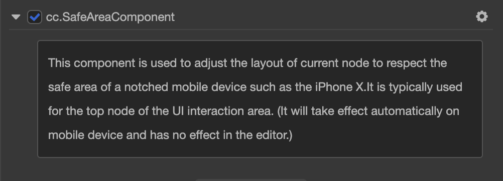

# SafeArea component reference

This component is used to adjust the layout of current node to respect the safe area of a notched mobile device such as the **iPhone X**.

It is typically used for the top node of the UI interaction area. For specific usage, refer to the [SafeArea](https://github.com/cocos-creator/test-cases-3d/tree/master/assets/cases/ui/20.safe-area) example in the example-cases.

The concept of safe area is to give you a fixed inner rectangle in which you can safely display content that will be drawn on screen.

It is strongly discouraged from providing controls outside of this area. But the screen background could embellish edges.

The developer only needs to add the component on the node, without any settings. This component internally uses the API cc.sys.getSafeAreaRect(); to obtain the safe area of the current iOS or Android device and implements the adaptation by using the Widget component and set anchor. (If there is no Widget component, it will be added automatically)

- [UI Basic Components](base-component.md)

- [UI Renderer Components](render-component.md)
