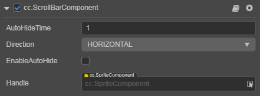

# ScrollBar Component Reference

ScrollBar allows the user to scroll a image by dragging a sliding block. It's a bit similar to the **Slider** component, but it is mostly used for scrolling while Slider is used to set values.

Click the **Add Component** button at the bottom of the **Inspector** panel and select **UI/ScrollBar** to add the ScrollBar component to the node.

## ScrollBar Properties

| Properties | Function Explanation |
| -------------- | ----------- |
| AutoHide Time | Auto hide time, need to set `Enable Auto Hide` along with it |
| Direction | Scroll direction, including **HORIZONTAL** and **VERTICAL**
| EnableAutoHide | Enable or disable auto hide. If this property is enabled, it will automatically disappear for `Auto Hide Time` times after the ScrollBar is displayed |
| Handle | ScrollBar foreground picture. Its length/width will be calculated according to the content size of ScrollView and the dimensions of the actual display area |

## Detailed Explanation

ScrollBar normally is used together with `ScrollView` instead of being used alone. Also, ScrollBar needs to assign a `Sprite` component, i.e. `Handle` in the Inspector panel.

Normally we will also designate a background image to ScrollBar. This can be used to indicate the length or width of the whole ScrollBar.
