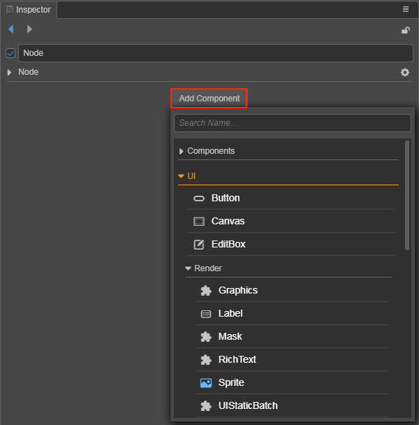

# UI Architecture

The UI uses a tree-based rendering structure, and the entire UI is rendered based on the Canvas node (a node with `CanvasComponent`) as the root node. That is, the final root node of the UI node must be the Canvas node before it can be rendered by the Canvas. The `UITransformComponent` is the necessary condition that each UI node must have for a click or alignment strategy, etc. to take effect.

In terms of overall rendering, the UI uses a separate render pipeline with the highest priority, the entire render pipeline will rendering 3D part before rendering the UI. And then the UI determines the rendering order by the `priority` property on the `CanvasComponent` of the Canvas node.

The UI also supports model rendering, the only condition being that a node with the model components (such as `ModelComponent`/`SkinningModelComponent`) must add __UI/Model__ component before it can be rendered on the same pipeline as the UI.

The UI rendering process as follows:

## Get Started with UI

The UI is a necessary interaction part of game development. The buttons, labels, backgrounds and so on in the game are usually made through the UI. When you start making a UI, the first thing you need to confirm is the size of the display area (Design resolution) of the current design, which can be set in the __Project -> Project Setting -> General__ panel of the menu bar:

Now that your design resolution is setup, you can start creating the UI elements. All UI elements are contained under the `Canvas` node, you can create a `Canvas` node by clicking the __+__ button at the top left of the __Hierarchy__ panel, and then select the __UI -> Canvas__. There is a [CanvasComponent](../editor/canvas.md) on the Canvas node, which automatically creates a camera inside. You can achieve true interspersed rendering between 3D camera and 2D camera by adjusting the `RenderMode` property on `CanvasComponent`. And then adjust the display priority between multiple Canvas with the `priority` property on `CanvasComponent`.

> __Note__: There can be more than one Canvas node in a scene, but the Canvas should not be nested under another Canvas or its child nodes.

> __Note__: Changes to the x property will take effect at runtime, and the editor still displays the rendered content in the order of the Canvas nodes

> __Note__: The change to the `priority` property takes effect at runtime, and the editor still displays the rendered content in the order of the Canvas nodes

After introducing the key contents of the UI, you can then create the UI nodes under the Canvas nodes according to the project structure. There are several UI nodes that come with the editor by default:

You can view UI components by checking the node and then clicking on the __Add Component__ in the __Inspector__ panel. The components in __UI -> Render__ belong to the UI renderer component and the others are UI functional components.

The UI renderer component uses Breadth-First Sorting scheme, that is, the order of child nodes under the Canvas already determines the subsequent [Rendering Order](priority.md), but you can modify the rendering order with `priority` property of the renderer component. For nodes without renderer component, you can add a component with only sorting function to sort by selecting __Add Component -> UI -> Reorder__ in the __Inspector__ panel.

In general game development, the necessary UI elements are usually *Sprite*, *Label*, *Mask*, *Layout*, *Widget*, etc. Sprite and Label are used for rendering image and text. Mask is mainly used to limit the display content, some commonly used places are chat boxes and backpacks, and so on. Layout is mainly used for layout, generally used for single arrangement of buttons, neat arrangement of props in backpacks, etc. The last more important is the Widget, which is mainly used for display alignment. This may involve the multi-resolution adaptation function. When we design the UI and publish it to different platforms, the actual device resolution of the platform will inevitably be different from our design resolution. In order to adapt, we need to do Some trade-offs. For example, the headshot frame cannot be scaled, but we also hope that it will not be greatly affected by the device. Then you can add a Widget component and always ensure that it is aligned at the upper left of our design resolution. Please refer to the [Widget Alignment](widget-align.md) and [Widget Component](../editor/widget.md) documentation for details.

When our interface is finished, you may find out how the display effects of iPhone7 and iPhoneX are different. This is actually a problem with the device resolution we mentioned above. When you design at the design resolution and publish at the device resolution, because the design resolution of different mobile phones may be different, the problem of pixel deviation may occur. Therefore, you also need to do screen adaptation.

As you can see on the __Project -> Project Setting -> General -> Default canvas setting__ page of the menu bar, there are two other options, __Fit Width__ and __Fit Height__. According to the screen adaptation rules provided by **Cocos Creator 3D**, and combined with the Widget component, you can easily adapt to different devices. Please refer to the [Multi-Resolution Adaptation](multi-resolution.md) documentation for details.

## UI Rules Introduction

- [Rendering Order](priority.md)
- [Multi-Resolution Adaption](multi-resolution.md)
- [Widget Alignment](widget-align.md)
- [Label Layout](label-layout.md)
- [Auto Layout Container](auto-layout.md)
- [List with data](list-with-data.md)
- [Stretchable UI Sprite](sliced-sprite.md)
- [UI Static Batching](../editor/ui-static.md)
- [UI Custom Material](ui-material.md)
