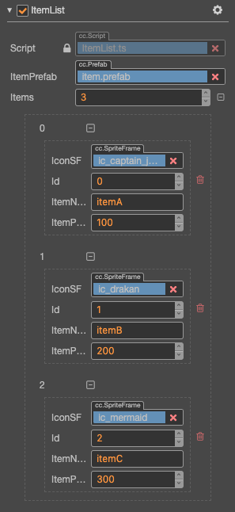
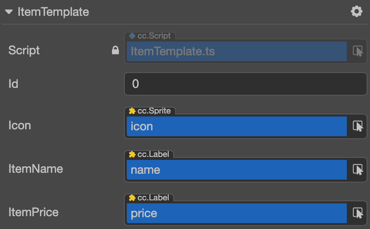
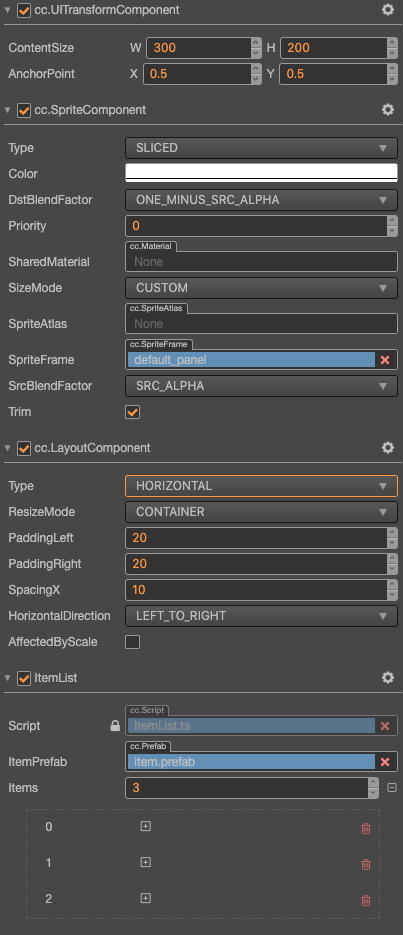

# Create a list of dynamically generated content

We can build and edit static UI interfaces with **Scene** panel easily, but in real world game project it's not enough. We'll need dynamically generated UI elements with data, such as character selection, inventory and level selection.

## Prepare data

Let's take an inventory interface as example, we need following data structure to generate an item dynamically:

- Item id
- Icon id, we can put up a icon id to spriteFrame reference dictionary or array
- Item name
- Item price
- ...

We will introduce how to define a data class and generate those data in **Inspector** panel. If you're not familiar with component system of Cocos Creator 3D, please start with [Workflow of script development](../../../scripting/index.md) chapter.


### Custom data class

For most game project, you can get inventory data from game server. For the simplicity let's define a data class for data structure and input. Let's add a new script `ItemList.js` and add the following properties:

```ts
@ccclass('Item')
export class Item {
    @property
    id = 0;
    @property
    itemName = '';
    @property
    itemPrice = 0;
    @property(SpriteFrame)
    iconSF: SpriteFrame | null = null;
}

@ccclass
export class ItemList extends Component {
    @property([Item])
    items: Item[] = [];
    @property(Prefab)
    itemPrefab: Prefab | null = null;

    onLoad () {
        for (var i = 0; i < this.items.length; ++i) {
            var item = instantiate(this.itemPrefab);
            var data = this.items[i];
            this.node.addChild(item);
            item.getComponent('ItemTemplate').init(data);
        }
    }
}
```

We defined an `Item` class at the top of the script for storing and easily updating data needed by item. Please notice this class does not extends `cc.Component`, so it can be defined as a property type for any component. You can learn more details about data class here [Declare class](../../../scripting/ccclass.md).

After the `Item` class definition, we defined a component class. Each script file can only contains one component definition and the component name will be the same as the file name. So the component we define is `ItemList`. In this component we have a list property which type is `Item`. This way we can populate the list with data input in **Inspector** panel.

Now let's create an empty node and add `ItemList` component. We can find `Items` property in **Inspector** panel. To populate data, let's give the list a length. Type `3` in the field and you can input data like these:



We have our data ready for now, you can also type in more data entries as you wish. If you're making a game with lots of data, please consider using more specialized data source like Excel and database. It's easy to convert such data sources to JSON for the engine.

## Make the view for data: Prefab as template

Let's now move on to the 'view' to visualize data, we can use [Prefab](../../../asset/prefab.md) to do this job. Let's create a prefab that looks like this:


The child nodes `icon`, `name`, `price` will be used to display icon, item name and price from data.

### Data binding

You can freely customize the prefab as you need, the picture above only shows an example. Now we need a component script to bind the data to the components that show them. Create a new script `ItemTemplate.js` and add it to the prefab root node. The script contains:

```ts
@ccclass
export class ItemTemplate extends Component {
    @property
    public id = 0;
    @property(SpriteComponent)
    public icon: SpriteComponent | null = null;
    @property(LabelComponent)
    public itemName: LabelComponent | null = null;
    @property(LabelComponent)
    public itemPrice: LabelComponent | null = null;
}
```

Let's drag all those nodes onto the property fields of `ItemTemplate` component.



**Note**: We will assign the value of `id` property directly through the data without binding the node.

### Update template display with script

Let's modify `ItemTemplate.js` script to add function to update the renderer components with input data. Let's add the following to the end of script:

```ts
// data: { id, iconSF, itemName, itemPrice }
init(data: Item) {
    this.id = data.id;
    this.icon.spriteFrame = data.iconSF;
    this.itemName.string = data.itemName;
    this.itemPrice.string = data.itemPrice;
}
```

`init` method takes a data object and use the data to update each renderer component on bound nodes. Now we can save `Item` node as a Prefab asset and use it as the template of our item entries.

## Instantiate template with data

Let's go back to `ItemList.js` script, and add reference to our Prefab and the logic to dynamically generate the list.

```ts
//...
@property(Prefab)
itemPrefab: Prefab | null = null;

onLoad () {
    for (var i = 0; i < this.items.length; ++i) {
        var item = instantiate(this.itemPrefab);
        var data = this.items[i];
        this.node.addChild(item);
        item.getComponent('ItemTemplate').init(data);
    }
}
```

In the `onLoad` callback method, we traverse each data stored in `items` in turn, instantiate `itemPrefab` to generate a new node and add it to the node where `ItemList.js` is. Then call the `init` method in `ItemTemplate.js` to update the performance of each node.

Now we can add a **Layout** component to the node that holds `ItemList.js` through **Add Component -> Add UI Component -> Layout** under the **Inspector** panel, and set the following properties:

- `Type`: `HORIZONTAL`
- `Resize Mode`: `CONTAINER`

Don't forget to drag and drop `item` Prefab to `itemPrefab` property field of `ItemList` component. You can also add a **Sprite** component to the node as the background.

We have completed all the work. Now `itemList` node should look like this:



## Preview

Running preview of the scene will get the result like this (the acutal look depends on how your template was setup and your data):


The **Layout** component added in previous step is not necessary. We can use it to help putting multiple items in a container in order but you can also use the script program to do that. You can also add a **ScrollView** component together to display a large amount of content in a limited space. For details of those layout method please read [Auto Layout Container](auto-layout.md) and [ScrollView Component](../editor/scrollview.md).
