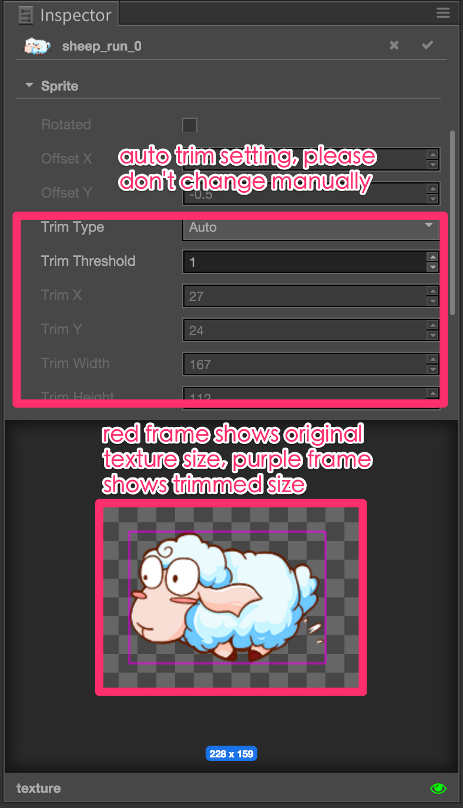
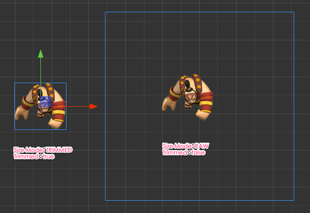

# Auto Trim for SpriteFrame

Once a texture is imported, the SpriteFrame asset generated with the texture will be trimmed automatically. Any fully transparent pixels around the image will be cropped. This will help us get the exact node size we need for Sprites.

## Trim Related Properties in Sprite Component

There are two properties related to trim setting in **Sprite** component:

- `Trim` If checked, the node's bounding box will not include transparent pixels around the image. Instead the bounding box will be an exact fit to trimmed image. If unchecked the bounding box will be showing original texture including transparent pixels.

- `Size Mode` Use the options in this property to set node's size to the original texture size or trimmed image size. Options are:

  - `TRIMMED` Select this option will set the `size` of the node to use trimmed image size of the current SpriteFrame used by Sprite component.

  - `RAW` Select this option will set the size of the node to use the original texture size, including transparent pixels.

  - `CUSTOM` This option make sure the size of the node will not be changed along with SpriteFrame, and should be managed by yourself. If you use the **Rect Transform Tool** to drag and change the `size` of the node, or modify the `size` property in **Inspector** panel, or modify the `width` or `height` in the script, the `Size Mode` property will be automatically set to `CUSTOM`.

The following picture shows the comparison of two size modes:

## Sprite Animation with offset

There are a lot of animator prefer to draw the moving motion in texture, commonly seen in attack animations. Usually animator will use a large texture and put character on different positions on the texture for different animation frames. In this case, we need to set the **Sprite** component's `Trim` property to `false`, and set the `Size Mode` to `RAW`. In this way, the animation will use the original texture size when playing each sequence frame, and retain the information of transparent pixels around the image. So that the character's position drawn in the texture can be displayed correctly.

When `Trim` property is set to `true`, it is more suitable for animation where the displacement is completely controlled by the character's `position` property.

## TexturePacker Setting

We recommend users to use sprite sheet tools such as [TexturePacker](https://www.codeandweb.com/texturepacker) for generating sprite animation texture assets. In TexturePacker before you publish your sprite sheet, please make sure you choose `Trim` in **Trim Mode** setting of Sprites section. Please do not use `Crop, flush position`, or the trim information will be lost and you can't get back originial texture offset anymore. It is currently recommended to use version **4.x** or higher for packaging to prevent the import failure caused by inconsistent export data in the lower version.

