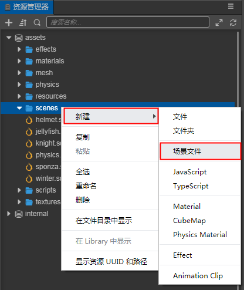
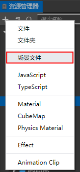
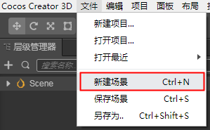
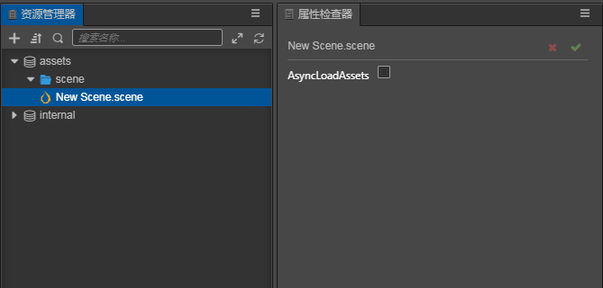

# 场景资源

在 Cocos Creator 3D 中，游戏场景（Scene） 是开发时组织游戏内容的中心，也是呈现给玩家所有游戏内容的载体。而场景文件本身也作为游戏资源存在，其保存了游戏的大部分信息，也是创作的基础。

## 创建场景

我们现在共有三种创建场景的方式：

为了您的项目具备良好的文件夹目录结构，我们强烈建议您使用 **方法一** 创建场景

方法一：在 `资源管理器` 中选中你想要创建场景文件的文件夹，在文件夹目录上
`右键/新建/场景文件`，之后键入想要的场景名即可。

方法二：在 `资源管理器` 中点击创建菜单，创建新场景。

方法三：选择主菜单：`文件/新建场景`，会在层级管理器直接出现新场景，但资源管理器中不会出现新场景，需要在进行了场景保存后才会在资源文件夹的根目录下出现`New Scene.scene`场景文件。

## 保存场景

在标记场景的过程中，可通过快捷键 `Ctrl + S` (Windows) 或 `Command + S` (Mac) 来快速保存场景

## 切换场景

在 `资源管理器` 中，双击需要打开的场景。 
如需游戏中切换场景，可通过 `director.loadScene` 等 API 来实现游戏中动态场景加载及切换，详情请见我们的 API 文档。

## 场景资源的属性

作为一个资源文件，在 `资源管理器` 中选中想要管理的场景时，可设置场景文件是否要异步加载资源

而在打开场景文件之后，scene 作为场景节点树的根节点，在 `层级管理器` 中选中 `Scene` 节点,在左侧的属性检查器中可设置整个场景相关的属性，包括环境光设置，阴影设置和天空盒设置。

各类属性的详细说明请见：
- [环境光](../concepts/scene/ambient.md)
- [阴影](../concepts/scene/shadow.md)
- [全局雾](../concepts/scene/fog.md)
- [天空盒](../concepts/scene/skybox.md)
