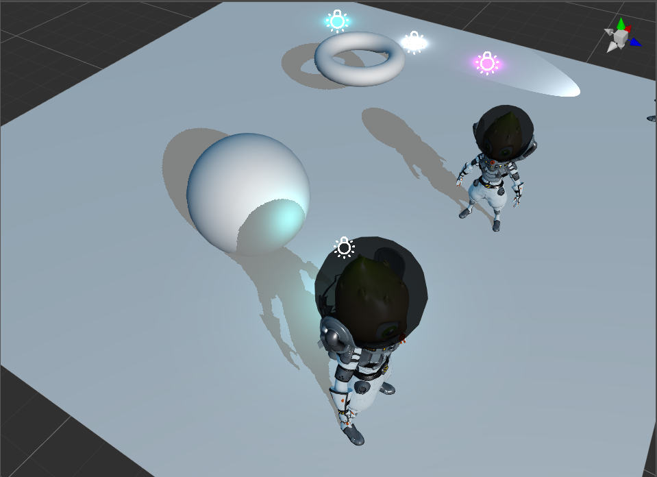

# 阴影

在 3D 世界中，光与影一直都是极其重要的组成部分，它们能够丰富整个环境，质量好的阴影可以达到以假乱真的效果，并且使得整个世界具有立体感。

以下为 Cocos Creator 的阴影示例：

## 开启阴影

Cocos Creator 3.0 目前支持 shadow Map 和 planer Shadow 两种阴影模式供开发者使用。

* 在 Cocos Creator 中开启 Planar Shadow 需要三步：

    1. 在层级管理器上选择 Scene 节点，可以看到以下面板，将 shadows 的 Enabled 属性勾选上。

    2. 在 Enabled 属性下方，选择 Type 下拉菜单中的 Planar 选项。

    3. 将需要显示阴影的模型组件中的 ShadowCasting 设置为 ON 。

    **注：Planar Shadow 只会投射在阴影面上，调节方向光角度可以调节阴影的投射**。

* 在 Cocos Creator 中开启 Shadow Map 需要四步：

    1. 在层级管理器上选择 Scene 节点，可以看到以下面板，将 shadows 的 Enabled 属性勾选上。

    2. 在 Enabled 属性下方，选择 Type 下拉菜单中的 Planar 选项。

    3. 将需要显示阴影的模型组件中的 ShadowCasting 设置为 ON 。

    4. 将需要显示阴影的模型组件中的 ReceiveShadow 设置为 ON 。

    **注：shadow Map 在开启了 ReceiveShadow 后就会接收其它物体产生的阴影效果；ShadowCasting 开启后会产生阴影效果，并在 ReceiveShadow：ON 的物体上显示阴影效果**。

## PlanarShadows 面板

以下介绍了面板的所有属性：

属性 | 解释
---|---
**Enabled**     | 是否开启阴影效果
**Type**        | 选择阴影类型
**ShadowColor** | 产生的阴影的颜色值
**Normal**      | 垂直与阴影平面的法线
**Distance**    | 阴影平面在 normal 法线的方向上与坐标原点的距离

## Shadow Map 面板

以下介绍了面板的所有属性：

属性 | 解释
---|---
**Enabled**         | 是否开启阴影效果
**Type**            | 选择阴影类型
**ShadowColor**     | 产生的阴影的颜色值
**Pcf**             | 设置阴影边缘反走样等级
**Near**            | 设置主光源阴影相机的近裁剪面
**Far**             | 设置主光源阴影相机的远裁剪面
**OrthoSize**       | 设置主光源阴影相机的正交视口大小
**ShadowMapSize**   | 设置阴影纹理大小
**Aspect**          | 设置主光源阴影相机的正交视口长宽比
