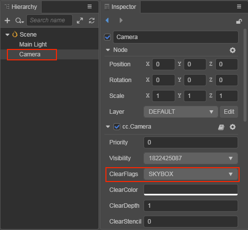
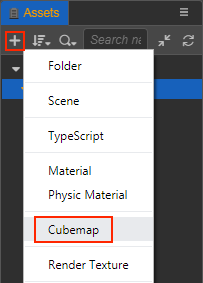

# 天空盒

游戏中的天空盒是一个包裹整个场景的立方体，可以很好地渲染并展示整个场景环境，在基于 PBR 的工作流中天空盒也是非常重要的部分。

## 开启天空盒

在 **层级管理器** 中选中 **Scene**，然后在 **属性检查器** 的 **skybox** 组件中勾选 **Enabled** 属性即可开启天空盒。

skybox 组件属性如下：

| 属性 | 说明 |
| :---| :--- |
| **Enabled** | 是否开启天空盒 |
| **UseIBL** | 是否使用环境光照 |
| **Envmap** | 环境贴图，TextureCube 类型，具体设置方法可参考下文介绍。 当该属性为空时，天空盒默认使用和显示的是像素贴图 |
| **IsRGBE** | 环境贴图的像素格式是否为 RGBE |

## 设置天空盒的环境贴图

开启天空盒之后还需要设置天空盒的环境贴图。天空盒的环境贴图资源可以是 TextureCube 类型的单张贴图，或者是由六张 texture 类型的贴图组合而成的 CubeMap（立方体贴图）。所以开发者可通过以下两种方式来设置天空盒的环境贴图。

### 通过设置 TextureCube 类型的贴图资源

1. 导入贴图资源，直接将图片资源拖拽到 **资源管理器** 面板即可。

2. 选中导入的贴图资源，在右侧的 **属性检查器** 面板中将 **Type** 属性设置为 **texture cube**，然后点击右上角的绿色打钩按钮保存设置。

    

3. 在 **层级管理器** 中选中 **Scene**，然后将设置好的图片资源拖拽到 **属性检查器**中 **skybox** 组件的 **Envmap** 属性框中：

    

这样子天空盒就设置完成了，开发者可以在 **场景编辑器** 中看到设置后的天空盒的环境贴图。若贴图没有正确显示，需要检查 **SkyIllum 参数** 的值是否太低，或者 **修改 Camera 的 Clear Flag**。

#### SkyIllum 参数

在 **层级管理器** 中选中 **Scene**，然后在 **属性检查器** 的 **ambient** 组件中即可看到 SkyIllum 参数，默认值为 20000。

若 SkyIllum 参数值设置 **太低** 可能会导致天空盒的环境贴图无法在 **场景编辑器** 中正确显示。一般情况下：

- 当 SkyIllum 参数值小于 300 时，天空盒的环境贴图便无法正常显示。

- 当 SkyIllum 参数值为 5000 时，效果相当于月夜的光照强度。

#### 修改 Camera 的 Clear Flag

若 **场景编辑器** 中天空盒的环境贴图已经可以正确显示，但是在项目运行之后仍然没有生效，此时就需要修改 Camera 组件的 **ClearFlag** 为 **SKYBOX**：

### 通过设置 CubeMap（立方体贴图）

如果要使用 CubeMap（立方体贴图）作为天空盒的环境贴图，需要先制作一张 CubeMap 再将其拖拽到 skybox 组件的 **Envmap** 属性框中。操作步骤如下：

1. 在 **资源管理器** 中将准备好的六张贴图资源全部选中，然后在 **属性检查器** 中将这些贴图资源的 **Type** 属性批量设置为 **texture**，并点击右上角的绿色打钩按钮。

   

2. 新建 CubeMap 资源。在 **资源管理器** 中选中要存放 CubeMap 的文件夹，点击左上角的 **+** 按钮，然后选择 **Cubemap** 即可。或者也可以右键点击要存放 CubeMap 的文件夹，选择 **新建 -> Cubemap**。

    

3. 将刚才设置为 texture 类型的 6 张贴图拖拽到 CubeMap 对应的属性框中，完成后点击右上方的绿色打钩按钮，这样就完成了一张 CubeMap。

    

    **注意**：
    - CubeMap 中未设置贴图的属性框将使用默认资源进行填充。
    - CubeMap 中的 6 个属性框 **不要使用同一张贴图**，否则会导致某些平台无法正常显示。

4. 最后，将完成的 CubeMap 资源拖入到 skybox 组件的 **Envmap** 属性框中，这样就完成了 CubeMap 的应用。

    
