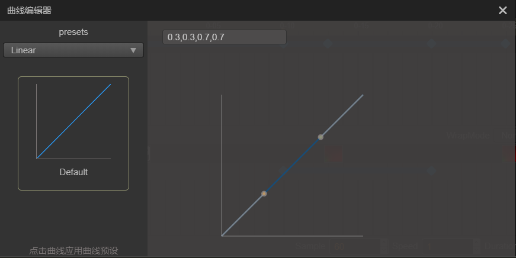

# 编辑动画曲线

我们已经创建了基本的动画了。
但有时候我们会需要在两帧之间实现 EaseInOut 等缓动效果，那么在动画编辑器中怎么实现呢？

我们首先需要在一条轨道上创建两个不相等的帧，比如在 position 上创建两帧，从 0,0 到 100,100。
这时候两帧之间会出现一根连接线（连接关键帧之间的蓝色线段），双击连接线，可以打开时间曲线编辑器。

曲线编辑器打开时，如果当前的动画曲线数据是预设里的，左边的预设对应项会有金黄色边框的选中效果。动画曲线的修改都是实时的，无需点击保存，修改完点击右上角的关闭按钮即可。

## 使用预设曲线

我们在曲线编辑器左侧可以选择预设的各种效果。比如说 Ease In 等，通过点击对应的曲线就可应用到当前的动画曲线上。

## 自定义曲线

有时候预设的不能够满足动画需求，我们也可以自己修改曲线。
右侧下方预览图内，有两个灰色的控制点，拖拽控制点可以更改曲线的轨迹。
如果控制点需要拖出视野外，则可以使用鼠标滚轮缩放预览图。

修改过程中的曲线数据会实时的显示在曲线区域左上角的输入框内，同时该曲线输入框还支持手动输入曲线数据来生成曲线，当然曲线数据的格式必须是和原先一致的否则无法正常应用。

## 保存自定义曲线
有时项目需求的一些自定义曲线数据需要复用，就可以将其保存在 User 的预设库内。在左上方选择 User 选项后，编辑需要保存的曲线数据，再在左下方的输入框内输入希望保存的曲线数据名称，点击 add 即可添加。注意，同名曲线会做覆盖处理，自定义曲线的保存是没有做撤销处理的，所以如果被覆盖了就需要重新添加的。

保存在预设里的自定义曲线，和其他库的预设曲线一样，点击即可应用。同时，鼠标移到曲线上方，会出现一个删除的图标，点击即可删除对应曲线数据。

更多关于动画曲线的设计以及脚本控制代码的部分可以参考 [动画曲线](./../../engine/animation/animation-clip.md)

---

继续前往 [添加动画事件](animation-event.md) 说明文档。