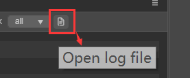
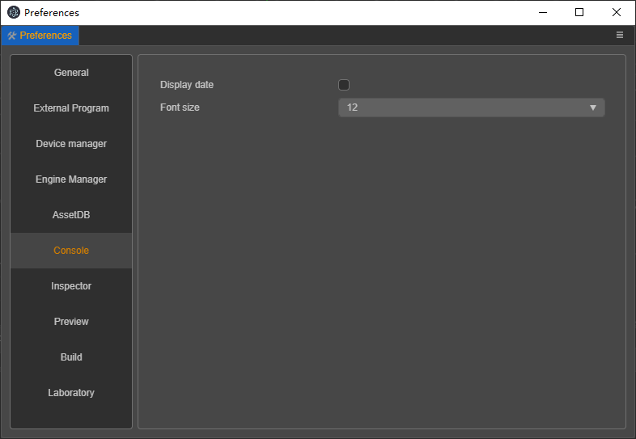

# 控制台


**控制台** 输出编辑器或引擎信息，信息类型有 log 日志, warn 警告, error 报错。不同类型的信息会以不同颜色显示。

显示的颜色如下

  - console.log() 输出日志: <font color=#b6b6b6>灰色文字</font>，编辑器以及插件内开发者觉得有必要打印到控制台的内容。
  

  - console.warn() 输出警告: <font color=#ebbe09>黄色文字</font>，程序运行遇到的不影响结果的异常情况。
  

  - console.error() 输出错误: <font color=#dd3c43>红色文字</font>，运行中遇到的会影响结果的异常，严重级别最高。
  


## 面板操作
顶部工具栏功能依次是：

- 清空当前控制台内的所有日志
- 输入文本模糊搜索
- 是否将输入文本转为正则进行搜索
- 选择要显示的日志类型
- 打开备份在磁盘里的日志文件，每次编辑器启动时会重置该文件数据。

  

## 参数设置

控制台的一些参数在偏好设置里配置，请参考 [偏好设置](../preferences/index.md) 里的扩展设置。



## 内容的输出规则

为了方便定位文件，节点或资源，提供跳转到帮助文档，需要对内容进行了一些识别，添加动作，具体需求有：

- 根据 url 跳转链接
- 根据 url 显示图片
- 根据 url 或 uuid 定位到 Asset 资源
- 根据 uuid 定位到 Node 节点
- 根据磁盘文件路径 path 定位到脚本文件
- 输出对应语言的文案

### 数据格式

- `{type[text](url)}`
- `{type(text | url | uuid | path)}`

### 数据格式说明：
- 整体匹配 `{}` 里面的字符;
- `[text]` 为扩展入参，选填；
- `type` 存在时，不区分大小写；
- `type` 不存在时，原数据输出；

- `types` 有：
  - `link` 外部跳转链接
  - `image` 显示图片
  - `asset` 定位到资源
  - `node` 定位到节点
  - `i18n` 多语言翻译

### 示例

```
console.log('Open {link[the help doc url](https://docs.cocos.com/creator3d/manual/en/editor/console/)}');
console.log('Locate {link[ the file in library](D:/cocos-creator/a/library/36/36b55a90-1547-4695-8105-abd89f8a0e5f.js)}');
console.log('Locate Node UUID {node(f6zHdGKiZDhqbDizUsp8mK)}');
console.warn('Locate Asset UUID {asset(17185449-5194-4d6c-83dc-1e785375acdb)}');
console.error('Locate Asset URL {asset(db://assets/animation.anim)}');
console.log('The URL is {asset[{asset(db://assets/animation.anim)}](db://assets/animation.anim)}');
console.log('Show image {image(https://forum.cocos.org/images/logo.png)}');
console.log('Translate: {i18n(console.description)}');

```
效果如下图

