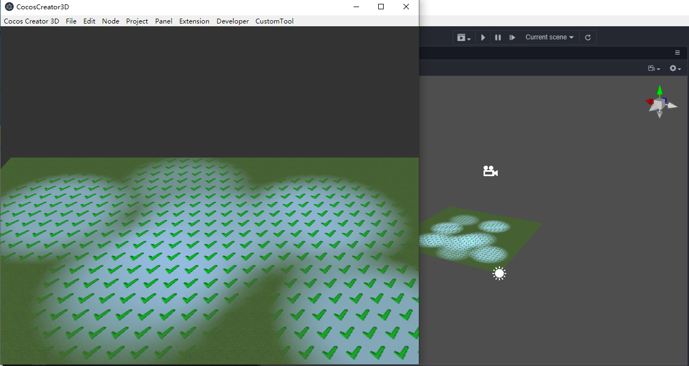
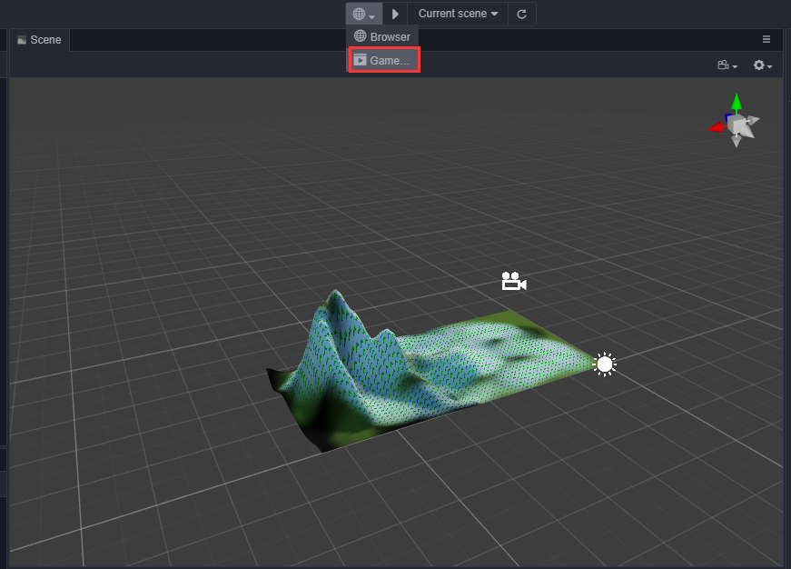
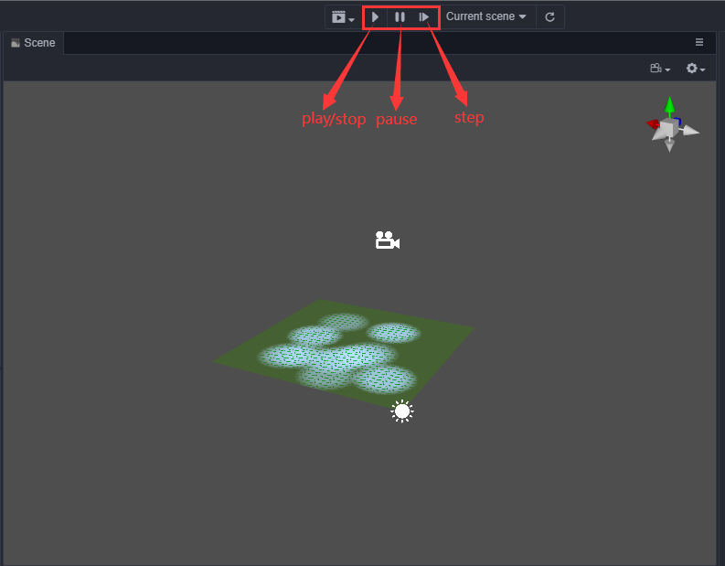
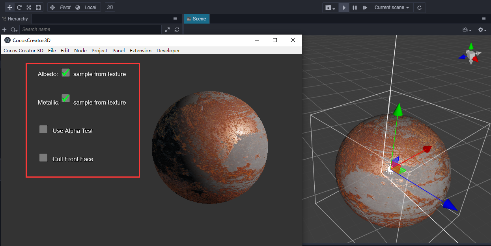

## 预览窗口说明

`预览窗口`是内嵌于编辑器中的游戏视图功能,它可以不通过打开浏览器即可在编辑器中运行游戏，这样做的优势在于:运行后的游戏可以通过编辑器中的其它插件或gizmo实时调整游戏中的模型以及游戏运行时的状态等，做到游戏运行时的"所见即所得"。

## 预览窗口打开方式

在编辑器中通过顶部工具栏`运行方式下拉框`点击`GameView(预览窗口)`项即可开启`预览窗口`功能。

## 按钮操作说明

通过上述方式打开`预览窗口`后，可以发现顶部工具栏多出了`play(播放)/stop(停止)`,`pause(暂停)`,`step(步进)`三个按钮,它们所代表的功能描述如下:

`play(播放)`: 点击该按钮可以在编辑器中运行游戏,同时按钮的状态会切换至可`stop(停止)`的状态(即: 点击`stop(停止)`按钮可停止游戏的运行)。

`pause(暂停)`: 点击该按钮可让运行中的游戏暂停。

`step(步进)`: 点击该按钮可对游戏按步进的方式运行，方便用于调试。

## 预览窗口同步

运行前的`预览窗口`可以作为简单的预览功能存在，当调整gizmo或通过其它插件调整场景时，`预览窗口`的画面可以实时同步。

## 预览窗口运行时

运行游戏时，`预览窗口`可以实时运行各节点组件上的生命周期，这包括了鼠标与键盘事件以及UI事件响应等。

