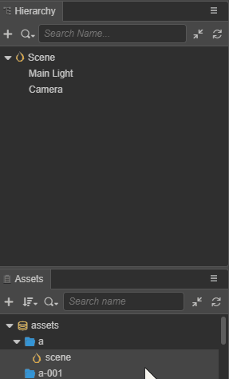
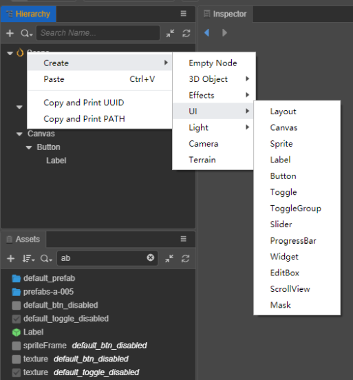
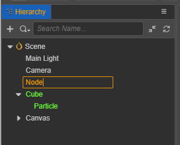

# 层级管理器

**层级面板** 面板上主要有顶部菜单区，底部树形列表区。用来展现当前场景里可编辑的节点之间的关系。场景中仍有一些不可见的私有节点，不会在此显示。

你可以单选，多选，创建，复制，移动，删除，重命名节点，任意节点都可创建出子节点，子节点的坐标相对于父级节点，跟随父级节点移动。

- 顶部菜单的功能有：**新建节点按钮** ，**搜索类型按钮** ，**搜索框**，**全部折叠或展开按钮** ，**刷新列表按钮** 。
- 树形列表区主要体现节点的层级关系，根节点是 **场景节点**，编辑 prefab 文件时，自身的节点作为根节点。
- 选中节点，节点呈现蓝底白字的高亮状态，节点的详细属性会在 **属性检查器** 中显示。点击树形空白区域，可以 **取消选中**。
- 面板按钮和节点支持右击菜单指令。
- 面板支持键盘快捷方式：

    - 复制：Ctrl or Cmd + C
    - 粘贴：Ctrl or Cmd + V
    - 克隆：Ctrl or Cmd + D，Ctrl + 拖动节点
    - 删除：Delete
    - 上下选择：上下箭头
    - 节点的折叠：左箭头
    - 节点的展开：右箭头
    - 多选：Ctrl or Cmd + 点击
    - 多选：Shift + 点击
    - 重命名： Enter/F2
    - 取消输入：Esc

## 新建节点

点击 **新建节点按钮** 新增节点的时候，会先出现一个 **输入框** 要求填入节点的名称，节点的名称允许为空。
树形列表中如果没有选中项，则默认新建到当前根节点上；
如果有多个选中项，此时会新建到第一个选中节点里。

此外节点的右击菜单中也有 **新建** 的入口。

对于 UI 节点，为了让其正常显示，它的任意上级节点至少得有一个含有 **UITransform** 组件，所以创建的时候，如果不符合规则，会辅助添加一个 **Canvas** 节点作为它的父级。

此外可以通过 **资源管理器** 中拖动一个 **prefab** 资源到 **层级管理器** 里生成一个节点。
可以通过 **层级管理器** 中拖动一个 **prefab** 节点到 **资源管理器** 里生成一个资源。

## 移动节点

移动分为**被移动的节点** 和 **目标放置节点**，其中对 **目标放置节点** 的高度进行偏上，中部，偏下三部分识别，分别表示：

- 偏上，将 **被移动的节点** 移到 **目标放置节点** 的上方，两者是平级的。
- 中部，将 **被移动的节点** 移到 **目标放置节点** 的内部，排在最末尾。
- 偏下，将 **被移动的节点** 移到 **目标放置节点** 的下方，两者是平级的。

## 搜索节点

搜索类型有：**搜索名称**，**搜索 UUID**，**搜索 Path**，**搜索组件名称**。
其中 **搜索组件名称** 是搜索节点组件，可在 **属性检查器** 查看到组件名称，如 **MeshRenderer**
**搜索框** 是即时变动搜索的，在搜索结果中选中节点，清空搜索内容后，会重新定位到该选中的节点。

## 重命名节点

选中某个节点，通过快捷键 Enter 或者 F2， 或通过右击菜单的 **重命名** 可以进入修改名称，节点名称允许为空，按快捷键 **Esc** 能取消此次重命名。
不同节点可以有相同的名称。

