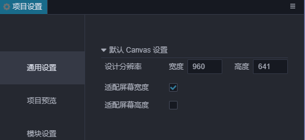
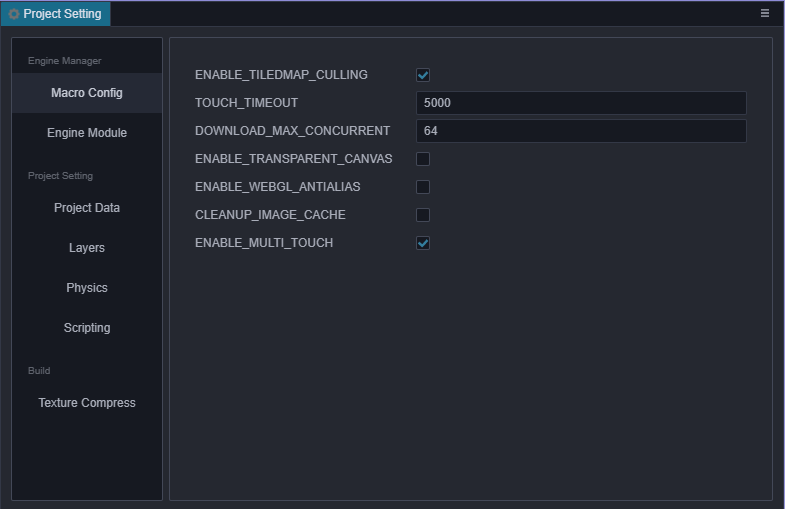
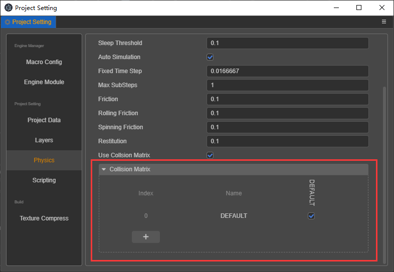
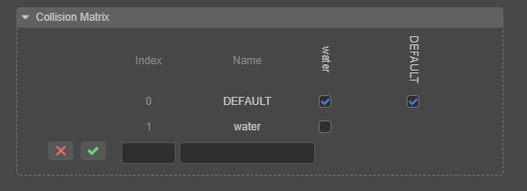
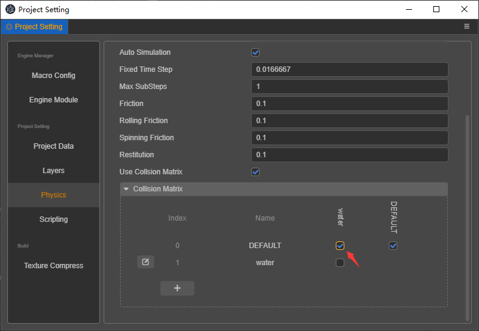

# 项目设置

项目设置面板通过主菜单的 `项目 -> 项目设置` 菜单打开，这里包括所有特定项目相关的设置,这些设置将会影响到整个游戏项目的预览、构建等。这些设置会保存在项目的 `settings / packages` 文件夹里。如果需要在不同开发者之间同步项目设置，请将 settings 目录加入到版本控制。

## 通用设置



### 默认 Canvas 设置

默认 Canvas 设置包括设计分辨率和适配屏幕宽度/高度，用于规定在新建场景或 Canvas 组件 时，Canvas 中默认的设计分辨率数值，以及 `Fit Height、Fit Width` 选项。

更多内容可以参考 [多分辨率适配方案](../ui-system/components/engine/multi-resolution.md)。

## 引擎模块设置


这里的设置是针对发布游戏时引擎中使用的模块进行裁剪，达到减小发布版引擎包体的效果。在列表中未选中的模块在打包、预览时将会被裁剪掉。建议打包后进行完整的测试，避免在场景和脚本中使用裁剪掉的模块。

## 引擎宏配置

关于引擎宏模块的具体信息与代码可以参考 [Engine macro](https://github.com/cocos-creator/engine/blob/3d/cocos/core/platform/macro.ts#L824)，这里提供了修改宏配置的快捷方式，配置的宏将会在预览、构建时生效，同时也会跟随自定义引擎的配置更新当前宏配置的默认值。



## 压缩纹理预设配置

> 编辑器自 v1.2 起，将压缩纹理配置的使用方式修改为在项目设置里配置预设，图片资源处选择预设的方式。旧版本的项目在升级上来后，编辑器将会自动扫描项目内的所有压缩纹理配置情况，整理出几个预设，由于是自动扫描的，在名称的生成可能不会是项目想要的，可以自行在此处修改。

用于添加压缩纹理预设配置，在对应图片资源处可以直接选择此处的压缩纹理预设来快速添加。同时添加完预设后，也可以直接修改预设来达到批量更新配置的使用需求。项目设置允许用户添加多个压缩纹理配置，每个压缩纹理配置允许再针对不同的平台大类来制定配置细则。

目前大致设置以下几个平台大类：

1. Web ：指 Web-Mobile、Web-Desktop 两个平台
2. Mac & Windows
3. iOS
4. Mini Game: 指代各个产商平台的小游戏，比如微信小游戏、华为快游戏等待；
5. Android

对应的平台大类的纹理压缩支持情况可以参考 [压缩纹理章节](../../asset/compress-texture.md)。

### 添加 / 删除纹理压缩预设

在输入框内输入压缩纹理预设名称，点击 Enter 键或者左侧的加号按钮即可添加。


添加完压缩纹理后，如需删除可以直接将鼠标移到预设名称上，点击右侧的删除按钮即可。


### 添加 / 删除纹理压缩格式

点击 `Add Format` 按钮，选择需要的纹理格式，再配置好对应的质量等级即可，目前同类型的图片格式同时只能添加一种。


如需删除，将鼠标移至纹理格式上方，点击红色删除按钮即可。

### 修改压缩纹理预设名称

压缩纹理的名称仅仅是作为显示使用，在添加压缩纹理预设时，就会随机生成 uuid 作为该预设的 ID，因而直接修改预设名称并不会影响图片资源处对预设的引用。


当然，如果确实有替换所有当前使用到该预设图片资源的预设选项需求是，可以鼠标上移到预设名称处，点击拷贝 ID 的按钮，自行在项目内搜索替换即可。

### 导出 / 导入压缩纹理预设

压缩纹理配置页面允许导入、导出压缩纹理预设来更好的跨项目复用配置，也可以自行在外部编辑好压缩纹理预设再导入到编辑器内。

大部分情况下直接导入导出即可，如果需要自行编写这份配置需要参考下方接口定义与范例：

```ts
type IConfigGroups = Record<ITextureCompressPlatform, IConfigGroupsInfo>;
type ITextureCompressPlatform = 'miniGame' | 'web' | 'ios' | 'android' | 'pc';
type ITextureCompressType =
    | 'jpg'
    | 'png'
    | 'webp'
    | 'pvrtc_4bits_rgb'
    | 'pvrtc_4bits_rgba'
    | 'pvrtc_4bits_rgb_a'
    | 'pvrtc_2bits_rgb'
    | 'pvrtc_2bits_rgba'
    | 'pvrtc_2bits_rgb_a'
    | 'etc1_rgb'
    | 'etc1_rgb_a'
    | 'etc2_rgb'
    | 'etc2_rgba'
    | 'astc_4x4'
    | 'astc_5x5'
    | 'astc_6x6'
    | 'astc_8x8'
    | 'astc_10x5'
    | 'astc_10x10'
    | 'astc_12x12';
type IConfigGroupsInfo = Record<ITextureCompressType, IQuality>
interface ICompressPresetItem {
    name: string;
    options: IConfigGroups;
}
```

示例参考：

```json
{
    "default": {
        "name": "default",
        "options": {
            "miniGame": {
                "etc1_rgb": "fast",
                "pvrtc_4bits_rgb": "fast"
            },
            "android": {
                "astc_8x8": "-medium",
                "etc1_rgb": "fast"
            },
            "ios": {
                "astc_8x8": "-medium",
                "pvrtc_4bits_rgb": "fast"
            },
            "web": {
                "astc_8x8": "-medium",
                "etc1_rgb": "fast",
                "pvrtc_4bits_rgb": "fast"
            },
        }
    },
    "transparent": {
        "name": "transparent",
        "options": {
            "miniGame": {
                "etc1_rgb_a": "fast",
                "pvrtc_4bits_rgb_a": "fast"
            },
            "android": {
                "astc_8x8": "-medium",
                "etc1_rgb_a": "fast"
            },
            "ios": {
                "astc_8x8": "-medium",
                "pvrtc_4bits_rgb_a": "fast"
            },
            "web": {
                "astc_8x8": "-medium",
                "etc1_rgb_a": "fast",
                "pvrtc_4bits_rgb_a": "fast"
            },
        }
    }
}
```

## Layers


- Layers 能让相机渲染部分场景，让灯光照亮部分场景。也可以在射线检测时通过 Layers 处理物体是否碰撞。
- 可自定义 0 到 19 个 Layers，当您把输入框清空时即删除原先的设置。
- 后 12 个 Layers 是引擎内置的，不可修改。
- 目前使用的位置有：编辑 node 节点时， inspector 面板上的 Layer 属性; 编辑 Camera 节点时的 Visibility 属性。


<!-- native 引擎设置的修改主要影响的是构建原生项目时使用 cocos2dx 引擎模板，修改后可以实时生效。 -->

## Physics 物理设置

在项目设置的引擎模块中 Physics 选项被勾选时，物理配置生效。


物理配置将会在项目预览和项目发布时使用，会影响到重力，摩擦力，动能传递，检测碰撞等方面的物理效果。

### 属性说明


- `gravity` 重力矢量，正负数值体现了方向性，默认值 *{ x: 0, y: -10, z: 0 }*
- `allowSleep` 是否允许休眠，默认值 *true*
- `sleepThreshold` 进入休眠的默认速度临界值，默认值 *0.1*，最小值 *0*
- `autoSimulation` 是否开启自动模拟
- `fixedTimeStep` 每步模拟消耗的固定时间，默认值 *1/60*，最小值 *0*
- `maxSubSteps` 每步模拟的最大子步数，默认值 *1*，最小值 *0*
- `friction` 摩擦系数，默认值 *0.5*
- `rollingFriction` 滚动摩擦系数，默认值 *0.1*
- `spinningFriction` 自旋摩擦系数，默认值 *0.1*
- `restitution` 弹性系数，默认值 *0.1*
- `useNodeChains` 是否使用节点链组合刚体，默认值 *true*
- `useCollisionMatrix` 是否使用碰撞矩阵，默认值 *true*
- `collisionMatrix`  碰撞矩阵的设置结果，{ index: value } 格式，默认值 *{ "0": 1 }*

### 碰撞矩阵设置



#### 分组的概念

碰撞矩阵的识别通过分组管理，每一组格式为 `{ index, name }` 格式，`index` 与 Layers 概念相同，也是从 0 到 31 的位数，而 `name` 是这组的名称。

默认会有一个 Default 分组 `{ index: 0, name: 'DEFAULT' }`

可以新增分组，新增时 `index`, `name` 均不能为空，且不能与现有项重复；新增后分组不可以删除，但可以修改分组的名称。




#### 碰撞分组配对

比如新增了一个 water 分组。



这张表里面的行与列分别列出了分组列表里面的项，你可以在这张表里面配置哪一个分组可以对其他的分组进行碰撞检测。

**  DEFAULT 分组 和 water 分组交叉的复选框勾上，就表示两组所在的节点，各自进行碰撞检测时，都会将对方组进行碰撞检测，没有勾上就不会有进行检测 **

根据上面的规则，在这张表里产生的碰撞对有：

DEFAULT - water

DEFAULT - DEFAULT

water - DEFAULT


## 骨骼贴图布局设置

显式指定骨骼贴图布局，用于辅助蒙皮模型的 instancing，具体参考 [这里](joints-texture-layout.md)。
