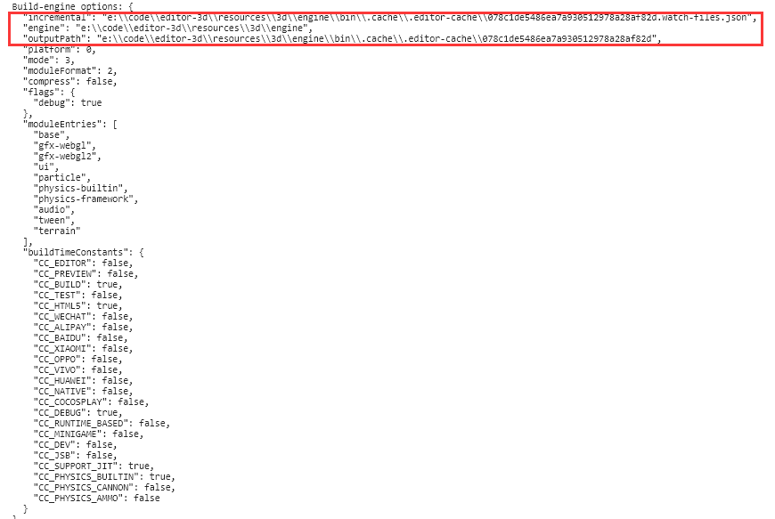

# 构建流程简介与常见问题指南

**构建基础结构介绍**

构建主要有两个大流程，一个是 **通用构建处理**，一个是 **平台适配处理**。各个平台的适配处理逻辑将会以构建插件的形式注入到编辑器构建内，每个平台的适配构建都是相互隔离的。平台各自的一些构建参数在构建面板也会以比较特殊的方式显示在界面上，这一点将来构建插件开放，开发者一样可以去动态注入一些构建参数 UI 在界面上方便使用。

## 通用构建处理流程简介

Cocos Creator 3D 的通用构建流程，主要有以下部分内容：

1. [构建参数初始化](#构建参数初始化)
2. [构建数据整理](#构建数据整理)
3. [资源构建写入文件系统](#资源构建写入文件系统)
4. [整理 settings 数据](#整理-settings-数据)
5. [settings uuid 压缩与文件写入](#settings-uuid-压缩与文件写入)

### 构建参数初始化

这个步骤主要是将传递给构建的初始 options 初始化为构建内部的 options，做一些参数的格式转换以及构建资源数据库的资源数据初始化，加载最新的资源信息并分类。

### 构建数据整理
 
编辑器会先汇总 **当前参与构建的场景以及所有在 `resources` 目录下的资源，每个资源的打包都会经过引擎的反序列化，查找出依赖资源再递归进行资源的打包**。在反序列化之前会先配置整个项目的脚本环境，也就是加载所有的非插件项目脚本。因为脚本的加载正确与否会直接影响到反序列化的进行，因而**如果脚本编写的不合法加载失败会直接导致构建失败。如果在反序列化过程中发现有依赖的资源丢失会发出警告，但会继续进行构建。这里的警告并不意味着问题不需要解决，如果资源丢失不解决，是难于保证构建后的内容不出问题的**。

这一步骤也会找出根据构建内部划分的资源类型，比如场景、脚本、图片压缩任务、json 分组信息等进行整理，这一步骤将会剔除没有使用到的资源信息。需要注意的是，这个步骤之前会去加载所有的用户脚本，

### 资源构建写入文件系统

根据前两个步骤（参数初始化以及构建数据整理）的结果，将使用到的资源生成到文件系统内，打包之后，所有的序列化文件都会放置在构建后目录的 `res/import` 目录下，所有的资源的源文件将会放置在 `res/raw-assets` 目录下。具体可以分为以下几个步骤：

- **脚本构建**：编辑器内对脚本的构建分为 **插件脚本** 和 **非插件脚本** 两类。

  - 插件脚本会直接把源文件按照原来的目录结构拷到构建后文件夹的 `src` 目录下，所以插件脚本是不支持任何需要编译的脚本形式的比如 ts 或者是使用 es6 写法的 js。插件脚本的资源信息则会写进 settings 里的 jsList 数组内。

  - 非插件脚本将会全部打包成 `project.js`（调试模式下是 `project.dev.js`），放在对应的 src 目录下。勾选 sourceMap 选项将会生成对应的 map 文件，根据 debug 选项来确定脚本是否压缩。

- **自动图集处理**：查询项目内部的自动图集资源信息，根据自动图集资源的配置将图集下的 SpriteFrame 小图打包成大图、生成序列化文件等等。这一步骤会修改 json 分组信息、asset 资源分组信息以及添加纹理压缩任务。如果构建选项没有勾选自动图集，不进行任何处理。

- **纹理压缩**：根据整理好的图片压缩任务，进行图片资源的压缩处理并写入到构建文件夹内，如果构建选项没有勾选纹理压缩，不进行任何处理。

- **引擎构建**：根据项目设置内的引擎模块设置剔除没有使用到的引擎模块，打包为 cocos3d.js，生成到 `src` 文件夹下。勾选 sourceMap 选项将会生成对应的 map 文件，根据 debug 选项来确定脚本是否压缩。

    引擎打包的主要步骤是：

    - 获取**项目设置里的引擎模块信息**；

    - **检查缓存**中的引擎版本与当前需要编译的引擎是否一致，内容一致直接拷贝不编译；

    - 如需编译，根据引擎接口，执行打包引擎的任务，之后拷贝编译后的 js 文件，并保存引擎的修改时间；

    编译引擎时，可以查看 [输出的 log 信息](./build-panel.md#%E6%9E%84%E5%BB%BA-log-%E4%BF%A1%E6%81%AF%E6%9F%A5%E7%9C%8B)：

    

    关于引擎文件的复用规则，这里有必要阐述下：<br>
    打包好的引擎文件将会放置在引擎目录的 `bin/.cache/.editor-cache` 文件夹下, 按照会影响引擎编译的参数生成的 hash 值存放，其中 `.watch-file.json` 是引擎各个文件的修改时间。

    ```bash
    engine-folder
    |--bin
        |--.cache
            |--.editor-cache
                |-- 1dc4a547f9...63a43bb8965.watch-files.json
                |-- 1dc4a547f9...63a43bb8965
                |-- 1dc4a547f9...63a43bb8965.map
                ...
    ```

    只要任何相关的引擎构建参数发生更改，就会重新编译引擎，具体影响构建引擎缓存使用的有：

  - debug: 是否打开调试模式
  - includeModules: 引擎模块设置
  - sourceMaps：是否开启 sourceMap
  - platform：构建平台
  - 引擎修改时间
  - 是否勾选分离引擎（仅微信平台）

- **json 构建**：序列化 json 根据 json 分组进行合并写入文件系统(`res/import` 文件夹内)，如果是 **release 模式还会对序列化 json 内的 uuid 进行压缩处理**。

- **普通资源拷贝**：一些原始资源（rawAssets）直接从 library 拷贝到构建后的 `res/raw-assets` 文件夹内。

- **md5 处理**：将 res 文件夹内的资源全部加上 md5 后缀，并整理数据准备记录在 settings 内。

- **main.js 模板文件生成**：根据用户选项注入一些项目设置到 main.js 文件夹内并生成到构建输出目录下。

### 整理 settings 数据

主要是根据之前资源整理的数据，准备游戏启动必要的配置信息。

关于 settings 结构的通用解析：

```js
{
    debug: boolean; // 是否为调试模式，取自构建配置面板
    designResolution: { // canvas 分辨率设置，取自项目设置内数据
        width: number; // canvas 分辨率宽度
        height: number; // canvas 分辨率高度
        policy: number; // 满屏的宽高适配模式
    };
    launchScene: string; // 初始场景的 url
    platform: string; // 平台
    rawAssets: { [index: string]: { [uuid: string]: string[] } };
    // 存储 resources 下加载的资源 url 与类型
    // 示例: "bba00d3a-2f17-4511-b47c-0d584b21b763@6c48a": ["test/right/texture", "cc.Texture2D", "bba0...@6c48a"]
    // "bba0...@6c48a": ["test/right/texture", 1, 1]
    scenes: Array<{url: string, uuid: string}>; // 参与运行的场景信息数组
    scriptPackages: Array<{moduleId: string, file: string}>; // 脚本信息数组
    jsList: string[]; // 脚本插件数组
    moduleIds: string[]; // 所有用户脚本组件的信息
    packedAssets: Record<string, IUuid[] | number[]>; // json 分组信息
    md5AssetsMap: { [index: string]: Array<string | number> }; // 勾选 md5Cache 后才有,数组部分以 [uuid_1, md5_1, uuid_2, md5_2, ...] 的格式存储的，其中 uuid_1 如果是个简单数字说明存储的是 uuids 数组内的 uuid 索引。
    uuids: string[]; // uuid 数组，仅 release 模式下
    assetTypes?: string[]; // 资源类型数组，仅 release 模式下

    subpackages?: Record<IUuid, IPackageInfo>; // 分包资源信息，仅仅支持分包的平台存在
    renderPipeline：string；// renderPipeline 信息，取自项目设置
}
```

这里的结构仅列举了通用流程下的 settings 结构，实际上在不同的平台打包时，会根据需要添加配置。

### settings uuid 压缩与文件写入

资源打包过程中也会不断的收集参与资源构建的资源 uuid，最终会整理写进 setting.js。setting.js 会被写入在构建后文件夹的 `src` 目录下，生成之前将会根据是否为调试模式来决定是否对文件内的 uuid 做压缩处理，所有使用到的 uuid 会进行整理，将出现 **两次以上** 的存储进 `uuids` 数组内，之前使用 uuid 的位置替换为索引。所有出现两次的 `assetType` 也会存储到 `assetTypes` 数组中，使用的地方存储为索引。

#### 构建资源

这一步骤内所指的对资源的打包是指除了脚本以外的资源文件，因为脚本是作为特殊文件来打包处理的。在打包资源阶段，编辑器会先汇总**当前参与构建的场景以及所有在 `resources` 目录下的资源，每个资源的打包都会经过引擎的反序列化，查找出依赖资源再递归进行资源的打包**。在反序列化之前会先配置整个项目的脚本环境，也就是加载所有的非插件项目脚本。因为脚本的加载正确与否会直接影响到反序列化的进行，因而如果脚本编写的不合法加载失败会直接导致构建失败。如果在反序列化过程中发现有依赖的资源丢失会发出警告，但会继续进行构建。这里的警告并不意味着问题不需要解决，**如果资源丢失不解决，是难于保证构建后的内容不出问题的**。

资源在打包过程中执行反序列化后会重新压缩序列化，以减小打包之后的包体。texture 资源的序列化文件会全部打包成一个 json 文件，其他序列化文件则根据构建配置参数来决定是否分包。

#### 构建脚本

编辑器内对脚本的构建分为 **插件脚本** 和 **非插件脚本** 两类。

- 插件脚本会直接将源文件按照原来的目录结构拷贝到构建后生成的 `build/src` 目录下，所以 **插件脚本是不支持任何需要编译的脚本形式** 的比如 ts 或者是使用 es6 写法的 js。插件脚本的资源信息则会写进 settings 里的 jsList 数组内。

- 非插件脚本将会全部打包成 `project.js`（调试模式下是 `project.dev.js`），放在对应的 src 目录下。

## 平台适配处理

构建提供了部分生命周期的钩子函数，方便开发者在构建的不同处理时期参与构建，影响构建结果。同时构建也提供了开发者直接添加一些构建选项的方法，可以修改构建配置页的 UI 界面、数据检验等等。目前这些功能都尚未对外开放，这里只简单介绍，但编辑器内部的平台构建插件已经是以这种方式开发的。构建插件注入的构建选项将会存放在 `options.packages` 内部，因而目前命令行构建的选项参数编写方式也需要遵循此规则。

## 常见问题指南

构建的整个进程是在一个单独的 worker 内的，所以如果想要查看构建过程的 log 信息或者查看出现报错时完整的调用栈，需要在主菜单的 `开发者 -> 打开构建调试工具` 里打开。构建时其实会输出很多的 log 信息，但是为了不干扰用户只有错误和重要信息会被打印到编辑器的控制台，调试工具里的信息才是最完整的。当然，也可以在 `偏好设置 -> 扩展 -> builder -> 日志等级` 内修改日志等级，详情可以参考 [构建相关文档](./build-panel.md)。

有必要说明的是，在构建之前**请先确保参与构建的场景是可以正常预览的**。一些场景的资源丢失或者其他脚本问题，是在预览阶段就能暴露出来的。在保证预览正常的情况下构建能更好的节约时间以及排查问题。

### 资源加载 404

这种情况下，请复制报资源丢失信息里的 `uuid` 去资源管理器里面查找对应的资源，查看该资源依赖的资源是否都正常。资源加载 404 通常有以下几种情况：

1. **在脚本内动态加载了没有放在 resources 中的资源**。

    - **原因**：通过上面的介绍，我们知道只有在 `resources` 目录下的资源以及参与构建场景的资源才会被打包到最终的构建文件夹内，并且**只有放进 `resources` 文件夹内的资源 url 才会写入到 settings.js**。所以如果在脚本内使用了某个资源但这个资源没有放在 `resources` 目录下，之后加载就会出现 404 了。

    - **解决方案**：将使用到的资源移动在 `resources` 文件夹下。

2. **加载的资源导入有问题，未能正常生成数据到 library 内**

    - **原因**：构建时所有的原始数据都是通过读取 library 中的资源文件获得的，如果导入失败将无法获取到正确对应的资源信息。

    - **解决方案**：通过资源管理器找到对应资源，点击右键，选择菜单中的 **重新导入资源**。

3. **资源丢失**

    - **原因**：在前面的构建流程里介绍过，**资源的构建会经过反序列查找依赖**，而最经常出现问题的就是所依赖的资源在项目迭代过程中被不小心删除而导致资源丢失。这些资源的丢失可能平时并没有注意到，但一旦执行构建将会暴露出来。

    - **解决方案**：通过代码编辑器查找该 uuid 被哪些资源所引用，修改对应资源。

### 脚本资源加载报错

在前面介绍 [构建数据整理](####构建数据整理) 时有提到过，构建时需要配置脚本环境。如果报错信息与脚本相关，请参考报错内容对脚本进行修改。如果不清楚是哪个脚本的报错，可以在报错信息调用栈中找到对应脚本的 uuid，然后在资源管理器中查找定位。

### 如何查找到小图自动合图后的大图

自动图集在构建过程中会打印出原始小图与合成大图的 uuid 信息，直接在构建调试工具内就可以查看到，用查找到的大图 uuid 在打包后文件夹 `res/raw-assets` 内查看即可。如果合图太多，可以打开构建 log 用搜索 uuid 的方式查找。


<!-- 
### 如何解压缩 uuid

在 release 模式下打包出来的资源 json 以及 settings 内的 uuid 都是压缩后的，需要将其解压才能找到对应原项目内的资源。 -->

<!-- ### 如何查找到资源序列化 json 在构建后包体内的位置

json 打包后都会存放在 `res/import` 文件夹内，如果是普通资源直接用 uuid 去文件夹内搜索即可。 -->

### 引擎编译失败

如果是自定义引擎编译失败，请检查你修改的代码，或者自定义引擎路径。<br>
如果是引擎编译失败，请附上 Creator 3D 版本、构建选项配置、构建任务中的构建日志文件以及可复现问题的 demo 到 [论坛](https://forum.cocos.org/c/3D) 提问。

### 其他报错

如果遇到其他无法自行解决的构建报错信息，请附上 Creator 3D 版本、构建选项配置、构建任务中的构建日志文件以及可复现问题的 demo 到 [论坛](https://forum.cocos.org/c/3D) 提问。
