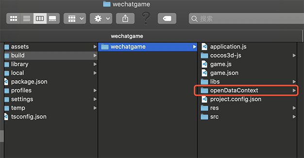
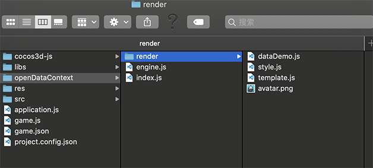
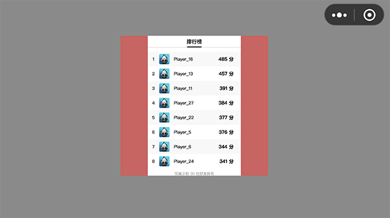

# 构建开放数据域工程

## 开放数据域简介

目前，**微信**、**百度** 和 **字节跳动** 这些小游戏平台为了保护其社交关系链数据，增加了 **开放数据域** 的概念，这是一个单独的游戏执行环境。开放数据域中的资源、引擎、程序，都和主游戏完全隔离，开发者只有在开放数据域中才能通过平台提供的开放接口来访问关系链数据，用于实现一些例如排行榜的功能。

在 Cocos Creator 3D 当中，我们已经废弃了对 Canvas Renderer 模块的维护。而开放数据域目前只支持 Canvas 渲染。
在之前的方案里，我们使用 Cocos Creator 2D 来构建子域项目。从 v3.0 开始，我们废弃了这样的做法，支持内置一个小游戏的 Canvas 引擎。该引擎由微信团队提供，是基于 XML+CSS 设计的一个前端轻量级 Canvas 引擎。

而开发者只要掌握一些基本的前端技能，就能简单地实现一个排行版功能了。

## 构建流程

1. 在主域工程当中，在需要显示子域的节点上添加 `SubContextView` 组件

2. 目前支持构建开放数据域项目的平台有 **微信**、**百度** 和 **字节跳动**，在这些平台的构建选项里，勾选 **生成开放数据域工程模版**，点击 **构建**

    

3. 构建后，将在目录下生成一个命名为 **openDataContext** 的开放数据域工程，该工程为 Cocos Creator 内置的模版工程。  
**注意**：下次构建，如果构建目录里存在 **openDataContext** 目录，则不会被覆盖掉。

    

4. 使用平台方提供的开发者工具打开构建出来的主域工程，即可看到开放数据域模版工程的效果

    

## 开放数据域工程定制方法

在准备定制开放数据域工程之前，我们需要先了解一些基础技能，这里包括 [minigame-canvas-engine 快速入门](https://wechat-miniprogram.github.io/minigame-canvas-engine/api/guide.html#%E5%AE%89%E8%A3%85) 和 [doT 模版引擎使用](http://olado.github.io/doT/?spm=a2c6h.12873639.0.0.36f45227oKu0XO)

在了解完这些基础技能之后，我们就可以很方便的定制开放数据域工程了。  
构建生成后的开放数据域工程模版，目录结构如下：



- **render/template.js**：记录 XML 文本信息，可参考 [标签文档](https://wechat-miniprogram.github.io/minigame-canvas-engine/api/tags.html#%E6%A0%87%E7%AD%BE%E5%88%97%E8%A1%A8)，工程里默认使用模版引擎生成 XML 文本
- **render/style.js**：记录 CSS 样式文本信息，可参考 [样式文档](https://wechat-miniprogram.github.io/minigame-canvas-engine/api/style.html#%E5%B8%83%E5%B1%80)
- **render/dataDemo.js**：模拟一些随机的排行版数据，开发者可以在这里请求平台方的关系链数据，并传给 doT 模版引擎生成相关 XML 文本
- **render/avatar.png**：模版工程展示用的头像图片，可以删除
- **engine.js**：小游戏 Canvas 引擎源码
- **index.js**：开放数据域工程入口文件，在该文件中通过将 XML 文本和 CSS 样式传递给 Canvas 引擎，即可渲染开放数据域

## SubContextView 组件说明

SubContextView 组件主要包含两个属性，**设计分辨率** 和 **FPS**


开放数据域的渲染流程是将 content 渲染到 sharedCanvas 上，之后主域将 sharedCanvas 作为纹理贴图渲染到 SubContextView 上。  

### 设计分辨率

上图中将组件的设计分辨率设置为 640 * 960。则在组件加载完成阶段，sharedCanvas 的尺寸会被设置为 640 * 960。意味着构建之后，开放数据域工程都是在一张 640 * 960 的离屏画布上做渲染，这就要求在 style.js 里设置样式的时候，标签的宽度最大为 640，高度最大为 960，否则渲染的内容会超出画布。例如：

```js
// style.js
export default {
    container: {
        width: 640, // max width
        height: 960,  // max height
    },
}
```
为了避免这部分的数据耦合，我们支持了给尺寸设置百分比适配，例如：
```js
// style.js
export default {
    container: {
        width: '100%',
        height: '100%',
    },
}
```

实际渲染的过程，可以将 sharedCanvas 理解为 content，将 SubContextView 节点理解为 container。引擎将采用 SHOW ALL 的适配策略将 sharedCanvas 渲染到屏幕上，避免渲染时拉伸使 UI 产生变形。




### 设置 FPS

该属性主要设置主域更新 sharedCanvas 到屏幕上的频率，避免主域频繁更新开放域贴图，以防造成一定的性能损耗。

## 一些推荐做法

1. 前面提到，在下一次构建开放数据域工程模版时，如果构建目录下已经存在 **openDataContext** 目录，则不会被覆盖掉，这是因为我们不希望覆盖掉开发者定制过的工程。由于 build 目录默认被 git 忽略，如果开发者希望将 **openDataContext** 工程纳入版本管理，可以考虑将构建后的工程放入 build-templates 目录，具体可参考 [定制项目构建流程](./custom-project-build-template.md)
2. 在开放数据域项目中，如果需要监听来自主域的消息，则需要先判断消息是否来自主域引擎，以微信接口为例：

```js
wx.onMessage(res => {
    if (!(res && res.type === 'engine')) {
        console.log('do something...');
    }
});
```

我们也推荐在向开放域发送消息时，附带上 type 信息，这里 `res.type === 'engine'` 表示消息来源于引擎，避免处理错误的消息源。

## 已知问题

在百度平台的开放数据域里，由于图片只能加载来自百度返回的玩家头像，所以生成的模版工程里，可能本地的头像图片会加载不出来。

## 参考链接

- [minigame-canvas-engine 文档](https://wechat-miniprogram.github.io/minigame-canvas-engine/)
- [minigame-canvas-engine 仓库](https://github.com/wechat-miniprogram/minigame-canvas-engine)
- [doT 模版引擎](http://olado.github.io/doT/?spm=a2c6h.12873639.0.0.36f45227oKu0XO)
