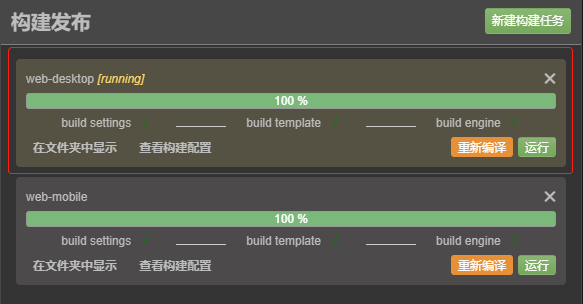

# 熟悉构建发布面板与常用构建参数

## 构建发布面板使用简介
点击主菜单中的 `项目` -> `构建发布` 或者使用快捷键 `Ctrl / Cmd + Shift + B` 即可打开构建发布面板，构建发布是以构建任务的形式进行，可以同时进行多个平台的构建任务。由于引擎的复用是以平台作为区分的，所以**不支持同一平台同时构建，但可以给同一平台添加多个构建任务**。如果同时添加了多个同一平台的构建任务，编辑器将会按照任务添加的先后顺序，在该平台的构建任务完成后自动开始继续构建下一个任务。在遇到一些面板或者参数的使用上的疑惑等，在构建参数配置面板的标题旁也有转到构建文档的按钮，帮助快速查阅文档。

## 新建构建任务
点击右上方的 **新建构建任务** 按钮，即可打开构建参数配置面板，在该区域内填写好相关的构建参数，点击构建即可。
>注：没有场景的项目构建是没有意义的，因而空场景的项目是不允许添加构建任务的。

其中构建参数的第一项，**构建任务名，将会作为实际打包后的包体文件夹命名**，默认是无需修改的，当需要覆盖旧有的包体文件夹时可以改成其他名字。

>注：Cocos Creator 构建后是使用平台作为包体名称，并且构建默认会覆盖原来打包后的内容。而 Cocos3D 是将构建任务名称作为包体名称，允许更改，默认会使用和现有包体不一样的名字作为构建任务名，修改未同名后可覆盖原包体。

## 构建进度查看
点击构建后，可以在构建面板上看到当前的构建任务进行情况。构建进行中进度条将显示为黄色，如果构建成功，进度条会显示为绿色，并且每个子任务后都会有 √ 的标识。第一次构建的时候，引擎编译会比较慢请耐心等待。如果构建失败，进度条则会显示为红色，对应失败的子任务后会显示红色的感叹号。

构建完成后，点击运行即可预览构建后的项目效果。

## 构建参数查看
面板上的构建任务都会有一个 `查看构建配置` 按钮，点击即可查看之前构建的参数配置情况。
在编辑器内构建过的构建任务信息，将会保存在项目目录下的 `profiles/packages/build.json` 里，只要没有在面板上删除对应构建任务或者删除对应的实体文件，就可以在重新打开编辑器后查看之前构建的参数配置、运行预览等操作。

同时，点击构建构建后，编辑器也将打印出当前构建的参数内容，可以作为命令行构建的参数配置参考。

## 重新编译
经常在打包后，会想要更改之前配置参数或者是之前的项目内 bug 修复后希望重新构建。而构建面板这边提供了两种重新编译的入口，一种是直接在构建任务上，点击将会直接复用之前的构建配置参数进行重新构建。另一种则是在点击 `查看构建配置参数` 后也会有 `重新构建` 的按钮出现。不同的是，后一种允许修改除了构建任务名与构建平台以外的参数。

## 正在运行的构建项目
构建的预览 url 都是预览 URL 路径下的 build 路径，同一时间内编辑器内可以预览的 web 构建项目只有一个，只有点击对应项目的 `运行` 按钮后才会将新的项目地址放在服务器上。当前已经设置在编辑器服务器上的项目，会有比较明显的标识如下图，直接访问构建的预览 URL 访问到的就是该项目。

