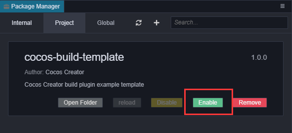
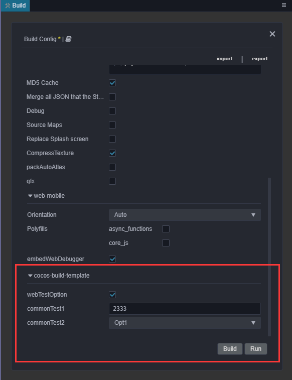
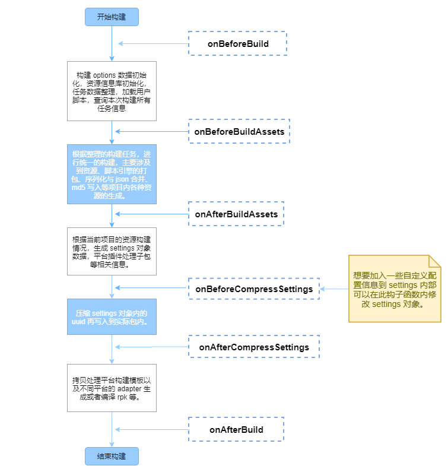

# 扩展构建流程

构建平台插件首先是需要一个普通的编辑器插件格式，关于插件的基本结构可以参考 [Package 插件系统](../extension/install.md)。扩展构建功能首先需要对构建的整体处理流程有所了解，不熟悉的开发者建议先阅读 [构建流程简介与常见问题指南](./build-guide.md)。

## 快速开始

1. 点击编辑器内的菜单内的 **项目 -> 生成构建插件模板**，选择文件夹后即可在对应位置生成一份构建插件模板。作为项目使用的构建插件可以选择项目下的 `packages/xxx` 路径，作为全局使用的构建插件可以选择全局插件目录下 `packages/xxx` 路径，本例作为测试使用直接放在项目下的 `packages` 文件夹内即可。

2. 选择对应文件夹后，如果正常生成会看到控制台上回打印生成构建模板成功的 log，使用 Ctrl + 鼠标可以直接跳转到对应位置。

3. 文件夹直接放置在项目目录下的 packages 后，在菜单里点击打开插件管理器，在项目页点击刷新即可看到最新添加的插件。此时点击 **Enable** 按钮即可启用插件。

    

4. 启用插件后打开构建插件面板，选择 `Web-Mobile` 平台，即可看到构建插件注入的新参数，点击 **构建** 即可生效。

    

5. 通过直接修改该文件夹内的代码，再编译，然后 reload 该插件即可。示例是一个使用 ts 编译的小范例，不清楚如何编译的可以参见插件包内的 readme 文档。

## 基本配置流程

扩展构建功能的插件，需要在 `package.json` 中的 `contributions` 添加 `builder` 字段，字段内可以对指定平台传递对应模块的相对路径配置。

**package.json 对应示例：**

```json
{
    "contributions": {
        "builder": "./dist/builder"
    }
}
```

## 插件入口配置代码示例与接口定义

入口配置代码示例如下：

```ts
export const configs: IConfigs = {
    'web-mobile': {
        hooks: './hooks',
        options: {
            remoteAddress: {
                label: 'i18n:xxx',
                render: {
                    ui: 'input',
                    attributes: {
                        placeholder: 'Enter remote address...',
                    },
                },
                verifyRules: ['require', 'http'],
            },
        },
    },
};
```

需要注意的是不同进程内的环境变量会有所差异，在编写脚本时需要额外注意：
- 如果平台 key 添加的是 `*`，则对所有的平台都生效。但是用 `*` 的话，和指定平台名称是互斥的，请不要在同一个构建插件内部同时使用两种配置方式。
- `hooks` 字段传递的脚本将会在构建进程内执行
- `panel` 字段传递的脚本则会在渲染进程内执行

详细的接口定义说明如下：

```ts
declare type IConfigs = Record<Platform | '*', IPlatformConfig>;
declare interface IBuildPlugin {
    hooks?: string; // 钩子函数的存储路径
    options?: IDisplayOptions; // 需要注入的平台参数配置
    verifyRuleMap?: IVerificationRuleMap; // 注册参数校验规则函数
}
declare type IDisplayOptions = Record<string, IConfigItem>;
declare interface IConfigItem {
    // 默认值，注册的默认值将会在插件自身配置里的 options.[platform].xxx 字段内
    default?: any;

    render: ?{
        // 渲染 ui 组件规则，与 ui-prop 处统一规则一致，只有指定了 ui 属性的配置才会在构建配置面板上显示
        ui?: string;
        // 传给 ui 组件的配置参数
        attributes?: IUiOptions;
    };

    // 配置显示的名字，如果需要翻译，则传入 i18n:${key}
    label?: string;

    // 设置的简单说明，将会显示在配置名称的鼠标上移 title 上
    description?: string;

    // 配置的类型
    type?: 'array' | 'object';

    // 如果 type 是 array，则会按照指定数据类型和 itemConfigs 来渲染数据
    itemConfigs?: Record<string, IConfigItem> | IConfigItem[];
}

declare interface IUiOptions extends IOptionsBase {
    // 校验规则数组，构建提供一些基础规则，也可以通过 verifyRuleMap 来指定新的校验规则，只有当传入 require 时才会做无值的校验，否则仅存在值时才校验
    verifyRules?: string[];
}

declare interface IUiOptions extends IOptionsBase {
    class?: string | string[]; // 需要设置在当前 ui-prop 上的样式名称
}
```

其中 `IOptionsBase` 的接口定义需要参考 [ui-prop 自动渲染规则定义](../extension/ui.md)。

## 自定义构建钩子函数代码配置

入口配置里的 hooks 字段定义的脚本模块内可以编写构建生命周期的钩子函数，在不同的钩子函数内部，接受到的数据会有差异。钩子函数全部都运行在构建进程内，在构建进程内可以直接使用引擎方法，如需使用 `Editor` 需要添加代码 `import * as Editor from 'editor';` 手动 require，关于 Editor 的接口介绍还请参考编辑器的插件开发文档。公开的钩子函数与构建的生命周期的关系可以参考下图：



钩子函数的大致接口定义如下图：

```ts
declare interface IHook {
    throwError?: boolean; // 插件注入的钩子函数，在执行失败时是否直接退出构建流程
    // ------------------ 钩子函数 --------------------------
    onBeforeBuild?: IBaseHooks;
    onBeforeCompressSettings?: IBaseHooks;
    onAfterCompressSettings?: IBaseHooks;
    onAfterBuild?: IBaseHooks;
}
type IBaseHooks = (options: IBuildTaskOptions, result?: IBuildResult) => void;
```

> **注意**：在 `onBeforeCompressSettings` 开始才能访问到 `result` 参数，并且传递到钩子函数内的 `options` 是实际构建进程中使用 `options` 一个副本仅作为信息的获取参考，因而直接修改它并不会真正的影响构建。构建参数的修改请使用入口的 `options` 来配置。由于接口定义众多，详细的接口定义可以参考构建插件模板文件夹内的 `@types/builder.d.ts` 文件。

简单的代码示例：

```ts
export function onBeforeBuild(options) {
    // Todo some thing...
}
export function onBeforeCompressSettings(options, result) {
    // Todo some thing...
}
```

## 构建插件调试

点击菜单里的 **开发者 —> 打开构建调试工具**，即可正常调试添加的构建插件脚本。
