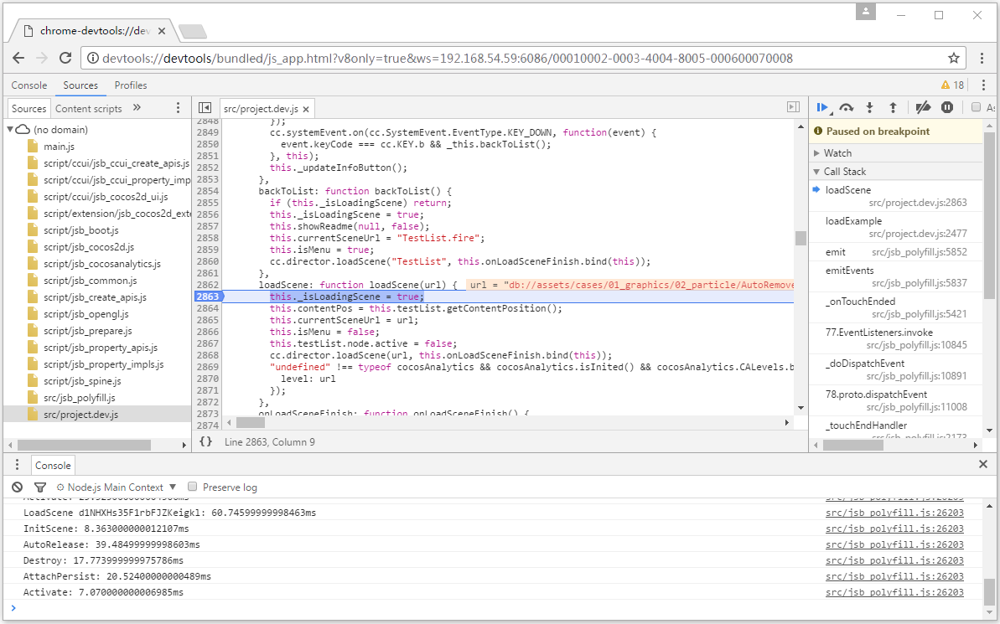
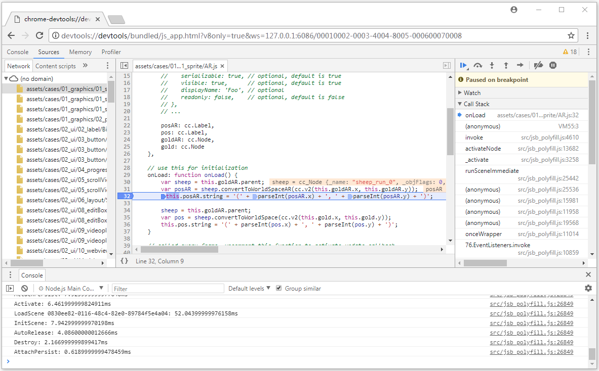
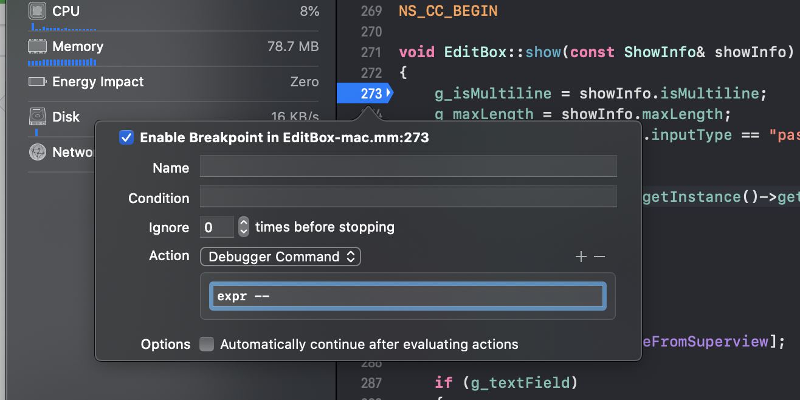
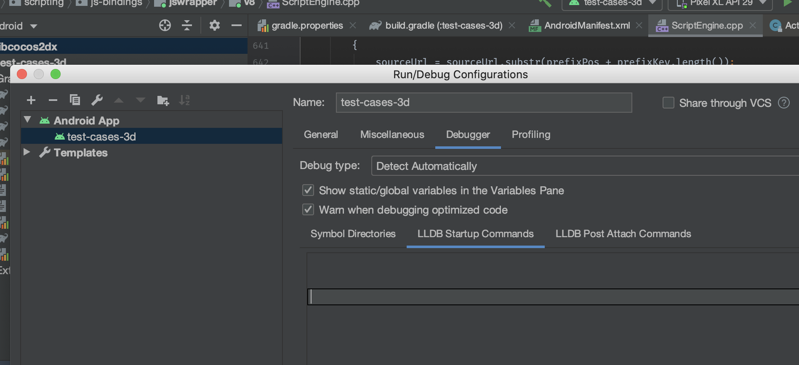

# 原生平台 JavaScript 调试

游戏发布到原生平台后，由于运行环境不同，可能会出现在浏览器预览时无法重现的 Bug，这时我们就必须直接在原生平台下进行调试。Cocos Creator 可以很方便地对原生平台中的 JavaScript 进行远程调试。

## iOS 和 Android 真机调试

如果游戏只有在真机上才能运行，那就必须用真机对打包后的游戏进行调试。调试步骤如下：

- 确保 Android/iOS 设备与 Windows 或者 Mac 在同一个局域网中。注意在调试过程中请勿开启代理，否则可能导致无法正常调试。
- 在 Creator 3D 的 **构建发布** 面板选择 Android/iOS 平台、Debug 模式，构建编译运行工程（iOS 平台建议通过 Xcode 连接真机进行编译运行）。
- 用 Chrome 浏览器打开地址：`devtools://devtools/bundled/js_app.html?v8only=true&ws={IP}:6086/00010002-0003-4004-8005-000600070008` 即可进行调试。其中 `{IP}` 为 Android/iOS 设备的本地 IP。

  

## Windows 平台及 Mac 平台调试

在 Windows 平台及 Mac 平台下调试游戏，步骤与真机调试类似，将工程用 IDE 编译运行之后，此时便可进行调试。步骤如下：

- 用 IDE 将打包好的工程编译并运行（Windows 平台请使用 Visual Studio， Mac 平台请使用 Xcode）
- 在游戏运行时打开 Chrome 浏览器，输入地址：`devtools://devtools/bundled/js_app.html?v8only=true&ws=127.0.0.1:6086/00010002-0003-4004-8005-000600070008` 即可进行调试。

   

## 使用 `lldb` 查看当前的 JS 调用栈

通过在 C++ 中断点我们能很便捷地看到 C++ 的调用栈, 但并不能同时看到 JS 的调用栈. 这个割裂的过程会常常打断调试的体验.  

我们可以使用 `lldb` 提供的功能, 在调试过程中进行很多的操作, 包括查看调用栈. 

`Xcode` 和 `Android Studio` 都默认使用 `lldb` 作为调试器.

> 详细的 `lldb` 文档可以查看 https://lldb.llvm.org/use/tutorial.html

###  `lldb` 的全局配置

 `lldb` 在启动的时候 会加载 `~/.lldbinit`

例如下面的配置: 

`~ % cat ~/.lldbinit`
```
target stop-hook add 
expr --  cocos2d::log(".lldbinit ---- \n%s\n", se::ScriptEngine::getInstance()->getCurrentStackTrace().c_str())
DONE
```

设置了*每次断点*后的行为, 执行代码

```c++
cocos2d::log(".lldbinit ---- \n%s\n", se::ScriptEngine::getInstance()->getCurrentStackTrace().c_str())
```
输出 JS 调用栈的信息. 

[查看 `target stop-hook` 的用法](https://lldb.llvm.org/use/map.html#examining-variables)


#### 这种方法也有明显的缺陷

会对 **所有项目** 生效, 其他项目不存在相应符号, 导致报错. 

###  Xcode 在断点中编辑 `action` (只对具体的断点触发)



可以在 `Debugger Command` 中输入命令
```lldb
expr --  cocos2d::log(".lldbinit ---- \n%s\n", se::ScriptEngine::getInstance()->getCurrentStackTrace().c_str())
```

[查看 `expr` 的用法](https://lldb.llvm.org/use/map.html#evaluating-expressions)


### 在断点触发后, 在 lldb console 中增加 回调

可以针对具体的断点, 进行更多的调用


同上, 也可以输入

```lldb
expr --  cocos2d::log(".lldbinit ---- \n%s\n", se::ScriptEngine::getInstance()->getCurrentStackTrace().c_str())
```
查看调用栈. 

### 在 Android Studio 配置 `lldb`
在 `Run/Debug Configuration/ Debugger` 界面进行类似的配置



Android Studio 也提供了和 Xcode 类似的 `lldb console`.

## 进阶调试指南

如果需要在 Release 模式下调试，或者需要调试定制后的原生引擎，可参考更详细的 [JSB 2.0 使用指南：远程调试与 Profile](https://docs.cocos.com/creator/manual/zh/advanced-topics/JSB2.0-learning.html)。
