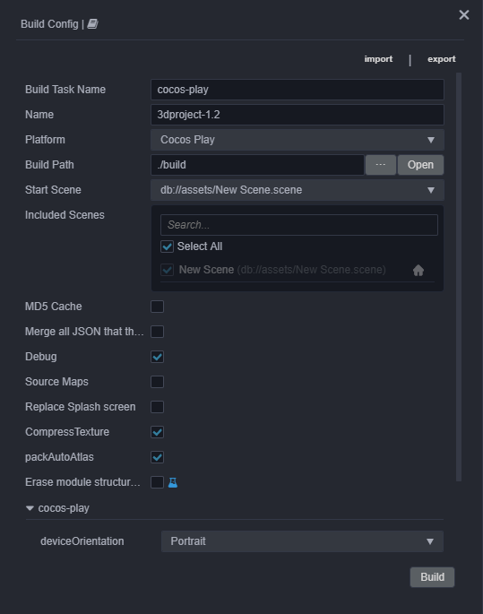
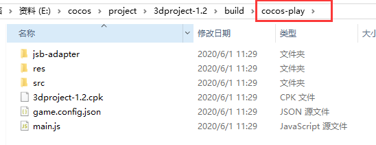

# 发布到 COCOS PLAY (即刻玩)

Cocos Creator 3D 从 **v1.0.3** 版本开始正式支持将游戏发布到 Cocos Play 小游戏。

## 参数选项说明

| 参数名 | 可选 | 默认值 | 说明 |
| - | - | - | - |
|tinyPackageMode | 选填 | false | 是否开启小包模式，开启后打包的 `cpk` 文件将不包含全部的 `res` 资源|
|tinyPackageServer | 选填 | ' ' | 远程服务器地址，填写后获取资源将会从该路径上获取，仅在小包模式开启时有效|
|packFirstScreenRes | 选填 | ' ' | 首屏游戏资源打包到游戏包，将保留首屏资源到 `cpk` 文件内|
| deviceOrientation | 必填 | 'portrait' | 设备方向， 可选值为 `'landscape' , 'portrait'`。|

### 小包模式相关配置

该项为选填项，默认不勾选。小游戏的包内体积包含代码和资源不能超过 10M，在资源量比较多的情况下需要通过网络请求加载。**小包模式** 就是帮助用户将一些 `res` 资源从 `cpk` 包中剔除，剩余的 `res` 可以上传到服务器，根据需要从远程服务器下载。

小包模式下还添加了一个 `首屏游戏资源打包到游戏包` 的选项，在小包模式下，如果首屏资源过多，下载和加载资源时间比较久，可能会导致首次进入游戏时出现短暂黑屏。如果在构建时勾选了 **首屏游戏资源打包到游戏包**，可以缩短首次进入游戏黑屏的时间。不过需要注意的是：`res/import` 资源暂不支持分割资源下载，整个 `import` 目录也会打包到首包。如果勾选了该选项，在构建后需要将发布路径下的 **cocos-play/res** 目录上传到小包模式服务器。例如：默认发布路径是 build，则需要上传 build/cocos-play/res 目录。

命令行构建参数：

```js
tinyPackageMode: false,
tinyPackageServer: '',
packFirstScreenRes: false,
```

## 发布流程

一、使用 Cocos Creator 3D 打开需要发布的项目工程，在 **构建发布** 面板的 **发布平台** 中选择 **Cocos Play 小游戏**，参考参数说明配置好选项后，点击构建即可。



构建后，点击构建任务的显示文件目录按钮，即可看到对应文件夹内有导出的即刻玩小游戏工程目录和 cpk 文件。cpk 包在 **/build/cocos-play** 目录下。



## 测试运行

### 自测环境配置

- 下载 [游戏自测工具](https://gamebox.gitbook.io/project/you-xi-jie-ru-wen-dang/zi-yuan-xia-zai/zi-ce-gong-ju) 并安装到 Android 设备（建议 Android Phone 6.0 或以上版本）。

- 打开之前已经安装完成的游戏自测工具，自测工具可以启动游戏并提供游戏登录、支付等功能。通过读取游戏配置参数，确定启动的游戏类型，以及游戏启动方式。开发者必须使用自测工具测试接入没有问题之后，才可以打包提交到平台审核。自测时没有要求包的大小，但如果是要提交审核的话，包的大小不能超过 10M。具体可参考 [自测工具](https://gamebox.gitbook.io/project/you-xi-jie-ru-wen-dang/ji-shu-dui-jie/zi-ce-gong-ju)。

然后点击自测工具左上方的 **配置游戏** 按钮进入游戏配置页面。根据需求配置参数并保存。


**参数配置**：

| 属性             | 功能说明             |
| --------------  |  -----------        |
| gameId          | 游戏 ID，可由后台获取           |
| gameKey         | 游戏 Key，可由后台获取          |
| gameSecret      | 游戏密钥，可由后台获取         |
| gameType        | 游戏类型，可根据用户需求选择 **对战** 或者 **非对战**  |
| gameMode        | 游戏模式，选择 **Runtime**      |
| lodeType        | 游戏加载类型，即游戏启动方式。包括 **File** 和 **Url** 两种。具体使用方式可查看下方 **启动游戏** 部分的介绍    |
| path            | 游戏加载地址，配合 lodeType 使用。具体使用方式可查看下方 **启动游戏** 部分的介绍   |

### **启动游戏**：

游戏自测工具可以通过以下两种方法启动游戏。

**方法一**：以文件方式从指定位置加载游戏包（游戏加载类型为 **File**）

  - 将构建生成的小游戏 cpk 文件（位于小游戏工程 cocos-play 目录下）拷贝到手机目录下。如果是拷贝到 sdcard 目录下，则需要在 sdcard 目录中新建一个文件夹，然后将 cpk 文件拷贝到新建文件夹中。
  - 游戏自测工具参数配置页面中的 **lodeType** 选择 **File**。
  - **path** 填写刚才拷贝 cpk 文件放置的新建文件夹，如：**/test/game.cpk**。
  - 配置完成后点击 **保存**，然后点击 **启动游戏**，即可打开游戏。

**方法二**：以网页方式从指定网址打开游戏（游戏加载类型为 **Url**）

  - 将 cpk 文件上传到服务器。
  - 游戏自测工具参数配置页面中的 **lodeType** 选择 **Url**。
  - 填写 **path**，如：`http://192.168.0.1:8080/game.cpk`。
  - 配置完成后点击 **保存**，然后点击 **启动游戏**，即可打开游戏。

## 相关参考链接

- [即刻玩小游戏中心](https://gamebox.cocos.com/)
- [即刻玩小游戏文档中心](https://gamebox.gitbook.io/project/)
- [即刻玩小游戏 API 文档](https://gamebox.gitbook.io/project/you-xi-jie-ru-wen-dang/ji-shu-dui-jie/ji-chu-neng-li)
- [即刻玩小游戏自测工具](https://gamebox.gitbook.io/project/you-xi-jie-ru-wen-dang/ji-shu-dui-jie/zi-ce-gong-ju)
- [即刻玩小游戏自测工具下载](https://gamebox.gitbook.io/project/you-xi-jie-ru-wen-dang/zi-yuan-xia-zai/zi-ce-gong-ju)
