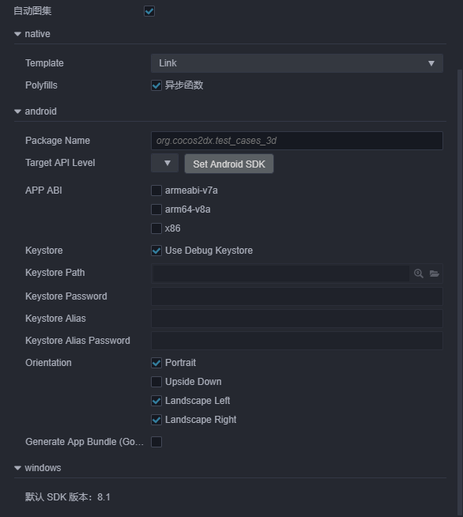
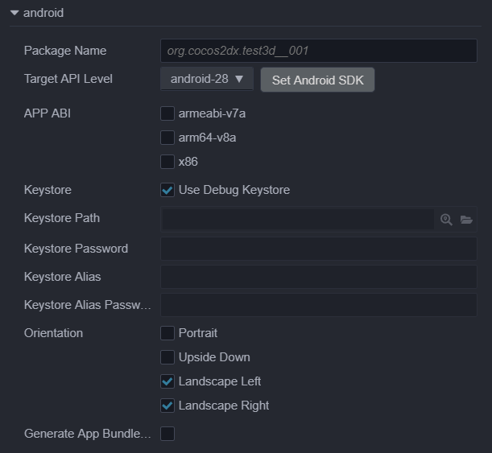

# 发布到原生平台

Cocos Creator 3D 自 v1.0.3 起正式支持原生平台，点击菜单栏的 **项目 -> 构建发布** 选项，打开构建发布面板，参照文档配置完项目信息后即可打包。

支持的原生平台包括 Android、iOS、Mac、Windows 四个，其中 iOS、Mac 和 Windows 的选项只能在相应的操作系统中才会出现，目前原生平台是集合在一起打包的，可以在同一界面上配置各个原生平台的参数选项，打包一次即可生成所有原生平台的项目包。

## 环境配置

发布原生平台需要配置一些必要的环境，详情请参考 [原生环境配置](setup-native-development.md)

## 构建选项

一些通用构建参数的配置，请参照 [通用构建参数介绍](build-options.md)。



下面介绍一些平台特有以及通用选项内需要注意的点：

### MD5 Cache

作为通用选项，主要是给构建后的所有资源文件名将加上 MD5 信息，解决热更新时的 CDN 资源缓存问题。
启用后，如果出现资源加载不了的情况，说明找不到重命名后的新文件。这通常是因为有些 C++ 中用到的第三方资源没通过 cc.loader 加载引起的。这时可以在加载前先用以下方法转换 url ，转换后的路径就能正确加载，具体代码如下：

```cpp
auto cx = ScriptingCore::getInstance()->getGlobalContext();
JS::RootedValue returnParam(cx);
ScriptingCore::getInstance()->evalString("cc.loader.md5Pipe.transformURL('url')", &returnParam);

string url;
jsval_to_string(cx, returnParam, &url);
```

### Native 选项

由于目前构建机制上的调整，不同平台的处理均以插件的形式注入，在选择完原生平台后，将会看到除了原生具体平台的选项外还有 `native` 的选项，native 相关选项配置后将会影响到所有的原生平台。


#### 选择源码模板（Template）

在 native 选项的 **模板 (Template)** 下拉菜单中有两种可用的引擎模板，我们可以从中选择一种：

- default，使用默认的 cocos2d-x 源码版引擎构建项目
- link，与 default 模板不同的是，link 模板不会拷贝 cocos2d-x 源码到构建目录下，而是使用共享的 cocos2d-x 源码。这样可以有效减少构建目录占用空间，以及对 cocos2d-x 源码的修改可以得到共享。

关于源码引擎的概念，可以参照下文：

> cocos2d-x 引擎中包括源码引擎。他们适用的范围是：
> - 源码引擎初次构建和编译某个工程时需要很长的时间编译 C++ 代码，视电脑配置而定，这个时间可能在 5~20 分钟。对于同一个项目，已经编译过一次之后，下次再编译需要的时间会大大缩短。
> - 源码引擎构建出的工程，使用原生开发环境编译和运行（如 Android Studio、Xcode 等 IDE），是可以进行调试和错误捕获的。

目前 Cocos Creator 3D 安装目录下已经包含了自带的 cocos2d-x 源码引擎，在安装目录下的 resources/3d/cocos2d-x-lite 文件夹内可以查看到。

#### Polyfills

项目内如果使用到一些高版本的脚本语法时比如 `async \ await`，需要勾选此项。

### Android 平台选项



#### 设置包名（Package Name）

（也称作 Package Name 或 Bundle Identifier），通常以产品网站 url 倒序排列，如 `com.mycompany.myproduct`。

**注意**：包名中只能包含数字、字母和下划线，此外包名最后一部分必须以字母开头，不能以下划线或数字开头。

#### Target API Level

设置编译 Android 平台所需的 Target API Level。点击旁边的 `Set Android SDK` 按钮即可快速跳转到配置页，具体配置请参考 [原生环境配置](setup-native-development.md)。

#### APP ABI

设置 Android 需要支持的 CPU 类型，可以选择一个或多个选项，分别有 **armeabi-v7a**、**arm64-v8a**、**x86** 三种类型。

**注意**：

- 当你选择一个 ABI 构建完成之后，在不 Clean 的情况下，构建另外一个 ABI，此时两个 ABI 的 so 都会被打包到 apk 中，这个是 Android Studio 默认的行为。若用 Android Studio 导入工程，选择一个 ABI 构建完成之后，先执行一下 **Build  -> Clean Project** 再构建另外一个 ABI，此时只有后面那个 ABI 会被打包到 apk 中。

- 项目工程用 Android Studio 导入后，是一个独立的存在，不依赖于构建面板。如果需要修改 ABI，直接修改 **gradle.properties** 中的 **PROP_APP_ABI** 属性即可。

    

#### 密钥库

Android 要求所有 APK 必须先使用证书进行数字签署，然后才能安装。Cocos Creator 3D 提供了默认的密钥库，勾选 **使用调试密钥库** 就是使用默认密钥库，若用户需要自定义密钥库可去掉 **使用调试密钥库** 勾选。具体请参考 [官方文档](https://developer.android.com/studio/publish/app-signing?hl=zh-cn)（需要使用 VPN）

#### Orientation 屏幕方向

- portrait: 屏幕直立
- upsideDown: 屏幕直立，上下顛倒
- landscapeLeft: 屏幕向左橫置
- landscapeRight: 屏幕向右橫置

#### 生成 App Bundle (Google Play)

勾选该项即可将游戏打包成 App Bundle 格式用于上传到 Google Play 商店。具体请参考 [官方文档](https://developer.android.com/guide/app-bundle/)（需要使用 VPN）

### Mac 平台选项


#### Bundle Identifier 包名

参见 Android Package Name 选项介绍。

### iOS 平台选项


#### Bundle Identifier 包名

参见 Android Package Name 选项介绍。

#### Orientation 屏幕方向

参见 Android Orientation 选项介绍。

## 构建编译原生工程

选择发布平台，设置了初始场景以及对应平台配置项后，就可以开始构建了，点击右下角的 `构建` 按钮，开始构建流程。

构建结束后，我们得到的是一个标准的 cocos2d-x 工程，和使用 Cocos Console 新建的工程有同样的结构。目前编辑器尚未集成编译功能，需要手动在相应平台的 IDE 中打开构建好的原生工程，进行进一步的预览、调试和发布。

具体的手动编译方式：

- iOS 平台：使用 Xcode 打开构建目录下的 native\frameworks\runtime-src\proj.ios_mac\.xcodeproj 文件，在 Xcode 面板 General -> Signing 中设置签名，在 Xcode 左上方选择连接的设备后点击编译按钮进行编译运行。

- Android 平台：过 Android Studio 打开工程，如版本升级根据提示下载缺失的工具即可，再进行编译运行。

- Mac 平台：使用 Xcode 打开构建目录下的 native\frameworks\runtime-src\proj.ios_mac 文件夹后即可预览编译。

- Windows 平台：使用 Visual Studio （推荐使用2017）打开构建目录下的 native\frameworks\runtime-src\proj.win32 文件夹内的 .sln 文件或者直接双击该文件，编译运行。在安装 Visual Studio 时，请注意需要勾选安装 Windows 8.1 版本 SDK。

## 使用原生工程

在原生平台构建完成后，点击发布路径旁边的 **打开** 按钮，就会在操作系统的文件管理器中打开构建发布路径，例如 `build/native`，展开目录至下图所所示，里面就包含了所有原生构建工程


图中红框所示的就是不同原生平台的工程，接下来您只要使用原生平台对应的 IDE （如 Xcode、Android Studio、Visual Studio）打开这些工程，就可以进行进一步的编译、预览、发布操作了。关于原生平台 IDE 的使用请搜索相关信息，这里就不再赘述了。

**注意**：在 MIUI 10 系统上运行 debug 模式构建的工程可能会弹出 “Detected problems with API compatibility” 的提示框，这是 MIUI 10 系统自身引入的问题，使用 release 模式构建即可。

---

要了解如何在原生平台上调试，请参考 [原生平台 JavaScript 调试](debug-jsb.md)。
