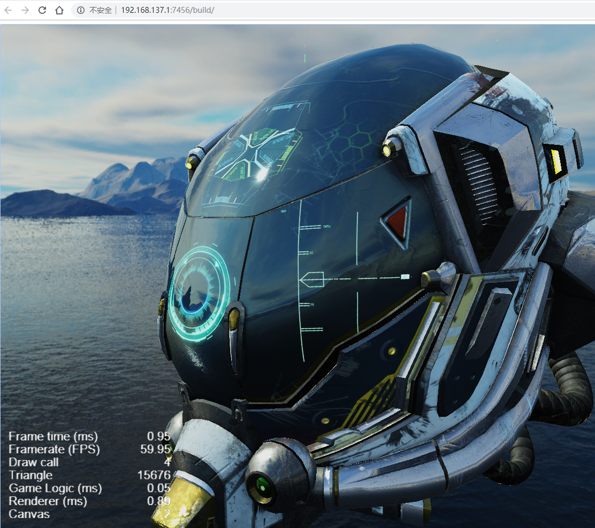

# 发布到 Web 平台

打开主菜单的 **项目 -> 构建发布**，打开构建发布面板。

Cocos Creator 提供了两种 Web 平台的页面模板，可以通过 **发布平台** 的下拉菜单选择 **Web Mobile** 或 **Web Desktop**，他们的区别主要在于 `Web Mobile` 会默认将游戏视图撑满整个浏览器窗口，而 `Web Desktop` 允许在发布时指定一个游戏视图的分辨率，而且之后游戏视图也不会随着浏览器窗口大小变化而变化。

## 构建选项介绍

一些通用的构建通用参数介绍，请参考 [通用构建参数介绍](build-options.md)。

### Web Desktop

参数名 | 可选 | 默认值 | 说明
- | - | - | -
polyfills | 选填 | { asyncFunctions: true } | 自 v1.0.3 版本起，构建支持一些新特性的 polyfills，主要是在打包脚本时会做对应处理，开发者可以根据实际需求选择需要的 polyfills，这组选项暂时只有 **异步函数**，后续将会开放更多功能。
designWidth | 必填 | 1280 | 游戏视图分辨率宽度
designHeight | 必填 | 960 | 游戏视图分辨率高度

### Web Mobile

参数名 | 可选 | 默认值 | 说明
- | - | - | -
polyfills | 选填 | { asyncFunctions: true } | 自 v1.0.3 版本起，构建支持一些新特性的 polyfills，主要是在打包脚本时会做对应处理，开发者可以根据实际需求选择需要的 polyfills，这组选项暂时只有 **异步函数**，后续将会开放更多功能。
embedWebDebugger | 选填 | false | 是否使用 vConsole，vConsole 类似 DevTools 的迷你版，用于辅助调试。
orientation | 必填 | 'auto' | 设备方向，可选值为 `'auto'、'landscape'、'portrait'`。

### 预览 URL

自 v1.0.3 版本起，构建支持同时预览多个 web 项目，因而构建的预览 URL 不再是统一的而是每个构建任务都会有一个单独的预览 URL 互不干扰。点击 URL 即可自动打开浏览器进行预览。具体的预览 URL 拼接规则为 `${偏好设置中的预览 IP 地址}:${编辑器预览端口号}/${构建平台}/${构建任务名}/index.html`。

## 构建和预览

配置好构建参数后，点击 **构建** 按钮，开始 Web 平台版本构建。面板上会出现一个进度条，当进度条达到 100% 时，构建就完成了。

接下来可以点击 **运行** 按钮，在浏览器中打开构建后的游戏版本进行预览和调试。

上图所示就是 Web Mobile 平台的预览，可以看到游戏视图会占满整个窗口，而 Web Desktop 则不会撑满屏幕，如下图。

### 浏览器兼容性

Cocos Creator 开发过程中测试的桌面浏览器包括： Chrome、Firefox（火狐）、Safari（Mac）、QQ 浏览器、360 浏览器。其他浏览器只要内核版本够高也可以正常使用，对部分浏览器来说请勿开启 IE6 兼容模式。

移动设备上测试的浏览器包括：Safari（iOS）、Chrome、QQ 浏览器、UC 浏览器和微信内置 WebView。

## Retina 设置

可以在脚本中通过 `view.enableRetina(true)` 设置是否使用高分辨率，构建到 Web 平台时默认会开启 Retina 显示。

## 发布到 Web 服务器

要在互联网上发布或分享您的游戏，只要点击 **发布路径** 旁边的 **打开** 按钮，打开发布路径之后，按照当前构建任务名称，将构建出的对应文件夹里的内容整个复制到您的 Web 服务器上就可以通过相应的地址访问了。

关于 Web 服务器的架设，可以自行搜索 Apache、Nginx、IIS、Express 等相关解决方案。
