# 快速上手：制作第一个游戏

Cocos Creator编辑器的强大之处就是可以让开发者快速的制作游戏原型。

下面我们将跟随教程制作一款名叫 **一步两步** 的魔性小游戏。这款游戏考验玩家的反应能力，根据路况选择是要跳一步还是跳两步，“一步两步，一步两步，一步一步似爪牙似魔鬼的步伐”。

可以在 [这里](https://gameall3d.github.io/MindYourStep_Tutorial/index.html) 体验一下游戏的完成形态。

## 新建项目

如果您还不了解如何获取和启动 Cocos Creator，请阅读 [安装和启动](../install/index.md) 一节。

1. 首先启动 Cocos Creator，然后新建一个名为 **MindYourStep** 的项目，如果不知道如何创建项目，请阅读 [Hello World!](../helloworld/index.md)。

2. 新建项目后会看到如下的编辑器界面：

    

## 创建游戏场景

在 Cocos Creator 中，**游戏场景（Scene）** 是开发时组织游戏内容的中心，也是呈现给玩家所有游戏内容的载体。游戏场景中一般会包括以下内容：

- 场景物体
- 角色
- UI
- 以组件形式附加在场景节点上的游戏逻辑脚本

当玩家运行游戏时，就会载入游戏场景，游戏场景加载后就会自动运行所包含组件的游戏脚本，实现各种各样开发者设置的逻辑功能。所以除了资源以外，游戏场景是一切内容创作的基础。现在，让我们来新建一个场景。

1. 在 **资源管理器** 中点击选中 **assets** 目录，点击 **资源管理器** 左上角的加号按钮，选择文件夹，命名为 Scenes。

   

2. 点击选中 Scenes 目录（下图把一些常用的文件夹都提前创建好了），点击鼠标右键，在弹出的菜单中选择 **场景文件**。

   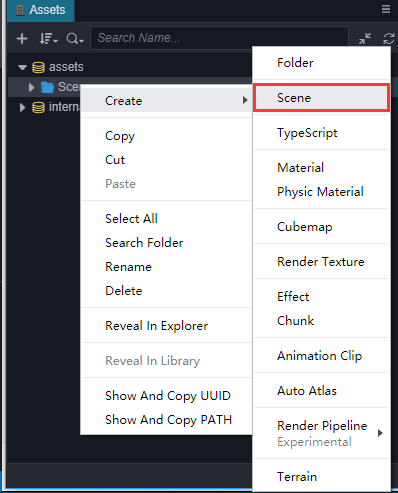

3. 我们创建了一个名叫 New Scene 的场景文件，创建完成后场景文件 New Scene 的名称会处于编辑状态，将它重命名为 Main。

4. 双击 Main，就会在 **场景编辑器** 和 **层级管理器** 中打开这个场景。

## 添加跑道

我们的主角需要在一个由方块（Block）组成的跑道上从屏幕左边向右边移动。我们使用编辑器自带的立方体（Cube）来组成道路。

1. 在 **层级管理器** 中创建一个立方体（Cube），并命名为 `Cube`。

   

2. 选中 Cube，按 **Ctrl + D** 复制出 3 个 Cube。

3. 将 3 个 Cube 按以下坐标排列：

    - 第一个节点位置（0，-1.5，0）
    - 第二个节点位置（1，-1.5，0）
    - 第三个节点位置（2，-1.5，0）
    
    效果如下：

    

## 添加主角

### 创建主角节点

首先创建一个名为 Player 的空节点，然后在这个空节点下创建名为 Body 的主角模型节点，为了方便，我们采用编辑器自带的胶囊体模型做为主角模型。

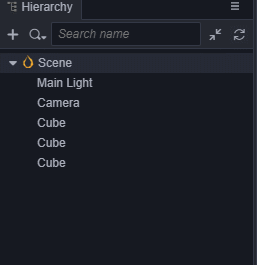

分为两个节点的好处是，我们可以使用脚本控制 Player 节点来使主角进行水平方向移动，而在 Body 节点上做一些垂直方向上的动画（比如原地跳起后下落），两者叠加形成一个跳越动画。

然后将 Player 节点设置在（0，0，0）位置，使得它能站在第一个方块上。效果如下：


### 编写主角脚本

想要主角影响鼠标事件来进行移动，我们就需要编写自定义的脚本。如果您从没写过程序也不用担心，我们会在教程中提供所有需要的代码，只要复制粘贴到正确的位置就可以了，之后这部分工作可以找您的程序员小伙伴来解决。下面让我们开始创建驱动主角行动的脚本吧。

#### 创建脚本

1. 如果还没有创建 Scripts 文件夹，首先在 **资源管理器** 中右键点击 **assets** 文件夹，选择 **新建 -> 文件夹**，重命名为 Scripts。
2. 右键点击 Scripts 文件夹，选择 **新建 -> TypeScript**，创建一个 TypeScript 脚本，有关 TypeScript 资料可以查看 [TypeScript 官方网站](https://www.typescriptlang.org/)。
3. 将新建脚本的名字改为 `PlayerController`，双击这个脚本，打开代码编辑器（例如 VSCode）。

    

**注意**：Cocos Creator 中脚本名称就是组件的名称，这个命名是大小写敏感的！如果组件名称的大小写不正确，将无法正确通过名称使用组件！

#### 编写脚本代码

在打开的 PlayerController 脚本里已经有了预先设置好的一些代码块，如下所示：

```ts
import { _decorator, Component } from "cc";
const { ccclass, property } = _decorator;

@ccclass("PlayerController")
export class PlayerController extends Component {
    /* class member could be defined like this */
    // dummy = '';

    /* use `property` decorator if your want the member to be serializable */
    // @property
    // serializableDummy = 0;

    start () {
        // Your initialization goes here.
    }

    // update (deltaTime: number) {
    //     // Your update function goes here.
    // }
}
```

这些代码就是编写一个组件（脚本）所需的结构。具有这样结构的脚本就是 Cocos Creator 中的 **组件（Component）**，他们能够挂载到场景中的节点上，提供控制节点的各种功能，更详细的脚本信息可以查看 [脚本](../../scripting/index.md)。

我们在脚本 `PlayerController` 中添加对鼠标事件的监听，让 Player 动起来：

```ts
import { _decorator, Component, Vec3, systemEvent, SystemEvent, EventMouse, Animation, v3 } from "cc";
const { ccclass, property } = _decorator;

@ccclass("PlayerController")
export class PlayerController extends Component {
    /* class member could be defined like this */
    // dummy = '';

    /* use `property` decorator if your want the member to be serializable */
    // @property
    // serializableDummy = 0;

    // for fake tween
    private _startJump: boolean = false;
    private _jumpStep: number = 0;
    private _curJumpTime: number = 0;
    private _jumpTime: number = 0.1;
    private _curJumpSpeed: number = 0;
    private _curPos: Vec3 = v3();
    private _deltaPos: Vec3 = v3(0, 0, 0);
    private _targetPos: Vec3 = v3();
    private _isMoving = false;

    start () {
        // Your initialization goes here.
        systemEvent.on(SystemEvent.EventType.MOUSE_UP, this.onMouseUp, this);
    }

    onMouseUp(event: EventMouse) {
        if (event.getButton() === 0) {
            this.jumpByStep(1);
        }
        else if (event.getButton() === 2) {
            this.jumpByStep(2);
        }

    }

    jumpByStep(step: number) {
        if (this._isMoving) {
            return;
        }
        this._startJump = true;
        this._jumpStep = step;
        this._curJumpTime = 0;
        this._curJumpSpeed = this._jumpStep / this._jumpTime;
        this.node.getPosition(this._curPos);
        Vec3.add(this._targetPos, this._curPos, v3(this._jumpStep, 0, 0));

        this._isMoving = true;
    }

    onOnceJumpEnd() {
        this._isMoving = false;
    }

    update (deltaTime: number) {
        if (this._startJump) {
            this._curJumpTime += deltaTime;
            if (this._curJumpTime > this._jumpTime) {
                // end
                this.node.setPosition(this._targetPos);
                this._startJump = false;
                this.onOnceJumpEnd();
            }
            else {
                // tween
                this.node.getPosition(this._curPos);
                this._deltaPos.x = this._curJumpSpeed * deltaTime;
                Vec3.add(this._curPos, this._curPos, this._deltaPos);
                this.node.setPosition(this._curPos);
            }
        }
    }
}
```

现在我们可以把 `PlayerController` 组件添加到主角节点 `Player` 上。在 **层级管理器** 中选中 `Player` 节点，然后在 **属性检查器** 中点击 **添加组件** 按钮，选择 **添加用户脚本组件 -> PlayerController**，为主角节点添加 `PlayerController` 组件。


为了能在运行时看到物体，我们需要将场景中 Camera 的参数进行一些调整，`Position`  设置为（0，0，13），`Color` 设置为（50，90，255，255）：

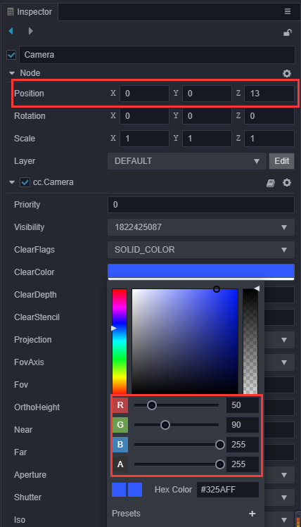

然后点击工具栏中心位置的 Play 按钮：


在打开的网页中点击鼠标左键和右键，可以看到如下画面：

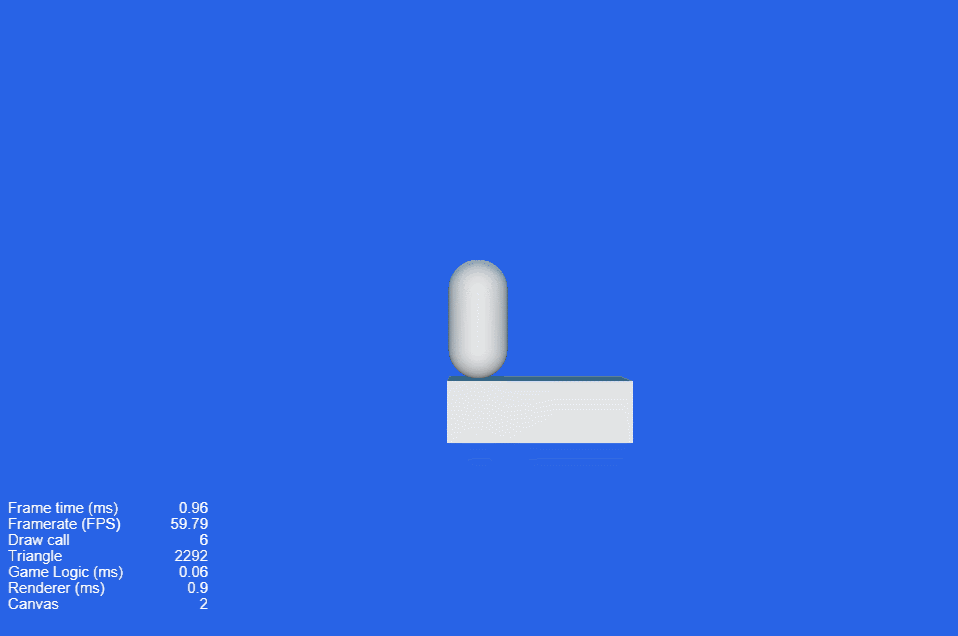

更多的预览功能，可以参考 [项目预览调试](../../editor/preview/index.md)

### 添加角色动画

从上面运行的结果可以看到单纯对 Player 进行水平方向的移动是十分呆板的，我们要让 Player 跳跃起来才比较有感觉，可以通过为 Player 添加垂直方向的动画来达到这个效果。有关 **动画编辑器** 的更多信息，请阅读 [动画编辑器](../../editor/animation/index.md)

1. 选中场景中的 Body 节点，然后在编辑器下方的 **动画编辑器** 中添加 Animation 组件并创建 Clip，命名为 `oneStep`。

    

2. 进入动画编辑模式，添加 position 属性轨道，并添加三个关键帧， position 值分别为（0，0，0）、（0，0.5，0）、（0，0，0）。

    

    **注意**：退出动画编辑模式前记得要保存动画，否则做的动画就白费了。

3. 我们还可以通过 **资源管理器** 来创建 Clip。创建一个名为 `twoStep` 的 Clip 并将它添加到 Body 的 `Animation` 上，这里为了录制方便调整了一下面板布局。

    

4. 进入动画编辑模式，选择并编辑 `twoStep` 的 Clip，类似第 2 步，添加三个 position 的关键帧，分别为（0，0，0）、（0，1，0）、（0，0，0）。

    

5. 在 `PlayerController` 组件中引用 **动画组件**，我们需要在代码中根据跳的步数不同来播放不同的动画。

    首先需要在 `PlayerController` 组件中引用 Body 身上的 `Animation`。

    ```ts
    @property({type: Animation})
    public BodyAnim: Animation = null;
    ```

    然后在 **属性检查器** 中将 Body 身上的 `Animation` 拖到这个变量上。

    

    在跳跃的函数 `jumpByStep` 中加入动画播放的代码：

    ```ts
    if (step === 1) {
        this.BodyAnim.play('oneStep');
    }
    else if (step === 2) {
        this.BodyAnim.play('twoStep');
    }
    ```

6. 最后点击 Play 按钮，点击鼠标左键和右键，可以看到新的跳跃效果：

    

## 跑道升级

为了让游戏有更久的生命力，我们需要一个很长的跑道让 Player 在上面一直往右跑。在场景中复制一堆 Cube 并编辑位置来组成跑道显然不是一个明智的做法，我们可以通过脚本完成跑道的自动创建。

### 游戏管理器（GameManager）

一般游戏都会有一个管理器，主要负责整个游戏生命周期的管理，可以将跑道的动态创建代码放到这里。在场景中创建一个名为 GameManager 的节点，然后在 `assets/Scripts` 中创建一个名为 GameManager 的 TypeScript 脚本文件，并将它添加到 GameManager 节点上。

### 制作Prefab

对于需要重复生成的节点，我们可以将它保存成 [Prefab（预制）资源](../../asset/prefab.md)，作为我们动态生成节点时使用的模板。

将生成跑道的基本元素 **正方体（Cube）** 制作成 Prefab，之后可以把场景中的三个 Cube 都删除了。


### 添加自动创建跑道代码

Player 需要一个很长的跑道，理想的方法是能动态增加跑道的长度，这样可以永无止境地跑下去，这里为了方便先生成一个固定长度的跑道，跑道长度可以自己定义。另外，我们可以在跑道上生成一些坑，当 Player 跳到坑上就 GameOver 了。

将 `GameManager` 脚本中的代码替换成以下代码：

```ts
import { _decorator, Component, Prefab, instantiate, Node, CCInteger } from "cc";
const { ccclass, property } = _decorator;

enum BlockType {
    BT_NONE,
    BT_STONE,
};

@ccclass("GameManager")
export class GameManager extends Component {

    @property({type: Prefab})
    public cubePrfb: Prefab = null;
    @property({type: CCInteger})
    public roadLength: Number = 50;
    private _road: number[] = [];

    start () {
        this.generateRoad();
    }

    generateRoad() {
        this.node.removeAllChildren();
        this._road = [];
        // startPos
        this._road.push(BlockType.BT_STONE);

        for (let i = 1; i < this.roadLength; i++) {
            if (this._road[i-1] === BlockType.BT_NONE) {
                this._road.push(BlockType.BT_STONE);
            }
            else {
                this._road.push(Math.floor(Math.random() * 2));
            }
        }

        for (let j = 0; j < this._road.length; j++) {
            let block: Node = this.spawnBlockByType(this._road[j]);
            if (block) {
                this.node.addChild(block);
                block.setPosition(j, -1.5, 0);
            }
        }
    }

    spawnBlockByType(type: BlockType) {
        let block = null;
        switch(type) {
            case BlockType.BT_STONE:
                block = instantiate(this.cubePrfb);
                break;
        }

        return block;
    }

    // update (deltaTime: number) {
    //     // Your update function goes here.
    // }
}
```

将上面制作好的 Cube 的 prefab 拖到 GameManager 在 **属性检查器** 中的 CubePrfb 属性上。

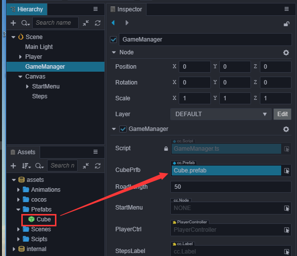

在 GameManager 的 **属性检查器** 面板中可以通过修改 roadLength 的值来改变跑道的长度。
此时点击预览可以看到自动生成了跑道，不过因为 Camera 没有跟随 Player 移动，所以看不到后面的跑道，我们可以将场景中的 Camera 设置为 Player 的子节点。


这样 Camera 就会跟随 Player 的移动而移动，现在点击预览可以从头跑到尾地观察生成的跑道了。

## 增加开始菜单

开始菜单是游戏不可或缺的一部分，我们可以在这里加入游戏名称、游戏简介、制作人员等信息。

1. 在 **层级管理器** 中添加一个 Button 节点并命名为 PlayButton。

    

    可以看到在 **层级管理器** 中生成了一个 Canvas 节点，一个 PlayButton 节点和一个 Label 节点。因为 UI 组件需要在带有 `Canvas` 的父节点下才能显示，所以编辑器在发现没有 Canvas 节点时会自动创建一个。

    然后将 Label 节点上 `cc.Label` 中的 **String** 属性从 Button 改为 Play。

2. 在 Canvas 底下创建一个名为 StartMenu 的空节点，将 PlayButton 拖到它底下。我们可以通过点击工具栏上的 2D/3D 按钮切换到 2D 编辑视图下进行 UI 编辑操作，详细的描述请查阅 [场景编辑](../../editor/scene/index.md)。

     

3. 在 StartMenu 下新建一个名为 `BG` 的 Sprite 节点作为背景框，调整它的位置到  PlayButton 的上方。

    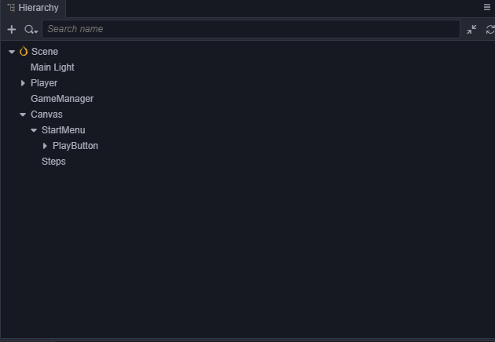

    然后在 **属性检查器** 中将 `cc.UITransform` 的 `ContentSize` 设置为（200，200），同时将 **资源管理器** 中的 `internal/default_ui/default_sprite_splash` 拖拽到 **SpriteFrame** 属性框中。

    

4. 在 **层级管理器** 的 StartMenu 节点下添加一个名为 Title 的 Label 节点用于开始菜单的标题。

    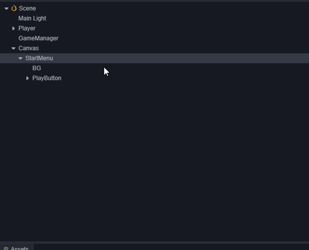

5. 在 **属性检查器** 中设置 Title 节点的属性，例如 `Position`、`Color`、`String`、`FontSize` 等。

    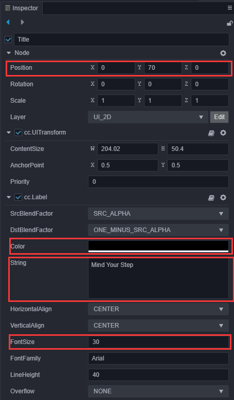

6. 根据需要增加操作的 Tips 节点，然后调整 PlayButton 的位置，一个简单的开始菜单就完成了

    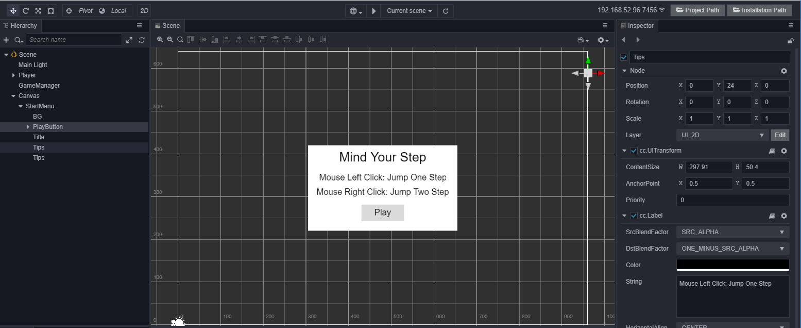

## 增加游戏状态逻辑

一般我们可以将游戏分为三个状态：

- 初始化（Init）：显示游戏菜单，初始化一些资源。
- 游戏进行中（Playing）：隐藏游戏菜单，玩家可以操作角色进行游戏。
- 结束（End）：游戏结束，显示结束菜单。

使用一个枚举（enum）类型来表示这几个状态。

```ts
enum BlockType{
    BT_NONE,
    BT_STONE,
};

enum GameState{
    GS_INIT,
    GS_PLAYING,
    GS_END,
};
```

在 `GameManager` 脚本中加入表示当前状态的私有变量：

```ts
private _curState: GameState = GameState.GS_INIT;
```

为了在游戏开始时不让用户操作角色，而在游戏进行时让用户操作角色，我们需要动态地开启和关闭角色对鼠标消息的监听。在 `PlayerController` 脚本中做如下修改：

```ts
start () {
    // Your initialization goes here.
    // systemEvent.on(SystemEvent.EventType.MOUSE_UP, this.onMouseUp, this);
}

setInputActive(active: boolean) {
    if (active) {
        systemEvent.on(SystemEvent.EventType.MOUSE_UP, this.onMouseUp, this);
    } 
    else {
        systemEvent.off(SystemEvent.EventType.MOUSE_UP, this.onMouseUp, this);
    }
}
```

然后在 `GameManager` 脚本中引用 `PlayerController` 脚本：

```ts
@property({type: PlayerController})
public playerCtrl: PlayerController = null;
```

完成后保存脚本，回到编辑器，将 **层级管理器** 中挂载了 `PlayerController` 脚本的 Player 节点拖拽到 GameManager 节点的 `playerCtrl` 属性框中。

同时，为了动态地开启/关闭开始菜单，还需要在 `GameManager` 脚本中引用 StartMenu 节点：

```ts
@property({type: Node})
public startMenu: Node = null;
```

完成后保存脚本，回到编辑器，将 **层级管理器** 中的 StartMenu 节点拖拽到 GameManager 节点的 `startMenu` 属性框中。


### 增加状态切换代码

增加状态切换代码并修改 GameManger 脚本的初始化方法：

```ts
start () {
    this.curState = GameState.GS_INIT;
}

init() {
    this.startMenu.active = true;
    this.generateRoad();
    this.playerCtrl.setInputActive(false);
    this.playerCtrl.node.setPosition(v3());
}

set curState (value: GameState) {
    switch(value) {
        case GameState.GS_INIT:
            this.init();
            break;
        case GameState.GS_PLAYING:
            this.startMenu.active = false;
            setTimeout(() => {      // 直接设置 active 会直接开始监听鼠标事件，这里做了延迟处理
                this.playerCtrl.setInputActive(true);
            }, 0.1);
            break;
        case GameState.GS_END:
            break;
    }
    this._curState = value;
}
```

### 添加对 Play 按钮的事件监听

为了能在点击 Play 按钮后开始游戏，我们需要对按钮的点击事件做出响应。在 `GameManager` 脚本中加入响应按钮点击的代码，以便用户在点击按钮后进入游戏的 Playing 状态：

```ts
onStartButtonClicked() {
    this.curState = GameState.GS_PLAYING;
}
```

然后在 **层级管理器** 中选中 PlayButton 节点，在 **属性检查器** 的 `cc.Button` 中添加 ClickEvents 的响应函数，将 GameManager 节点拖拽到 `cc.Node` 属性框中：

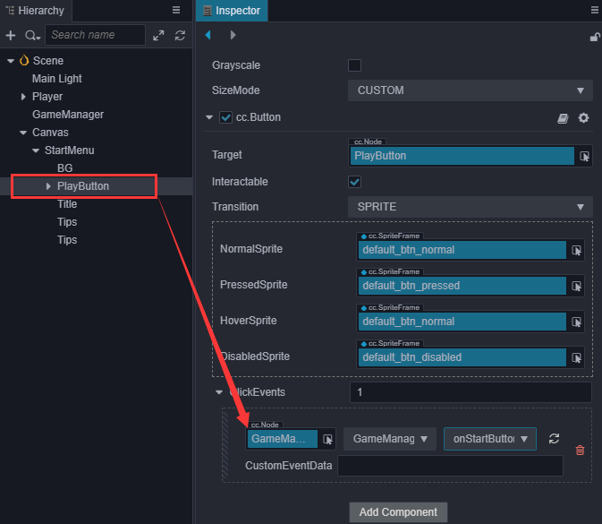

现在预览场景就可以点击 Play 按钮开始游戏了。

## 添加游戏结束逻辑

目前游戏角色只是呆呆的往前跑，我们需要添加游戏规则，让它跑的更有挑战性。

1. 角色每次跳跃结束都需要发出消息，并将自己当前所在的位置做为参数发出消息，在 `PlayerController` 脚本中记录自己跳了多少步：

    ```ts
    private _curMoveIndex = 0;
    // ...
    jumpByStep(step: number) {
        // ...

        this._curMoveIndex += step;
    }
    ```

    并在每次跳跃结束发出消息：

    ```ts
    onOnceJumpEnd() {
        this._isMoving = false;
        this.node.emit('JumpEnd', this._curMoveIndex);
    }
    ```

2. 在 `GameManager` 脚本中监听角色跳跃结束事件，并根据规则判断输赢，增加失败和结束判断，如果跳到空方块或是超过了最大长度值都结束：

    ```ts
    checkResult(moveIndex: number) {
        if (moveIndex <= this.roadLength) {
            if (this._road[moveIndex] == BlockType.BT_NONE) {   // 跳到了空方块上
                this.curState = GameState.GS_INIT;
            }
        }
        else {    // 跳过了最大长度
            this.curState = GameState.GS_INIT;
        }
    }
    ```

    监听角色跳跃消息，并调用判断函数：

    ```ts
    start () {
        this.curState = GameState.GS_INIT;
        this.playerCtrl.node.on('JumpEnd', this.onPlayerJumpEnd, this);
    }

    // ...
    onPlayerJumpEnd(moveIndex: number) {
        this.checkResult(moveIndex);
    }
    ```

    此时预览，会发现重新开始游戏时会有判断出错的问题，这是由于重新开始时没有重置 `PlayerController.ts` 中的 `_curMoveIndex` 属性值导致的。所以我们需要在 `PlayerController` 脚本中增加一个 `reset` 函数：

    ```ts
    reset() {
        this._curMoveIndex = 0;
    }
    ```
  
    然后在 `GameManager` 脚本的 `init` 函数中调用 `reset` 来重置 `PlayerController.ts` 中的 `_curMoveIndex` 属性。
 
    ```ts
    init() {
        \\ ...
        this.playerCtrl.reset();
    }
    ```

## 步数显示

我们可以将当前跳的步数显示在界面上，这样在跳跃过程中看着步数的不断增长会十分有成就感。

1. 在 Canvas 下新建一个名为 Steps 的 Label 节点，调整位置、字体大小等属性。

    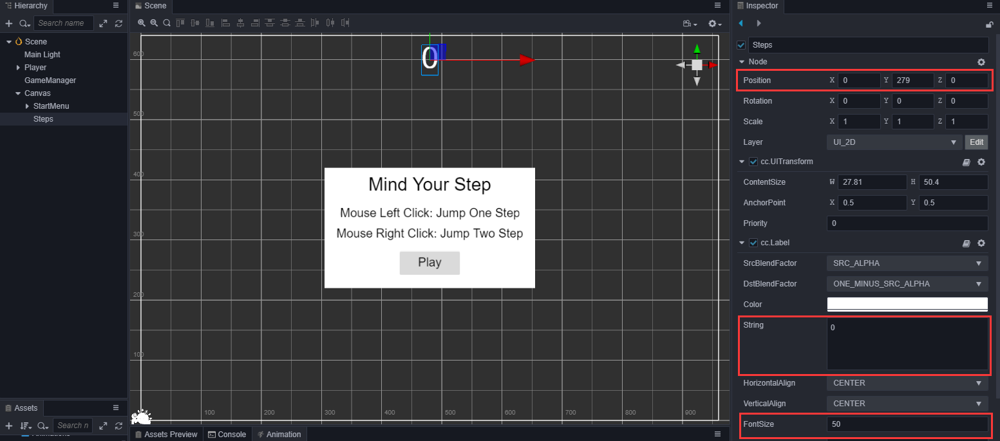

2. 在 `GameManager` 脚本中引用这个 Label：

    ```ts
    @property({type: Label})
    public stepsLabel: Label = null;
    ```

    保存脚本后回到编辑器，将 Steps 节点拖拽到 GameManager 在属性检查器中的 stepsLabel 属性框中：

   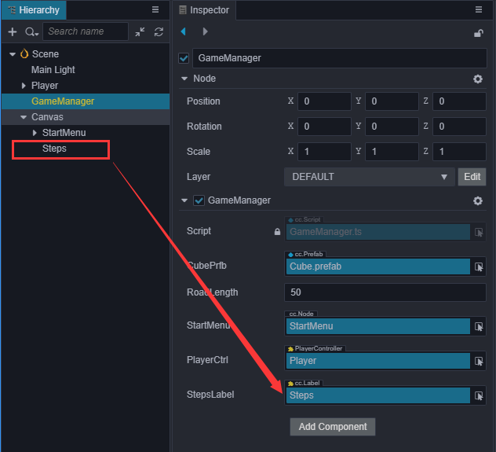

3. 将当前步数数据更新到 Steps 节点中。因为我们现在没有结束界面，游戏结束就跳回开始界面，所以在开始界面要看到上一次跳的步数，因此我们需要在进入 Playing 状态时，将步数重置为 0。

    ```ts
    // GameManager.ts
    set curState (value: GameState) {
        switch(value) {
            case GameState.GS_INIT:
                this.init();
                break;
            case GameState.GS_PLAYING:
                this.startMenu.active = false;
                this.stepsLabel.string = '0';   // 将步数重置为 0
                setTimeout(() => {      // 直接设置 active 会直接开始监听鼠标事件，这里做了延迟处理
                    this.playerCtrl.setInputActive(true);
                }, 0.1);
                break;
            case GameState.GS_END:
                break;
        }
        this._curState = value;
    }
    ```

    然后在响应角色跳跃的函数 `onPlayerJumpEnd` 中，将步数更新到 Label 控件上

    ```ts
    onPlayerJumpEnd(moveIndex: number) {
        this.stepsLabel.string = '' + moveIndex;
        this.checkResult(moveIndex);
    }
    ```

## 光照和阴影

有光的地方就会有影子，光和影构成明暗交错的 3D 世界。接下来我们为角色加上简单的影子。

### 开启阴影

1. 在 **层级管理器** 中点击最顶部的 `Scene` 节点，然后在 **属性检查器** 勾选 `shadows` 中的 Enabled，并修改 **Distance** 和 **Normal** 属性：

    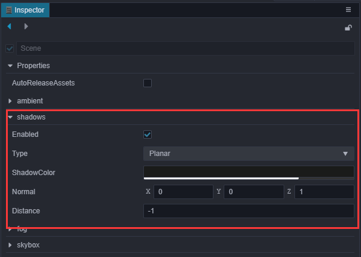

2. 点击 Player 节点下的 Body 节点，将 `cc.MeshRenderer` 中的 **ShadowCastingMode** 设置为 **ON**。

    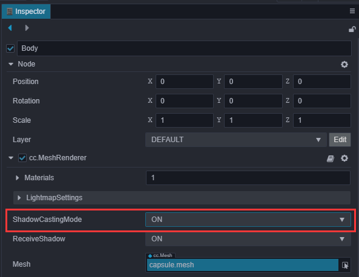

此时在 **场景编辑器** 中会看到一个阴影面片，预览会发现看不到这个阴影，这是因为它在模型的正后方，被胶囊体盖住了。

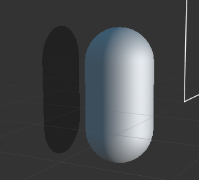

### 调整光照

新建场景时默认会添加一个挂载了 `cc.DirectionalLight` 的 **Main Light** 节点，由这个平行光计算阴影。所以为了让阴影换个位置显示，我们可以调整这个平行光的方向。在 **层级管理器** 中点击选中 **Main Light** 节点，调整 `Rotation` 属性为（-10，17，0）。


点击预览可以看到影子效果：

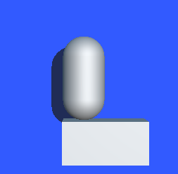

## 添加主角模型

做为一个官方教程，用胶囊体当主角显的有点寒碜，所以我们花（低）重（预）金（算）制作了一个 Cocos 主角。

### 导入模型资源

从原始资源导入模型、材质、动画等资源不是本篇基础教程的重点，所以这边直接使用已经导入工程的资源。将 [项目工程](https://github.com/cocos-creator/tutorial-mind-your-step-3d) 中 assets 目录下的 cocos 文件夹拷贝到你自己工程的 assets 目录下。

### 添加到场景中

在 cocos 文件中已经包含了一个名为 Cocos 的 Prefab，将它拖拽到 **层级管理器** 中 Player 节点下的 Body 节点中，作为 Body 节点的子节点。

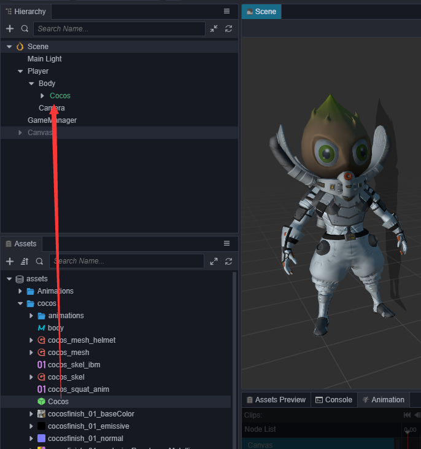

同时在 **属性检查器** 中移除原先的胶囊体模型：

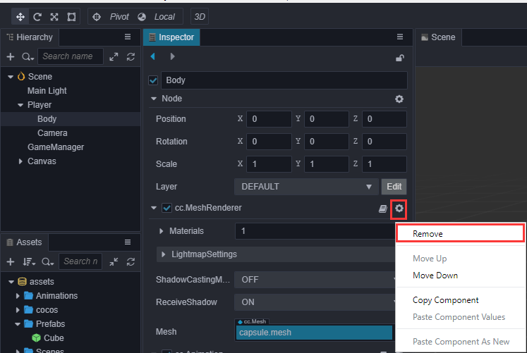

此时会发现模型有些暗，可以在 Cocos 节点下加个聚光灯（Spot Light），以突出它锃光瓦亮的脑门。


### 添加跳跃动画

现在预览可以看到主角初始会有一个待机动画，但是跳跃时还是用这个待机动画会显得很不协调，所以我们可以在跳跃过程中将其换成跳跃的动画。在 `PlayerController.ts` 类中添加一个引用模型动画的变量：

```ts
@property({type: SkeletalAnimation})
public CocosAnim: SkeletalAnimation = null;
```

然后在 **层级管理器** 中将 Cocos 节点拖拽到 Player 节点的 `CocosAnim` 属性框中：

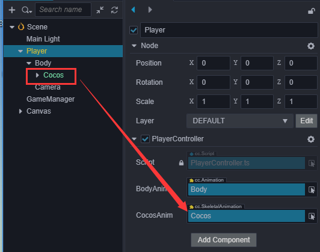

在 `PlayerController` 脚本的 `jumpByStep` 函数中播放跳跃动画：

```ts
jumpByStep(step: number) {
    if (this._isMoving) {
        return;
    }
    this._startJump = true;
    this._jumpStep = step;
    this._curJumpTime = 0;
    this._curJumpSpeed = this._jumpStep / this._jumpTime;
    this.node.getPosition(this._curPos);
    Vec3.add(this._targetPos, this._curPos, v3(this._jumpStep, 0, 0));

    this._isMoving = true;

    this.CocosAnim.getState('cocos_anim_jump').speed = 3.5; // 跳跃动画时间比较长，这里加速播放
    this.CocosAnim.play('cocos_anim_jump'); // 播放跳跃动画
    if (step === 1) {
        // this.BodyAnim.play('oneStep');
    } else if (step === 2) {
        this.BodyAnim.play('twoStep');
    }

    this._curMoveIndex += step;
}
```

在 `PlayerController` 脚本的 `onOnceJumpEnd` 函数中让主角变为待机状态，播放待机动画。

```ts
onOnceJumpEnd() {
    this._isMoving = false;
    this.CocosAnim.play('cocos_anim_idle');
    this.node.emit('JumpEnd', this._curMoveIndex);
}
```

预览效果如下：


## 最终代码

**PlayerController.ts**

```ts
import { _decorator, Component, Vec3, systemEvent, SystemEvent, EventMouse, Animation, SkeletalAnimation, v3 } from "cc";
const { ccclass, property } = _decorator;

@ccclass("PlayerController")
export class PlayerController extends Component {

    @property({type: Animation})
    public BodyAnim: Animation = null;
    @property({type: SkeletalAnimation})
    public CocosAnim: SkeletalAnimation = null;

    // for fake tween
    private _startJump: boolean = false;
    private _jumpStep: number = 0;
    private _curJumpTime: number = 0;
    private _jumpTime: number = 0.3;
    private _curJumpSpeed: number = 0;
    private _curPos: Vec3 = v3();
    private _deltaPos: Vec3 = v3(0, 0, 0);
    private _targetPos: Vec3 = v3();
    private _isMoving = false;
    private _curMoveIndex = 0;

    start () {
    }

    reset() {
        this._curMoveIndex = 0;
    }

    setInputActive(active: boolean) {
        if (active) {
            systemEvent.on(SystemEvent.EventType.MOUSE_UP, this.onMouseUp, this);
        }
        else {
            systemEvent.off(SystemEvent.EventType.MOUSE_UP, this.onMouseUp, this);
        }
    }

    onMouseUp(event: EventMouse) {
        if (event.getButton() === 0) {
            this.jumpByStep(1);
        }
        else if (event.getButton() === 2) {
            this.jumpByStep(2);
        }

    }

    jumpByStep(step: number) {
        if (this._isMoving) {
            return;
        }
        this._startJump = true;
        this._jumpStep = step;
        this._curJumpTime = 0;
        this._curJumpSpeed = this._jumpStep / this._jumpTime;
        this.node.getPosition(this._curPos);
        Vec3.add(this._targetPos, this._curPos, v3(this._jumpStep, 0, 0));

        this._isMoving = true;

        this.CocosAnim.getState('cocos_anim_jump').speed = 3.5; // 跳跃动画时间比较长，这里加速播放
        this.CocosAnim.play('cocos_anim_jump'); // 播放跳跃动画
        if (step === 1) {
            // this.BodyAnim.play('oneStep');
        } else if (step === 2) {
            this.BodyAnim.play('twoStep');
        }

        this._curMoveIndex += step;
    }

    onOnceJumpEnd() {
        this._isMoving = false;
        this.CocosAnim.play('cocos_anim_idle');
        this.node.emit('JumpEnd', this._curMoveIndex);
    }

    update (deltaTime: number) {
        if (this._startJump) {
            this._curJumpTime += deltaTime;
            if (this._curJumpTime > this._jumpTime) {
                // end
                this.node.setPosition(this._targetPos);
                this._startJump = false;
                this.onOnceJumpEnd();
            } else {
                // tween
                this.node.getPosition(this._curPos);
                this._deltaPos.x = this._curJumpSpeed * deltaTime;
                Vec3.add(this._curPos, this._curPos, this._deltaPos);
                this.node.setPosition(this._curPos);
            }
        }
    }
}
```

**GameManager.ts**

```ts
import { _decorator, Component, Prefab, instantiate, Node, Label, CCInteger, v3} from "cc";
import { PlayerController } from "./PlayerController";
const { ccclass, property } = _decorator;

enum BlockType{
    BT_NONE,
    BT_STONE,
};

enum GameState{
    GS_INIT,
    GS_PLAYING,
    GS_END,
};

@ccclass("GameManager")
export class GameManager extends Component {

    @property({type: Prefab})
    public cubePrfb: Prefab = null;
    @property({type: CCInteger})
    public roadLength: Number = 50;
    private _road: number[] = [];
    @property({type: Node})
    public startMenu: Node = null;
    @property({type: PlayerController})
    public playerCtrl: PlayerController = null;
    private _curState: GameState = GameState.GS_INIT;
    @property({type: Label})
    public stepsLabel: Label = null;

    start () {
        this.curState = GameState.GS_INIT;
        this.playerCtrl.node.on('JumpEnd', this.onPlayerJumpEnd, this);
    }

    init() {
        this.startMenu.active = true;
        this.generateRoad();
        this.playerCtrl.setInputActive(false);
        this.playerCtrl.node.setPosition(v3());
        this.playerCtrl.reset();
    }

    set curState (value: GameState) {
        switch(value) {
            case GameState.GS_INIT:
                this.init();
                break;
            case GameState.GS_PLAYING:
                this.startMenu.active = false;
                this.stepsLabel.string = '0';   // 将步数重置为0
                setTimeout(() => {      // 直接设置 active 会直接开始监听鼠标事件，这里做了延迟处理
                    this.playerCtrl.setInputActive(true);
                }, 0.1);
                break;
            case GameState.GS_END:
                break;
        }
        this._curState = value;
    }

    generateRoad() {

        this.node.removeAllChildren();

        this._road = [];
        // startPos
        this._road.push(BlockType.BT_STONE);

        for (let i = 1; i < this.roadLength; i++) {
            if (this._road[i-1] === BlockType.BT_NONE) {
                this._road.push(BlockType.BT_STONE);
            }
            else {
                this._road.push(Math.floor(Math.random() * 2));
            }
        }

        for (let j = 0; j < this._road.length; j++) {
            let block: Node = this.spawnBlockByType(this._road[j]);
            if (block) {
                this.node.addChild(block);
                block.setPosition(j, -1.5, 0);
            }
        }
    }

    spawnBlockByType(type: BlockType) {
        let block = null;
        switch(type) {
            case BlockType.BT_STONE:
                block = instantiate(this.cubePrfb);
                break;
        }

        return block;
    }

    onStartButtonClicked() {
        this.curState = GameState.GS_PLAYING;
    }

    checkResult(moveIndex: number) {
        if (moveIndex <= this.roadLength) {
            if (this._road[moveIndex] == BlockType.BT_NONE) {   // 跳到了空方块上
                this.curState = GameState.GS_INIT;
            }
        }
        else {    // 跳过了最大长度
            this.curState = GameState.GS_INIT;
        }
    }

    onPlayerJumpEnd(moveIndex: number) {
        this.stepsLabel.string = '' + moveIndex;
        this.checkResult(moveIndex);
    }

    // update (deltaTime: number) {
    //     // Your update function goes here.
    // }
}
```

## 总结

恭喜您完成了用 Cocos Creator 制作的第一个游戏！在 [这里](https://github.com/cocos-creator/tutorial-mind-your-step-3d) 可以下载完整的工程，希望这篇快速入门教程能帮助您了解 Cocos Creator 游戏开发流程中的基本概念和工作流程。如果您对编写和学习脚本编程不感兴趣，也可以直接从完成版的项目工程中把写好的脚本复制过来使用。

接下来您还可以继续完善游戏的各方各面，以下是一些推荐的改进方向：
- 为游戏增加难度，当角色在原地停留1秒就算失败
- 改为无限跑道，动态的删除已经跑过的跑道，延长后面的跑道。
- 增加游戏音效
- 为游戏增加结束菜单界面，统计玩家跳跃步数和所花的时间
- 用更漂亮的资源替换角色和跑道
- 可以增加一些可拾取物品来引导玩家“犯错”
- 添加一些粒子特效，例如角色运动时的拖尾、落地时的灰尘
- 为触屏设备加入两个操作按钮来代替鼠标左右键操作

此外如果希望将完成的游戏发布到服务器上分享给好友玩耍，可以阅读 [发布工作流](../../editor/publish/index.md) 一节的内容。
