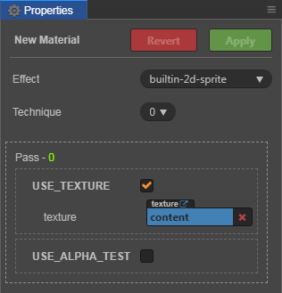

## 材质系统：

从 v2.x 升级的用户应该参考升级指南

材质系统控制着每个模型最终的着色流程与顺序  

## Effect：

相当于是材质shader的核心，自定义效果都有Effect来完成，很多很多算法可以加入到effect里。比如光影计算，和各种特殊效果。

## Technique：

对于多PASS的设计，我们可以参考OGRE的材质方法或是D3DX的效果框架。我们把完成一个最终效果的方案称作一个渲染技术 Technique ，一个技术可由多个Pass来完成。
Technique是多个Pass的组合，多个Pass必须按一定的顺序进行执行来实现一个渲染算法。

Technique是多个Pass的组合，多个Pass必须按一定的顺序进行执行来实现一个渲染算法。

## Pass：

一个也就是一次绘制，一般包括一次顶点着色器和一次片元着色器（俗称像素着色器），有些渲染需要多次绘制有的一次绘制即可。

材质系统的总览：大概就是通过资源Asset->给到material暴露属性并且指定effect(指定相应的shaderInfo一般就是glsl)。随后就光栅化输出图像。

  
一：  

首先2.4与3.0EffectAsset有一些差异，Cocos Creator 的 Effect 书写规则基本与 Cocos Creator 3D 一致，可以使用 VS Code 的 Cocos Effect 插件进行编写，只是内置的一些 shader 变量名字有些区别。基本书写语法没有大的区别，是由用户书写的着色流程描述文件。

二：  

2.4与3.0的material系统也有一些区别。2.4的material系统主要由Effect，Technique，Pass组成。如下图

  
  
Effect 下拉框会列出当前项目中所有的 Effect 资源，开发者可以选择当前材质使用的 Effect 资源。当切换了 Effect 后其他属性也会同步更新。  

Technique 下拉框会列出当前使用的 Effect 资源中所有的 Technique。
Effect 资源中可能会存在多个 Technique，每个 Technique 适用于不同的情况，比如效果差一点但是性能更好的 Technique 更适合用于手机平台。
当切换了 Technique 后 Pass 列表也会同步更新。
  
Pass 列表会列出当前使用的 Technique 中所有的 Pass。
每个 Pass 可能会有不同的属性和定义，开发者可以分别设置这些属性和定义。如果属性是被定义包裹住的，需要先勾上定义才能看到对应的属性。
  
而3.0的material和2.0大致还是差不多的。也是由effectAsset：使用哪个 EffectAsset 所描述的流程进行渲染。  
**Technique** 使用 EffectAsset 中的第几个 technique? (默认为 0 号)  
**Defines** 宏定义列表, 需要开启哪些宏定义? (默认全部关闭)  
**States**管线状态重载列表, 对渲染管线状态 (深度模板透明混合等) 有哪些重载? (默认与 effect 声明一致).如下图  
  
  
**预设置材质方面也有很多的区别**
2.X的预设材质（不包括2D材质）基本是粒子材质（particle），经典的phong光照材质，默认的卡通toon材质，以及一个无光照unlit材质。
而3.0的材质系统要更成熟，有很多无光照的 unlit、基于物理光照的 standard、skybox、粒子、sprite 等。  
  
3.0和2.X 一样也可以做一些暴露参数并且用宏定义来控制。比如3.0默认的standard材质，就比较全面，而不过不一样的在于2.x没有引入PBR比如BRDF，所以一些比如occlusion，roughness，metallic等一些PBR系统是没有的。2.x默认的builtin-phong只是简单的phong光照模型。 

## YAML 101： 

Creator2.X和3.0都是采用的YAML 1.2 标准的解析器。这些基本没有什么大的区别  
  
## Effect语法：  
Effect语法问题2.x和3.0都是差不多的。注意就是头文件以及某些函数名称都是不一样的。比如获取灯光方向这个函数，在3.0里是cc_mainLitDir，而在2.X里想要获取到灯光方向就要用到cc_lightDirection[i]这样一个数组了，同时要包含头文件cc-lights.  
大概的框架就是，首先就是声明你的pass,每个pass对应了一个顶点着色器，以及一个片元着色器。然后就是blendstate来控制是否关闭深度写入来开启透明混合。

通过property暴露参数进行外部控制。 

接下去就是顶点着色器，可以引用头文件来使用文件资源。可以用宏来控制某些代码是否可以被启用。通过property从外部传入的参数可以直接用到顶点着色器里。同样的顶点着色器里也可以用宏来进行控制。注意uniform和宏依赖信息都会被自动提取处理。以CC开头的内置函数都可以通过添加头文件来调用,然后顶点着色器就返回了顶点的各种信息。

然后来到了片元着色器，和顶点着色器一样可以通过uniform来获取到property暴露的参数传输进来，也一样可以用宏来控制某些代码是否可以被启用。

最后frag函数进行采样返回颜色，当然很多函数也可以在frag里添加进去。（语法都是基于GLSL）。

## Include机制：
头文件默认扩展名为 .chunk，包含时可省略；尖括号和双引号没有区别。  
编辑器内置头文件资源就在 internal DB 的 assets/chunks 目录下, 所以可以不加目录，直接引用，主要包括一些常用的工具函数, 和标准光照模型等。  
所有在同一个 effect 文件中声明的 CCProgram 代码块都可以相互引用。 

还有很多的默认的着色函数，比如CCStandardShading，CCToonShading等。这些都是3.0独有的，2.X上没有这些。

同时注意关于UBO内存布局里面不应该出现vec3，统一使用vec4.

## Pass可选配置参数：

整理方面，Pass可选配置参数2.X和3.0大致上都是差不多的。主要就是：（摘自官方文档）

Switch  
指定这个 pass 的执行依赖于哪个 define，它不应与使用到的 shader 中定义的任何 define 重名。
这个字段默认是不存在的，意味着这个 pass 是无条件执行的。  

Priority  
指定这个 pass 的渲染优先级，数值越小越优先渲染；default 代表默认优先级 (128)，min 代表最小（0），max 代表最大（255），可结合四则运算符指定相对值。  

Stage  
指定这个 pass 归属于管线的哪个 stage，对默认 forward 管线，只有 default 一个 stage。  

Phase  
指定这个 pass 归属于管线的哪个 stage，对默认 forward 管线，可以是 default, forward-add, shadow-caster 几个。  

PropertyIndex（这个要注意，很重要。Creator3.0独有2.x没有这个功能）  
指定这个 pass 的运行时 uniform 属性数据要和哪个 pass 保持一致，比如 forward add 等 pass 需要和 base pass 一致才能保证正确的渲染效果。
一旦指定了此参数，材质面板上就不再会显示这个 pass 的任何属性。  

embeddedMacros  （Creator3.0独有2.x没有这个功能）  
指定在这个 pass 的 shader 基础上额外定义的常量宏。在多个 pass 的 shader 只有宏定义不同时可使用此参数来复用 shader 资源。  

Properties  
properties 存储着这个 Pass 有哪些可定制的参数需要在 Inspector 上显示，
这些参数可以是 shader 中的某个 uniform 的完整映射，也可以是具体某个分量的映射 (使用 target 参数)：  

当然了这些Property Param 都有一些默认值，这一点2.X与3.0都差不多的。
这里官方文档有详细说明https://docs.cocos.com/creator3d/manual/zh/material-system/pass-parameter-list.html。有详细的默认值参数表。  

## 常用 shader 内置 Uniform：  

接下去就是2.x与3.0最大的不同了：常用 shader 内置 Uniform。这里是重点中的重点。

在creator3.0里另外如果需要对接引擎动态合批和 instancing 流程，需要包含 cc-local-batch 头文件，通过 CCGetWorldMatrix 工具函数获取世界矩阵。
要在 shader 中使用内置变量，需要包含对应头文件。 目前所有的内置变量，按所在头文件分组。

Creator2.X     | Creator3.0 
------ | ------
头文件cc-local.chunk | 头文件cc-local.chunk
**Name**:cc_matWorld  **Type**:mat4  **Info**:模型空间转世界空间矩阵。 | **Name**:cc_matWorld  **Type**:mat4  **Info**:模型空间转世界空间矩阵。
**Name**: cc_matWorldIT **Type**:mat4  **Info**: 模型空间转世界空间逆转置矩阵 | **Name**: cc_matWorldIT **Type**:mat4  **Info**: 模型空间转世界空间逆转置矩阵
_
_

Creator2.X     | Creator3.0 
------ | ------
头文件cc-global.chunk | 头文件cc-global.chunk
**Name**:cc_time **Type**:vec4 **Info**: x：自开始以来的全球时间，以秒为单位，y：当前帧的增量时间，z：自开始以来的总帧数| **Name**:cc_time **Type**:vec4 **Info**: x：自开始以来的全球时间，以秒为单位，y：当前帧的增量时间，z：自开始以来的总帧数
_
_
  
Creator2.X     | Creator3.0 
------ | ------
头文件cc-global.chunk|头文件cc-global.chunk
Name: cc_screenSize|Name: cc_screenSize
Type:vec4|Type:vec4
Info: xy：屏幕尺寸 zw：屏幕尺寸倒数|Info: xy：屏幕尺寸 zw：屏幕尺寸倒数
_
—
  
Creator2.X     | Creator3.0 
------ | ------
头文件cc-global.chunk|头文件cc-global.chunk
Name: cc_screenScale|Name: cc_screenScale
Type:vec4|Type:vec4
Info: xy：屏幕比例，zw：逆屏幕比例|Info: xy：屏幕比例，zw：逆屏幕比例
—
—

Creator2.X     | Creator3.0 
------ | ------
没有这个Uniform。|头文件cc-global.chunk
_|Name:cc_nativeSizen
_|Type:vec4
_|Info: xy：实际着色缓冲的尺寸 zw：实际着色缓冲的尺寸倒数
_
_

Creator2.X     | Creator3.0 
------ | ------
头文件:cc-global.chunk|头文件:cc-global.chunk
Name: cc_matView|Name: cc_matView
Type:mat4|Type:mat4
Info: 视图矩阵|Info: 视图矩阵
_
_

Creator2.X     | Creator3.0 
------ | ------
头文件:cc-global.chunk|头文件:cc-global.chunk
Name: cc_matViewInv|Name: cc_matViewInv
Type:mat4|Type:mat4
Info: 视图逆矩阵|Info: 视图逆矩阵
_
_

Creator2.X     | Creator3.0 
------ | ------
头文件:cc-global.chunk|头文件:cc-global.chunk
Name: cc_matProj|Name: cc_matProj
Type:mat4|Type:mat4
Info: 投影矩阵|Info: 投影矩阵
_
_

Creator2.X     | Creator3.0 
------ | ------
头文件:cc-global.chunk|头文件:cc-global.chunk
Name: cc_matProjInv|Name: cc_matProjInv
Type:mat4|Type:mat4
Info: 投影逆矩阵|Info: 投影逆矩阵
_
_

Creator2.X     | Creator3.0 
------ | ------
头文件:cc-global.chunk|头文件:cc-global.chunk
Name: cc_matViewProj|Name: cc_matViewProj
Type:mat4|Type:mat4
Info: 视图投影矩阵|Info: 视图投影矩阵
_
_

Creator2.X     | Creator3.0 
------ | ------
头文件:cc-global.chunk|头文件:cc-global.chunk
Name: cc_matViewProjInv|Name: cc_matViewProjInv
Type:mat4|Type:mat4
Info: 视图投影逆矩阵|Info: 视图投影逆矩阵
_
_

Creator2.X     | Creator3.0 
------ | ------
头文件:cc-global.chunk|头文件:cc-global.chunk
Name: cc_cameraPos|Name: cc_cameraPos
Type:vec4|Type:vec4
Info: xyz：相机位置|Info: xyz：相机位置
_
_

Creator2.X     | Creator3.0 
------ | ------
没有这个Uniform。|头文件cc-global.chunk
_|Name:cc_exposure
_|Type:vec4
_|Info: x：相机曝光 y：相机曝光倒数 z：是否启用 HDR w：HDR 转 LDR 缩放参数
_
_

**Crentor2.x 与creator3.0在光源和阴影方面差异很大。我看了底层代码发现，相比2.x，creator3.0 在灯光和阴影这一块有很大的提升。 我举一些常用的功能例子。**

Creator2.X 类似功能     | Creator3.0 
------ | ------
头文件:cc-lights.chunk|头文件:cc-global.chunk
Name: cc_lightDirection[CC_MAX_LIGHTS]|Name: cc_mainLitDir
Type:vec4|Type:vec4
Info:单个模型在shader中一次绘制受多少盏灯光影响，默认最大值为1.如果要获取到位置信息就填写0。例如cc_lightDirection[0]|Info: xyz：主方向光源方向
_
_

Creator2.X 类似功能     | Creator3.0 
------ | ------
头文件:cc-lights.chunk|头文件:cc-global.chunk
Name: cc_lightColor[CC_MAX_LIGHTS]|Name: cc_mainLitColor
Type:vec4|Type:vec4
Info: 光的exp，就是光的pow强度|Info: xyz：主方向光颜色 w：主方向光强度
_
_

Creator2.X 类似功能     | Creator3.0 
------ | ------
头文件:cc-lights.chunk|头文件:cc-global.chunk
Name: CC_CALC_LIGHTS|Name: cc_ambientSky
Type:这是一个宏定义|Type:vec4
Info:这是一个宏，通过穿进去的ambient参数来进行计算。而且还有函数重载，可以传入不同的参数。|Info: xyz：天空颜色 w：亮度
_
_

Creator2.X     | Creator3.0 
------ | ------
没有这个功能。|头文件cc-global.chunk
_|Name: cc_ambientGround
_|Type:vec4
_|Info: xyz：地面反射光颜色
_
_

Creator2.X     | Creator3.0 
------ | ------
没有这个功能。|头文件:cc-environment.chunk
_|Name: cc_environment
_|Type: samplerCube
_|Info: xyz：IBL 环境贴图
_
_

在create3.0里点光源叫球面光有很多现成的功能，要加入头文件cc-forward-light.chunk 函数名称如下图所示

|Name    | Type |Info|
|------ | ------|------|
|cc_sphereLitPos[MAX_LIGHTS] | vec4|xyz：球面光位置|
|cc_sphereLitSizeRange[MAX_LIGHTS] | vec4|x：球光尺寸 y：球光范围|
|cc_sphereLitColor[MAX_LIGHTS]| vec4|xyz：球光颜色 w：球光强度|

更多详细信息参照官方文档https://docs.cocos.com/creator3d/manual/zh/material-system/builtin-shader-uniforms.html

**在create3.0里聚光灯有很多现成的功能，要加入头文件cc-forward-light.chunk 函数名称如下图所示**

|Name    | Type |Info|
|------ | ------|------|
|cc_spotLitPos[MAX_LIGHTS] | vec4|xyz：聚光灯位置|
|cc_spotLitSizeRangeAngle[MAX_LIGHTS] | vec4|x：聚光灯尺寸 y：聚光灯范围 z：聚光灯角度|
|cc_spotLitDir[MAX_LIGHTS]| vec4|xyz：聚光灯方向|
|cc_spotLitColor[MAX_LIGHTS]| vec4|xyz：聚光灯颜色 w：聚光灯强度|

更多详细信息参照官方文档https://docs.cocos.com/creator3d/manual/zh/material-system/builtin-shader-uniforms.html
******
******
***
***

在create2.X里计算方向光（directional light）为。加入头文件cc-lights.chunk  
函数LightInfo computeDirectionalLighting(  
  vec4 lightDirection,  
  vec4 lightColor  
) 输入灯光方向和灯光颜色    

函数返回值.lightDir为灯光方向  
函数返回值. Radiance 为灯光辐射亮度，值就是灯光的颜色RGB值  
函数返回值. lightColor 为灯光的颜色。  
***

在create2.X里计算点光源（point light）为。加入头文件cc-lights.chunk  
函数LightInfo computePointLighting(  
  vec3 worldPosition,  
  vec4 lightPositionAndRange,  
  vec4 lightColor 
) 输入世界位置信息，点光源的位置和范围，灯光颜色    

函数返回值.lightDir为灯光方向    
函数返回值. Radiance 为灯光辐射亮度包含了衰减值。   
函数返回值. lightColor 为灯光的颜色。 
***
在create2.X里计算聚光灯（spot light）为。加入头文件cc-lights.chunk  
函数LightInfo computeSpotLighting(  
  vec3 worldPosition,  
  vec4 lightPositionAndRange,  
  vec4 lightDirection,  
  vec4 lightColor  
) 输入世界位置信息，聚光灯的位置和范围，灯光方向，灯光颜色  
函数返回值.lightDir为灯光方向  
函数返回值. Radiance 为灯光辐射亮度包含了衰减值和灯光扩散范围  
函数返回值. lightColor 为灯光的颜色。  
***
## 阴影部分  
Creator3.0 加入头文件cc-shadow.chunk  常用阴影uniform
|Name    | Type |Info|
|------ | ------|------|
|cc_matLightPlaneProj | mat4|平面阴影的变换矩阵|
|cc_shadowColor | vec4|阴影颜色|

Creator2.0  
加入头文件shadow.chunk
|Name    | Type |Info|
|------ | ------|------|
|cc_shadow_lightViewProjMatrix[CC_MAX_SHADOW_LIGHTS] | mat4|在灯光坐标下绘制阴影贴图|
|cc_shadow_info[CC_MAX_SHADOW_LIGHTS] | vec4|计算阴影偏移|
***
|Name    | Type |Info|
|------ | ------|------|
|getDepth | Float|返回深度值|
|shadowSimple  | float|阴影的硬采样会有锯齿问题|
***
## PCF软阴影
Creator3.0  
ShadowPCF软阴影 加入头文件cc-shadow-map-fs.chunk  
函数为CC_DIR_SHADOW_FACTOR直接修改内存里的阴影颜色数值  
——  
——  

Creator2.x  
ShadowPCF软阴影。加入头文件shadow .chunk函数有shadowPCF3X3（3X3采样），shadowPCF5X5（5X5采样）
