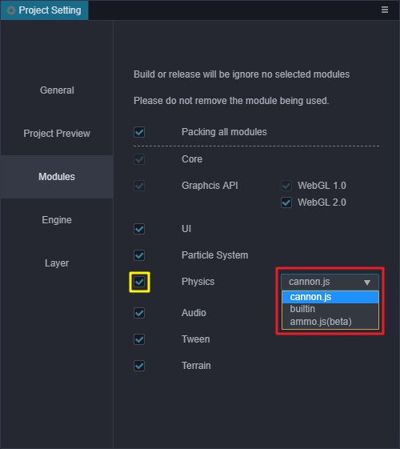

# 选择适合你项目的物理系统

在编辑器中选择 **项目**->**项目设置**->**模块选项** 中，您可以选择适合项目需求的物理引擎进行开发。

> **注**：默认为`cannon.js`物理引擎。
> **注**：开发过程中物理引擎可随意切换。

## 碰撞检测:`builtin`

`builtin` 仅有碰撞检测的功能，相对于其它的物理引擎，它没有复杂的物理模拟计算。如果您的项目不需要这一部分的物理模拟，那么可以考虑使用`builtin` ，这将使得游戏的包体更小。

若使用`builtin` 进行开发，请注意以下几点：

- `builtin`只有`trigger`类型的事件。
- `RigidbodyComponent`无效。
- `Collider`中的`isTrigger`无论值真假，都为触发器。

## 物理引擎:`cannon.js`

[cannon.js](https://github.com/cocos-creator/cannon.js) 是一个开源的物理引擎，它使用 js 语言开发并实现了比较全面的物理功能，如果您的项目需要更多复杂的物理功能，那么您可以考虑使用 [cannon.js](https://github.com/cocos-creator/cannon.js)。`cannon.js`模块大小为`141KB`。

## 物理引擎:`ammo.js`

[ammo.js](https://github.com/cocos-creator/ammo.js) 是 [bullet](https://github.com/bulletphysics/bullet3) 物理引擎的 `asm.js` / `wasm` 版本（目前仅提供了 `asm.js` 版本），由 [emscripten](https://github.com/emscripten-core/emscripten) 工具编译而来。`Bullet`具有完善的物理功能，未来我们也将在此投入更多工作。

需要注意的是，目前`ammo.js`模块具有**1MB左右**的大小。

## 不使用物理

若不需要用到任何物理相关的组件和接口，可以取消黄色框的勾选，这样在发布时将有更小的包体。

> **注**：若处于取消勾选的状态，项目将不可以使用物理相关的组件和接口，否则运行时将会报错。

<!-- ## 扩展物理后端 -->
